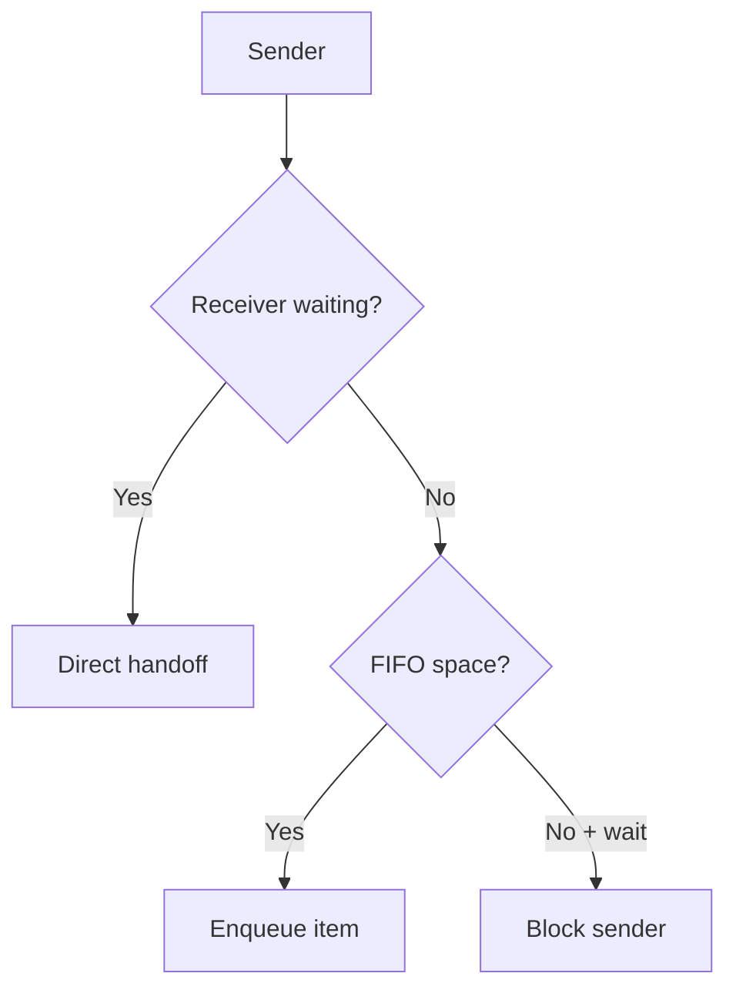
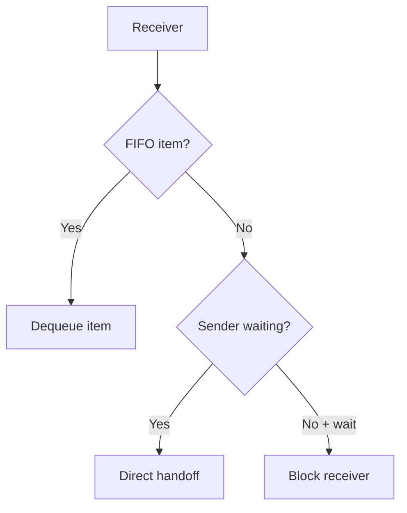

# `09-queue-blocking-ipc` — Queue and Blocking IPC

> **Environment:** Target  
> **Source:** `examples/09-queue-blocking-ipc/main.c`  
> **Focus:** Bounded FIFO + blocking IPC

[← Root README](../../README.md)

## Table of Contents

- [Objective and Core Concept](#objective)
- [Build Graph and Configuration](#build-graph)
- [Runtime Flow](#runtime)
- [API and Ownership](#api)
- [Invariant / PASS criteria](#pass)
- [Debugging and Failure Modes](#debug)
- [Validation](#validation)
- [Source Map and References](#source-map)

<a id="objective"></a>
## Objective and Core Concept

Producer/consumer tasks use a small-capacity queue so direct handoff, blocking, and timeout behavior are all observable.


<a id="build-graph"></a>
## Build Graph and Configuration

- CMake declares this example as a **Target** environment.
- Modules linked for this example: `platform`, `task_kernel`, `kernel_runtime`, `kernel_time`, `queue`.
- Reference target: `bluepill_f103c8` — STM32F103C8T6 / Cortex-M3 / nominal 72 MHz / USART1 115200 / active-low PC13 LED.

### Compile-time / source constants

| Symbol | Value in `main.c` |
| --- | --- |
| `CONSUMER_TASK_PRIORITY` | `1U` |
| `PRODUCER_TASK_PRIORITY` | `3U` |
| `TASK_STACK_WORDS` | `224U` |
| `MESSAGE_QUEUE_CAPACITY` | `2U` |
| `CONSUMER_DELAY_TICKS` | `200U` |
| `SEND_TIMEOUT_TICKS` | `100U` |

### CMake feature overrides

- The example uses the default configuration except for modules/definitions explicitly declared in `cmake/hairtos_examples.cmake`.

<a id="runtime"></a>
## Runtime Flow

**Send path**



**Receive path**




### Details Observed Directly in the Example

- Create a queue backed by application-owned storage.
- Block receivers when the queue is empty and senders when it is full.
- Use a finite timeout for send.
- Verify FIFO order for successfully received messages.
- Ring buffer with head/tail/count.
- Send/receive wait lists are ordered by priority.
- Direct handoff to a blocked receiver.
- Refill a freed slot from a blocked sender when the receiver removes an item.
- Timeout cleanup removes the task from both the queue wait list and timeout list.
- `hairtos/hr_queue.h`
- `hairtos/hr_time.h`
- `hr_queue_create_static()`
- `hr_queue_send()`
- `hr_queue_receive()`
- `hr_queue_get_count()`
- `task_kernel`
- `kernel_runtime`
- `kernel_time`
- Hardware — STM32F103C8T6 Blue Pill — Runs the target firmware.
- Flash/debug — ST-Link V2 over SWD — OpenOCD is used to flash, verify, and reset the target.
- UART — USART1, PA9 TX / PA10 RX, 115200 8-N-1 — Observes logs and PASS/FAIL status.
- LED — PC13, active-low — Displays heartbeat or observable status.
- Queue — 2 `queue_message_t` entries — Each message contains `sequence` and `produced_at`.
- `consumer` — Priority 1, stack 224 words — Receives forever and processes slowly for 200 ticks.

<a id="api"></a>
## API and Ownership

APIs called directly from `main.c` (extracted from source):

- `board_init()`
- `board_led_toggle()`
- `board_panic()`
- `board_uart_write_line()`
- `board_uart_write_string()`
- `board_uart_write_u32()`
- `hr_kernel_init()`
- `hr_kernel_start()`
- `hr_port_thread_uses_psp()`
- `hr_queue_create_static()`
- `hr_queue_get_count()`
- `hr_queue_receive()`
- `hr_queue_send()`
- `hr_task_create_static()`
- `hr_task_current()`
- `hr_task_delay()`
- `hr_task_start()`
- `hr_time_now()`

Ownership rules to keep in mind:

- `hr_task_t`, stacks, queue/semaphore/mutex/timer objects, and haievent storage in the examples are all static/caller-owned.
- Kernel APIs retain pointers to this storage after creation, so the storage lifetime must cover the entire period in which the object remains active.
- ISR paths must not call blocking APIs. `_from_isr` APIs perform bounded work and return `higher_priority_task_woken` so PendSV can perform any required switch after ISR exit.
- Dynamic haievent events allocated from a pool use retain/release semantics; static events are not freed automatically by the framework.

<a id="pass"></a>
## Invariants and PASS Criteria

- Queue storage is not dynamically allocated; `item_size × capacity` bytes are caller-owned and must remain valid for the queue's entire lifetime.
- Task APIs support timeouts; ISR APIs are always non-blocking and report `higher_priority_task_woken` rather than scheduling directly.
- Waiters are ordered by effective priority and FIFO within the same priority through wait-list insertion order.
- When a receiver is already waiting, send may copy directly into the receive buffer instead of enqueueing and then dequeueing; similarly, receive may take data directly from a blocked sender.
- Full/empty queues with `HR_NO_WAIT` return immediately; blocking is valid only while the kernel is RUNNING and the caller is not in ISR context.

Hard-coded checks/logs in the source:

- `ERROR: invalid queue task context.`
- `ERROR: blocking queue receive failed.`
- `ERROR: queue FIFO sequence violated.`
- `ERROR: consumer delay failed.`
- `ERROR: blocking queue send failed.`
- `Queue creation failed.`
- `Kernel initialization failed.`
- `Consumer task creation failed.`

<a id="debug"></a>
## Debugging and Failure Modes

- Sender/receiver hangs: inspect queue wait lists, timeout nodes, and single-winner wake cleanup.
- Data corruption after direct handoff: inspect item size and waiter-buffer ownership.
- Incorrect FIFO path: inspect head/tail/count of circular storage when no waiter is present.
- Timeout and object wakeup must not publish two results for the same task.

<a id="validation"></a>
## Validation

- This example is target-only in CMake; host evidence does not replace ARM cross-build, OpenOCD, and hardware validation.
- Host validation baseline: `make TARGET=bluepill_f103c8 host-tests` passes the entire suite.

### Standard Commands

```bash
make TARGET=bluepill_f103c8 EXAMPLE=09-queue-blocking-ipc build
make TARGET=bluepill_f103c8 EXAMPLE=09-queue-blocking-ipc run
make TARGET=bluepill_f103c8 EXAMPLE=09-queue-blocking-ipc check
```

<a id="source-map"></a>
## Source Map and References

- `examples/09-queue-blocking-ipc/main.c`
- `cmake/hairtos_examples.cmake`
- `kernel/src/hr_queue.c`
- `kernel/internal/hr_queue_internal.h`
- `kernel/src/hr_wait.c`
- `tests/host/test_queue.c`

### References

- [Arm Cortex-M3 Technical Reference Manual](https://developer.arm.com/documentation/100165/latest/)
- [Arm Cortex-M3 Devices Generic User Guide](https://developer.arm.com/documentation/dui0552/latest/)

**Implementation sources in the repository:**
- `kernel/src/hr_queue.c`
- `kernel/internal/hr_queue_internal.h`
- `kernel/src/hr_wait.c`
- `tests/host/test_queue.c`
