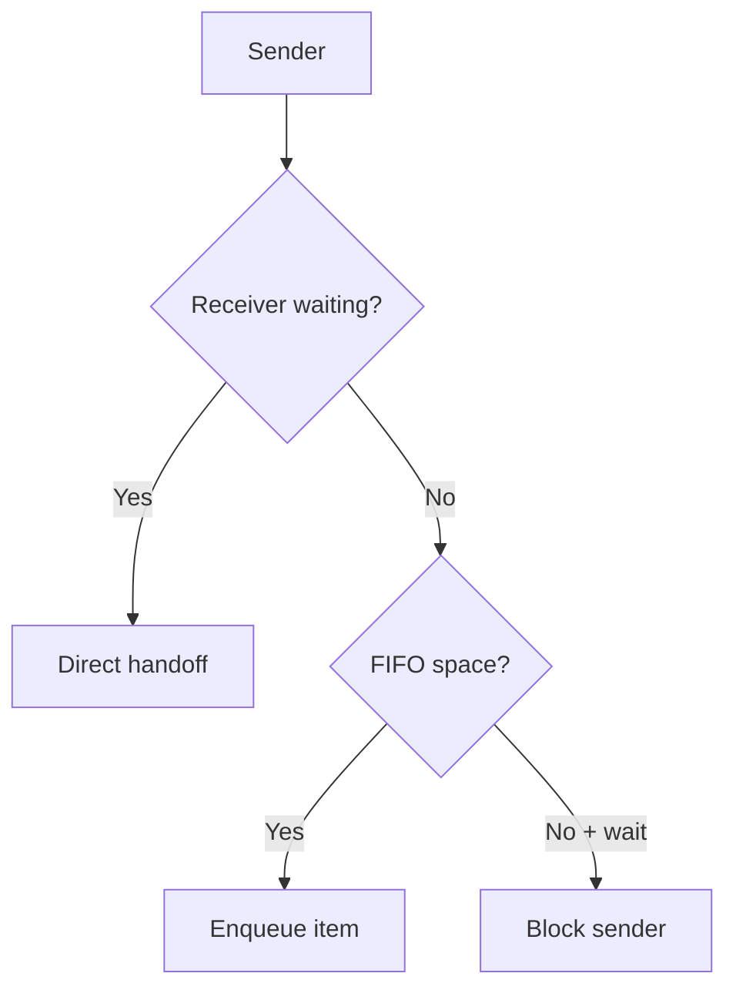
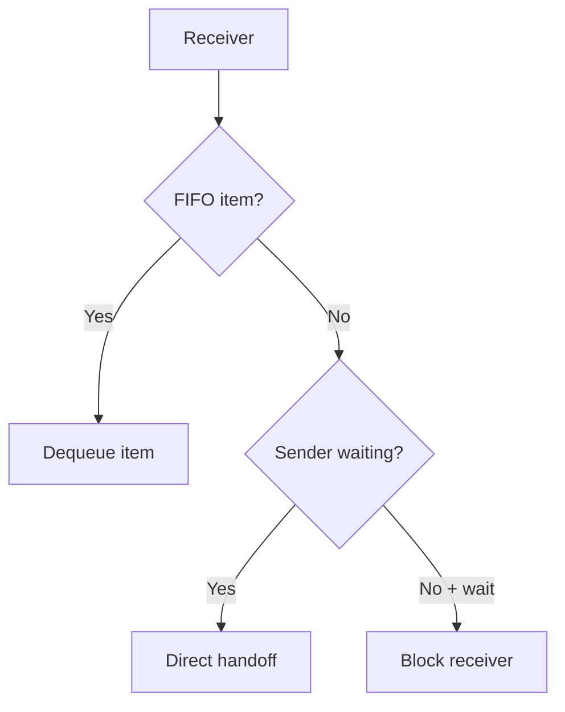

# `09-queue-blocking-ipc` — Queue và IPC chặn

> **Môi trường:** Target  
> **Source:** `examples/09-queue-blocking-ipc/main.c`  
> **Trọng tâm:** Bounded FIFO + blocking IPC

[← Root README](../../README.md)

## Mục lục

- [Mục tiêu và bản chất](#muc-tieu)
- [Build graph và cấu hình](#build-graph)
- [Luồng thực thi](#runtime)
- [API và ownership](#api)
- [Invariant / PASS criteria](#pass)
- [Debug và failure modes](#debug)
- [Validation](#validation)
- [Source map và references](#source-map)

<a id="muc-tieu"></a>
## Mục tiêu và bản chất

Producer/consumer dùng queue capacity nhỏ để buộc cả direct handoff, blocking và timeout trở nên quan sát được.


<a id="build-graph"></a>
## Build graph và cấu hình

- Environment được CMake khai báo: **Target**.
- Module được link cho example này: `platform`, `task_kernel`, `kernel_runtime`, `kernel_time`, `queue`.
- Target tham chiếu: `bluepill_f103c8` — STM32F103C8T6 / Cortex-M3 / 72 MHz nominal / USART1 115200 / LED PC13 active-low.

### Compile-time / source constants

| Symbol | Giá trị trong `main.c` |
| --- | --- |
| `CONSUMER_TASK_PRIORITY` | `1U` |
| `PRODUCER_TASK_PRIORITY` | `3U` |
| `TASK_STACK_WORDS` | `224U` |
| `MESSAGE_QUEUE_CAPACITY` | `2U` |
| `CONSUMER_DELAY_TICKS` | `200U` |
| `SEND_TIMEOUT_TICKS` | `100U` |

### CMake feature overrides

- Example dùng default config trừ những module/definition được khai báo trong `cmake/hairtos_examples.cmake`.

<a id="runtime"></a>
## Luồng thực thi

**Send path**



**Receive path**




### Các chi tiết quan sát trực tiếp từ example

- Tạo queue với storage do application cấp.
- Block receiver khi queue rỗng và sender khi queue đầy.
- Dùng finite timeout cho send.
- Xác nhận FIFO của các message được nhận thành công.
- Ring buffer với head/tail/count.
- Các wait list gửi/nhận được sắp theo priority.
- Direct handoff tới blocked receiver.
- Refill slot từ blocked sender khi receiver lấy item.
- Timeout cleanup khỏi queue wait list và timeout list.
- `hairtos/hr_queue.h`
- `hairtos/hr_time.h`
- `hr_queue_create_static()`
- `hr_queue_send()`
- `hr_queue_receive()`
- `hr_queue_get_count()`
- `task_kernel`
- `kernel_runtime`
- `kernel_time`
- Phần cứng — STM32F103C8T6 Blue Pill — Chạy firmware target.
- Nạp/debug — ST-Link V2 qua SWD — Dùng OpenOCD để flash, verify và reset.
- UART — USART1, PA9 TX / PA10 RX, 115200 8-N-1 — Theo dõi log và trạng thái PASS/FAIL.
- LED — PC13, active-low — Hiển thị heartbeat hoặc trạng thái quan sát.
- Queue — 2 phần tử `queue_message_t` — Mỗi message chứa `sequence` và `produced_at`.
- `consumer` — Priority 1, stack 224 words — Receive forever, xử lý chậm 200 ticks.

<a id="api"></a>
## API và ownership

API được gọi trực tiếp trong `main.c` (đã trích từ source):

- `board_init()`
- `board_led_toggle()`
- `board_panic()`
- `board_uart_write_line()`
- `board_uart_write_string()`
- `board_uart_write_u32()`
- `hr_kernel_init()`
- `hr_kernel_start()`
- `hr_port_thread_uses_psp()`
- `hr_queue_create_static()`
- `hr_queue_get_count()`
- `hr_queue_receive()`
- `hr_queue_send()`
- `hr_task_create_static()`
- `hr_task_current()`
- `hr_task_delay()`
- `hr_task_start()`
- `hr_time_now()`

Ownership cần nhớ:

- `hr_task_t`, stack, queue/semaphore/mutex/timer object và haievent storage trong examples đều là static/caller-owned.
- API kernel giữ pointer tới storage này sau create, vì vậy lifetime phải kéo dài toàn bộ thời gian object còn active.
- ISR path không được gọi blocking API. API `_from_isr` chỉ làm bounded work và trả `higher_priority_task_woken` để PendSV xử lý switch sau ISR.
- Dynamic haievent event từ pool dùng retain/release; static event không được framework tự free.

<a id="pass"></a>
## Invariant và PASS criteria

- Storage queue không được cấp phát động; `item_size × capacity` do caller sở hữu và phải tồn tại suốt đời queue.
- Task API hỗ trợ timeout; ISR API luôn non-blocking và báo `higher_priority_task_woken` thay vì tự schedule trực tiếp.
- Waiters được sắp theo effective priority, FIFO trong cùng priority nhờ wait-list insertion order.
- Khi receiver đang chờ, send có thể copy trực tiếp vào receive buffer thay vì bắt buộc enqueue rồi dequeue; tương tự receive có thể lấy trực tiếp từ blocked sender.
- Queue full/empty với `HR_NO_WAIT` trả status ngay; blocking chỉ hợp lệ khi kernel đang RUNNING và caller không ở ISR.

Các check/log cứng trong source:

- `ERROR: invalid queue task context.`
- `ERROR: blocking queue receive failed.`
- `ERROR: queue FIFO sequence violated.`
- `ERROR: consumer delay failed.`
- `ERROR: blocking queue send failed.`
- `Queue creation failed.`
- `Kernel initialization failed.`
- `Consumer task creation failed.`

<a id="debug"></a>
## Debug và failure modes

- Sender/receiver treo: kiểm tra queue wait lists, timeout node và single-winner wake cleanup.
- Data sai sau direct handoff: kiểm tra item size và waiter buffer ownership.
- FIFO path sai: kiểm tra head/tail/count của circular storage khi không có waiter.
- Timeout và object wake không được cùng publish hai kết quả cho một task.

<a id="validation"></a>
## Validation

- Example là target-only trong CMake; host evidence không thay thế ARM cross-build, OpenOCD và hardware validation.
- Host validation baseline: `make TARGET=bluepill_f103c8 host-tests` PASS toàn bộ suite.

### Lệnh chuẩn

```bash
make TARGET=bluepill_f103c8 EXAMPLE=09-queue-blocking-ipc build
make TARGET=bluepill_f103c8 EXAMPLE=09-queue-blocking-ipc run
make TARGET=bluepill_f103c8 EXAMPLE=09-queue-blocking-ipc check
```

<a id="source-map"></a>
## Source map và references

- `examples/09-queue-blocking-ipc/main.c`
- `cmake/hairtos_examples.cmake`
- `kernel/src/hr_queue.c`
- `kernel/internal/hr_queue_internal.h`
- `kernel/src/hr_wait.c`
- `tests/host/test_queue.c`

### Tài liệu tham khảo

- [Arm Cortex-M3 Technical Reference Manual](https://developer.arm.com/documentation/100165/latest/)
- [Arm Cortex-M3 Devices Generic User Guide](https://developer.arm.com/documentation/dui0552/latest/)

**Nguồn implementation trong repository:**
- `kernel/src/hr_queue.c`
- `kernel/internal/hr_queue_internal.h`
- `kernel/src/hr_wait.c`
- `tests/host/test_queue.c`
