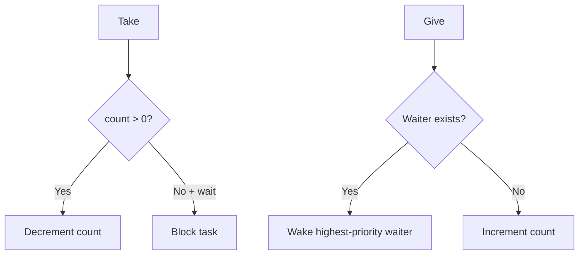

# `10-01-semaphore-from-isr` — Giving a Semaphore from an ISR

> **Environment:** Target  
> **Source:** `examples/10-01-semaphore-from-isr/main.c`  
> **Focus:** ISR-to-task synchronization

[← Root README](../../README.md)

## Table of Contents

- [Objective and Core Concept](#objective)
- [Build Graph and Configuration](#build-graph)
- [Runtime Flow](#runtime)
- [API and Ownership](#api)
- [Invariant / PASS criteria](#pass)
- [Debugging and Failure Modes](#debug)
- [Validation](#validation)
- [Source Map and References](#source-map)

<a id="objective"></a>
## Objective and Core Concept

A hardware/bare-metal tick ISR gives a semaphore; a task blocks waiting for it, and `higher_priority_task_woken` determines whether PendSV is requested.


<a id="build-graph"></a>
## Build Graph and Configuration

- CMake declares this example as a **Target** environment.
- Modules linked for this example: `platform`, `task_kernel`, `kernel_runtime`, `kernel_time`, `semaphore`.
- Reference target: `bluepill_f103c8` — STM32F103C8T6 / Cortex-M3 / nominal 72 MHz / USART1 115200 / active-low PC13 LED.

### Compile-time / source constants

| Symbol | Value in `main.c` |
| --- | --- |
| `WAITER_TASK_PRIORITY` | `1U` |
| `TRIGGER_TASK_PRIORITY` | `3U` |
| `TASK_STACK_WORDS` | `192U` |
| `TRIGGER_PERIOD_TICKS` | `500U` |
| `STM32F1_EXTI_BASE` | `0x40010400UL` |
| `STM32F1_NVIC_ISER0` | `0xE000E100UL` |
| `STM32F1_EXTI_IMR` | `STM32F1_REG32(STM32F1_EXTI_BASE + 0x00UL)` |
| `STM32F1_EXTI_SWIER` | `STM32F1_REG32(STM32F1_EXTI_BASE + 0x10UL)` |
| `STM32F1_EXTI_PR` | `STM32F1_REG32(STM32F1_EXTI_BASE + 0x14UL)` |
| `STM32F1_NVIC_ISER0_REG` | `STM32F1_REG32(STM32F1_NVIC_ISER0)` |
| `STM32F1_EXTI_LINE0` | `(1UL << 0U)` |
| `STM32F1_EXTI0_IRQ_BIT` | `(1UL << 6U)` |

### CMake feature overrides

- The example uses the default configuration except for modules/definitions explicitly declared in `cmake/hairtos_examples.cmake`.

<a id="runtime"></a>
## Runtime Flow




### Details Observed Directly in the Example

- Use the non-blocking semaphore API from ISR context.
- Propagate `higher_priority_task_woken` out of the kernel API.
- Pend a context switch after ISR exit with `hr_yield_from_isr()`.
- Distinguish ISR context from task context.
- A binary semaphore is a counting semaphore with maximum count 1.
- An ISR must not block or use a finite timeout.
- Context switching does not occur in the middle of the ISR handler; PendSV runs after exception return.
- EXTI0 is triggered through SWIER, so no external button is required.
- `hairtos/hr_semaphore.h`
- `hairtos/hr_context.h`
- `stm32f1.h`
- `hr_semaphore_create_binary()`
- `hr_semaphore_take()`
- `hr_semaphore_give_from_isr()`
- `hr_yield_from_isr()`
- `task_kernel`
- `kernel_runtime`
- `kernel_time`
- Hardware — STM32F103C8T6 Blue Pill — Runs the target firmware.
- Flash/debug — ST-Link V2 over SWD — OpenOCD is used to flash, verify, and reset the target.
- UART — USART1, PA9 TX / PA10 RX, 115200 8-N-1 — Observes logs and PASS/FAIL status.
- LED — PC13, active-low — Displays heartbeat or observable status.
- `waiter` — Priority 1, stack 192 words — Blocks on the binary semaphore.
- `trigger` — Priority 3, stack 192 words — Writes EXTI_SWIER every 500 ticks.

<a id="api"></a>
## API and Ownership

APIs called directly from `main.c` (extracted from source):

- `board_init()`
- `board_led_toggle()`
- `board_panic()`
- `board_uart_write_line()`
- `board_uart_write_string()`
- `board_uart_write_u32()`
- `hr_kernel_init()`
- `hr_kernel_start()`
- `hr_port_thread_uses_psp()`
- `hr_port_yield_from_isr()`
- `hr_semaphore_create_binary()`
- `hr_semaphore_give_from_isr()`
- `hr_semaphore_take()`
- `hr_task_create_static()`
- `hr_task_current()`
- `hr_task_delay_until()`
- `hr_task_start()`
- `hr_time_now()`

Ownership rules to keep in mind:

- `hr_task_t`, stacks, queue/semaphore/mutex/timer objects, and haievent storage in the examples are all static/caller-owned.
- Kernel APIs retain pointers to this storage after creation, so the storage lifetime must cover the entire period in which the object remains active.
- ISR paths must not call blocking APIs. `_from_isr` APIs perform bounded work and return `higher_priority_task_woken` so PendSV can perform any required switch after ISR exit.
- Dynamic haievent events allocated from a pool use retain/release semantics; static events are not freed automatically by the framework.

<a id="pass"></a>
## Invariants and PASS Criteria

- `take` consumes a token when count > 0; if no token is available, it may block according to the timeout.
- `give` with a waiting task transfers forward progress directly to that waiter; only when there is no waiter is the count incremented.
- `give_from_isr` is ISR-safe and reports any required context switch through its output flag.
- Semaphores track no owner and provide no priority inheritance; use a mutex when ownership-aware mutual exclusion is required.
- Giving when the count is already at maximum and no waiter exists returns `HR_ERROR_SEMAPHORE_FULL`.

Hard-coded checks/logs in the source:

- `ERROR: semaphore ISR handoff failed.`
- `ERROR: trigger delay failed.`
- `Semaphore creation failed.`
- `Kernel initialization failed.`
- `Semaphore task setup failed.`
- `ERROR: hr_kernel_start returned status=`

<a id="debug"></a>
## Debugging and Failure Modes

- ISR give does not wake the task: inspect the ISR API, waiter selection, and `higher_priority_task_woken`.
- Count increments while a waiter exists: inspect direct-handoff semantics; a token should not simultaneously exist in both the count and a waiter.
- ISR path must remain non-blocking and defer context switching only through PendSV.
- Compare the priority of the awakened task against the current task before requesting a switch.

<a id="validation"></a>
## Validation

- This example is target-only in CMake; host evidence does not replace ARM cross-build, OpenOCD, and hardware validation.
- Host validation baseline: `make TARGET=bluepill_f103c8 host-tests` passes the entire suite.

### Standard Commands

```bash
make TARGET=bluepill_f103c8 EXAMPLE=10-01-semaphore-from-isr build
make TARGET=bluepill_f103c8 EXAMPLE=10-01-semaphore-from-isr run
make TARGET=bluepill_f103c8 EXAMPLE=10-01-semaphore-from-isr check
```

<a id="source-map"></a>
## Source Map and References

- `examples/10-01-semaphore-from-isr/main.c`
- `cmake/hairtos_examples.cmake`
- `kernel/src/hr_semaphore.c`
- `kernel/internal/hr_semaphore_internal.h`
- `tests/host/test_semaphore.c`

### References

- [Arm Cortex-M3 Technical Reference Manual](https://developer.arm.com/documentation/100165/latest/)
- [Arm Cortex-M3 Devices Generic User Guide](https://developer.arm.com/documentation/dui0552/latest/)

**Implementation sources in the repository:**
- `kernel/src/hr_semaphore.c`
- `kernel/internal/hr_semaphore_internal.h`
- `tests/host/test_semaphore.c`
