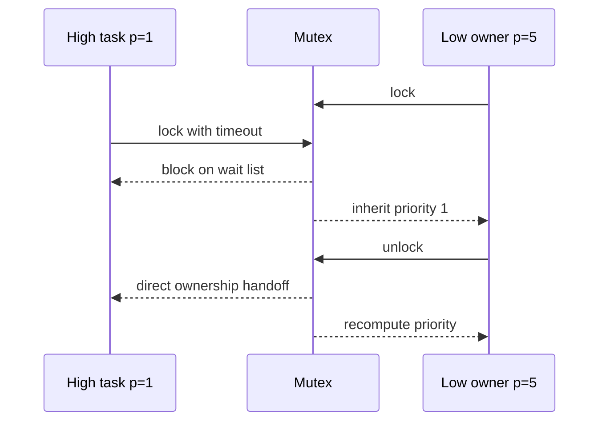

# `10-02-mutex-priority-inheritance` — Mutex và kế thừa ưu tiên

> **Môi trường:** Target  
> **Source:** `examples/10-02-mutex-priority-inheritance/main.c`  
> **Trọng tâm:** Priority inversion và inheritance

[← Root README](../../README.md)

## Mục lục

- [Mục tiêu và bản chất](#muc-tieu)
- [Build graph và cấu hình](#build-graph)
- [Luồng thực thi](#runtime)
- [API và ownership](#api)
- [Invariant / PASS criteria](#pass)
- [Debug và failure modes](#debug)
- [Validation](#validation)
- [Source map và references](#source-map)

<a id="muc-tieu"></a>
## Mục tiêu và bản chất

Low giữ mutex, High block và boost Low; Medium CPU-bound không được kéo dài inversion.


<a id="build-graph"></a>
## Build graph và cấu hình

- Environment được CMake khai báo: **Target**.
- Module được link cho example này: `platform`, `task_kernel`, `kernel_runtime`, `kernel_time`, `mutex`.
- Target tham chiếu: `bluepill_f103c8` — STM32F103C8T6 / Cortex-M3 / 72 MHz nominal / USART1 115200 / LED PC13 active-low.

### Compile-time / source constants

| Symbol | Giá trị trong `main.c` |
| --- | --- |
| `HIGH_TASK_PRIORITY` | `1U` |
| `MEDIUM_TASK_PRIORITY` | `3U` |
| `LOW_TASK_PRIORITY` | `5U` |
| `TASK_STACK_WORDS` | `224U` |
| `HIGH_TASK_RELEASE_TICK` | `10U` |
| `MEDIUM_TASK_RELEASE_TICK` | `20U` |
| `LOW_TASK_WORK_UNTIL_TICK` | `120U` |

### CMake feature overrides

- Example dùng default config trừ những module/definition được khai báo trong `cmake/hairtos_examples.cmake`.

<a id="runtime"></a>
## Luồng thực thi




### Các chi tiết quan sát trực tiếp từ example

- Phân biệt base priority và effective priority.
- Quan sát task high block trên mutex do low sở hữu.
- Ngăn medium task làm low bị starvation bằng priority inheritance.
- Xác nhận direct ownership handoff và priority restoration.
- Quyền sở hữu mutex.
- Priority inheritance từ waiter cao nhất.
- Owner được requeue khi effective priority thay đổi.
- Unlock chuyển ownership trực tiếp cho waiter phù hợp.
- `hairtos/hr_mutex.h`
- `hairtos/hr_time.h`
- `hr_mutex_create()`
- `hr_mutex_lock()`
- `hr_mutex_unlock()`
- `hr_mutex_get_owner()`
- `hr_mutex_get_waiting_tasks()`
- `hr_task_get_effective_priority()`
- `task_kernel`
- `kernel_runtime`
- Phần cứng — STM32F103C8T6 Blue Pill — Chạy firmware target.
- Nạp/debug — ST-Link V2 qua SWD — Dùng OpenOCD để flash, verify và reset.
- UART — USART1, PA9 TX / PA10 RX, 115200 8-N-1 — Theo dõi log và trạng thái PASS/FAIL.
- LED — PC13, active-low — Hiển thị heartbeat hoặc trạng thái quan sát.
- `high` — Priority 1, stack 224 words — Thức ở tick 10 và chờ mutex.
- `medium` — Priority 3, stack 224 words — Thức ở tick 20, CPU-bound cho đến PASS.

<a id="api"></a>
## API và ownership

API được gọi trực tiếp trong `main.c` (đã trích từ source):

- `board_init()`
- `board_led_toggle()`
- `board_panic()`
- `board_uart_write_line()`
- `board_uart_write_string()`
- `board_uart_write_u32()`
- `hr_kernel_init()`
- `hr_kernel_start()`
- `hr_mutex_create()`
- `hr_mutex_get_owner()`
- `hr_mutex_get_waiting_tasks()`
- `hr_mutex_lock()`
- `hr_mutex_unlock()`
- `hr_task_create_static()`
- `hr_task_delay()`
- `hr_task_get_effective_priority()`
- `hr_task_start()`
- `hr_time_now()`

Ownership cần nhớ:

- `hr_task_t`, stack, queue/semaphore/mutex/timer object và haievent storage trong examples đều là static/caller-owned.
- API kernel giữ pointer tới storage này sau create, vì vậy lifetime phải kéo dài toàn bộ thời gian object còn active.
- ISR path không được gọi blocking API. API `_from_isr` chỉ làm bounded work và trả `higher_priority_task_woken` để PendSV xử lý switch sau ISR.
- Dynamic haievent event từ pool dùng retain/release; static event không được framework tự free.

<a id="pass"></a>
## Invariant và PASS criteria

- Non-recursive mutex từ chối lock lại bởi chính owner; recursive mutex tăng recursion count và chỉ release ownership khi count về 0.
- Waiter priority cao hơn có thể boost owner; task READY phải được requeue theo effective priority mới.
- Chained inheritance được hỗ trợ bằng recompute đệ quy có bound phòng cycle/pathological depth.
- Unlock chỉ hợp lệ với owner; ownership có thể handoff trực tiếp sang waiter được chọn trước khi task cũ restore priority.
- Mutex API không được gọi từ ISR.

Các check/log cứng trong source:

- `ERROR: high mutex lock failed.`
- `ERROR: mutex ownership/restoration failed.`
- ` PASS`
- `ERROR: low could not acquire mutex first.`
- `ERROR: low did not inherit priority 1.`
- `ERROR: low mutex unlock failed.`
- `Mutex creation failed.`

<a id="debug"></a>
## Debug và failure modes

- Priority inversion không được rút ngắn: kiểm tra owner effective priority và requeue sau inheritance.
- Unlock không handoff đúng waiter: kiểm tra priority-ordered waiter list và ownership transfer.
- Owner không trở về priority phù hợp: recompute từ base priority và toàn bộ mutex còn sở hữu.
- Non-owner unlock hoặc recursive-count sai phải trả status theo mutex contract, không silent success.

<a id="validation"></a>
## Validation

- Example là target-only trong CMake; host evidence không thay thế ARM cross-build, OpenOCD và hardware validation.
- Host validation baseline: `make TARGET=bluepill_f103c8 host-tests` PASS toàn bộ suite.

### Lệnh chuẩn

```bash
make TARGET=bluepill_f103c8 EXAMPLE=10-02-mutex-priority-inheritance build
make TARGET=bluepill_f103c8 EXAMPLE=10-02-mutex-priority-inheritance run
make TARGET=bluepill_f103c8 EXAMPLE=10-02-mutex-priority-inheritance check
```

<a id="source-map"></a>
## Source map và references

- `examples/10-02-mutex-priority-inheritance/main.c`
- `cmake/hairtos_examples.cmake`
- `kernel/src/hr_mutex.c`
- `kernel/internal/hr_mutex_internal.h`
- `kernel/src/hr_kernel.c`
- `tests/host/test_mutex.c`

### Tài liệu tham khảo

- [Arm Cortex-M3 Technical Reference Manual](https://developer.arm.com/documentation/100165/latest/)
- [Arm Cortex-M3 Devices Generic User Guide](https://developer.arm.com/documentation/dui0552/latest/)

**Nguồn implementation trong repository:**
- `kernel/src/hr_mutex.c`
- `kernel/internal/hr_mutex_internal.h`
- `kernel/src/hr_kernel.c`
- `tests/host/test_mutex.c`
