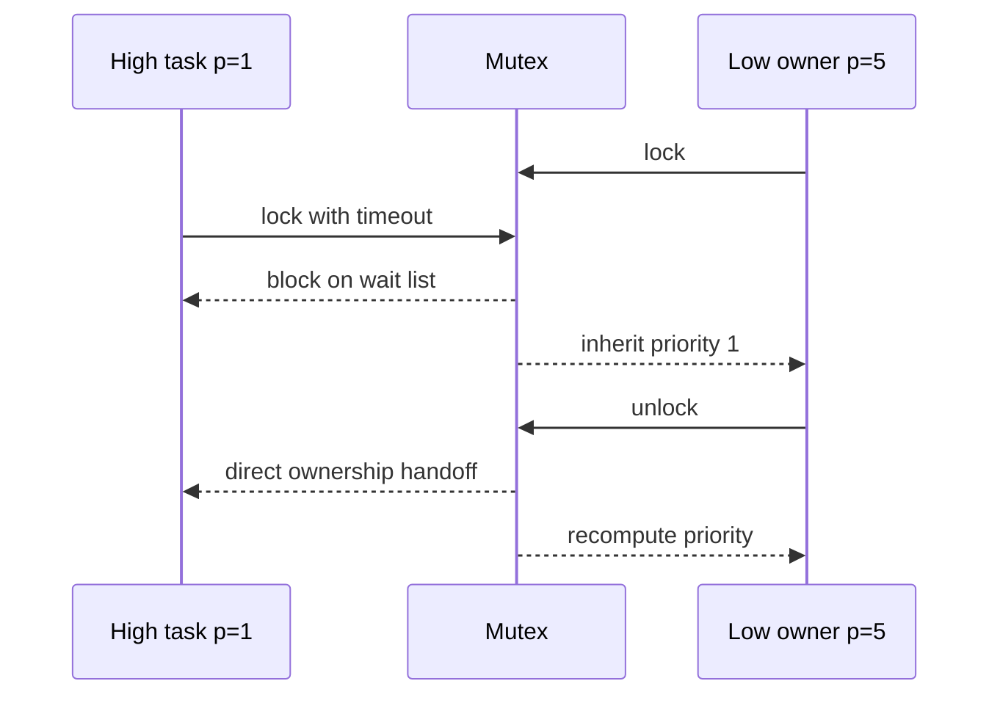

# `10-02-mutex-priority-inheritance` — Mutex and Priority Inheritance

> **Environment:** Target  
> **Source:** `examples/10-02-mutex-priority-inheritance/main.c`  
> **Focus:** Priority inversion and inheritance

[← Root README](../../README.md)

## Table of Contents

- [Objective and Core Concept](#objective)
- [Build Graph and Configuration](#build-graph)
- [Runtime Flow](#runtime)
- [API and Ownership](#api)
- [Invariant / PASS criteria](#pass)
- [Debugging and Failure Modes](#debug)
- [Validation](#validation)
- [Source Map and References](#source-map)

<a id="objective"></a>
## Objective and Core Concept

Low holds the mutex, High blocks and boosts Low, and the CPU-bound Medium task must not prolong the inversion.


<a id="build-graph"></a>
## Build Graph and Configuration

- CMake declares this example as a **Target** environment.
- Modules linked for this example: `platform`, `task_kernel`, `kernel_runtime`, `kernel_time`, `mutex`.
- Reference target: `bluepill_f103c8` — STM32F103C8T6 / Cortex-M3 / nominal 72 MHz / USART1 115200 / active-low PC13 LED.

### Compile-time / source constants

| Symbol | Value in `main.c` |
| --- | --- |
| `HIGH_TASK_PRIORITY` | `1U` |
| `MEDIUM_TASK_PRIORITY` | `3U` |
| `LOW_TASK_PRIORITY` | `5U` |
| `TASK_STACK_WORDS` | `224U` |
| `HIGH_TASK_RELEASE_TICK` | `10U` |
| `MEDIUM_TASK_RELEASE_TICK` | `20U` |
| `LOW_TASK_WORK_UNTIL_TICK` | `120U` |

### CMake feature overrides

- The example uses the default configuration except for modules/definitions explicitly declared in `cmake/hairtos_examples.cmake`.

<a id="runtime"></a>
## Runtime Flow




### Details Observed Directly in the Example

- Distinguish base priority from effective priority.
- Observe a high-priority task blocking on a mutex owned by a low-priority task.
- Prevent the medium-priority task from starving Low through priority inheritance.
- Verify direct ownership handoff and priority restoration.
- Mutex ownership.
- Priority inheritance from the highest-priority waiter.
- The owner is requeued when its effective priority changes.
- Unlock transfers ownership directly to the appropriate waiter.
- `hairtos/hr_mutex.h`
- `hairtos/hr_time.h`
- `hr_mutex_create()`
- `hr_mutex_lock()`
- `hr_mutex_unlock()`
- `hr_mutex_get_owner()`
- `hr_mutex_get_waiting_tasks()`
- `hr_task_get_effective_priority()`
- `task_kernel`
- `kernel_runtime`
- Hardware — STM32F103C8T6 Blue Pill — Runs the target firmware.
- Flash/debug — ST-Link V2 over SWD — OpenOCD is used to flash, verify, and reset the target.
- UART — USART1, PA9 TX / PA10 RX, 115200 8-N-1 — Observes logs and PASS/FAIL status.
- LED — PC13, active-low — Displays heartbeat or observable status.
- `high` — Priority 1, stack 224 words — Wakes at tick 10 and waits for the mutex.
- `medium` — Priority 3, stack 224 words — Wakes at tick 20 and remains CPU-bound until PASS.

<a id="api"></a>
## API and Ownership

APIs called directly from `main.c` (extracted from source):

- `board_init()`
- `board_led_toggle()`
- `board_panic()`
- `board_uart_write_line()`
- `board_uart_write_string()`
- `board_uart_write_u32()`
- `hr_kernel_init()`
- `hr_kernel_start()`
- `hr_mutex_create()`
- `hr_mutex_get_owner()`
- `hr_mutex_get_waiting_tasks()`
- `hr_mutex_lock()`
- `hr_mutex_unlock()`
- `hr_task_create_static()`
- `hr_task_delay()`
- `hr_task_get_effective_priority()`
- `hr_task_start()`
- `hr_time_now()`

Ownership rules to keep in mind:

- `hr_task_t`, stacks, queue/semaphore/mutex/timer objects, and haievent storage in the examples are all static/caller-owned.
- Kernel APIs retain pointers to this storage after creation, so the storage lifetime must cover the entire period in which the object remains active.
- ISR paths must not call blocking APIs. `_from_isr` APIs perform bounded work and return `higher_priority_task_woken` so PendSV can perform any required switch after ISR exit.
- Dynamic haievent events allocated from a pool use retain/release semantics; static events are not freed automatically by the framework.

<a id="pass"></a>
## Invariants and PASS Criteria

- A non-recursive mutex rejects relocking by its current owner; a recursive mutex increments a recursion count and releases ownership only when the count returns to zero.
- A higher-priority waiter may boost the owner; a READY owner must be requeued under its new effective priority.
- Chained inheritance is supported through bounded recursive recomputation to guard against cycles or pathological depth.
- Unlock is valid only for the owner; ownership may be handed directly to the selected waiter before the previous owner's priority is restored.
- Mutex APIs must not be called from ISR context.

Hard-coded checks/logs in the source:

- `ERROR: high mutex lock failed.`
- `ERROR: mutex ownership/restoration failed.`
- ` PASS`
- `ERROR: low could not acquire mutex first.`
- `ERROR: low did not inherit priority 1.`
- `ERROR: low mutex unlock failed.`
- `Mutex creation failed.`

<a id="debug"></a>
## Debugging and Failure Modes

- Priority inversion is not shortened: inspect the owner's effective priority and requeue behavior after inheritance.
- Unlock does not hand off to the correct waiter: inspect the priority-ordered waiter list and ownership transfer.
- Owner does not return to the proper priority: recompute from base priority and all mutexes it still owns.
- Non-owner unlock or an invalid recursion count must return status according to the mutex contract, not silently succeed.

<a id="validation"></a>
## Validation

- This example is target-only in CMake; host evidence does not replace ARM cross-build, OpenOCD, and hardware validation.
- Host validation baseline: `make TARGET=bluepill_f103c8 host-tests` passes the entire suite.

### Standard Commands

```bash
make TARGET=bluepill_f103c8 EXAMPLE=10-02-mutex-priority-inheritance build
make TARGET=bluepill_f103c8 EXAMPLE=10-02-mutex-priority-inheritance run
make TARGET=bluepill_f103c8 EXAMPLE=10-02-mutex-priority-inheritance check
```

<a id="source-map"></a>
## Source Map and References

- `examples/10-02-mutex-priority-inheritance/main.c`
- `cmake/hairtos_examples.cmake`
- `kernel/src/hr_mutex.c`
- `kernel/internal/hr_mutex_internal.h`
- `kernel/src/hr_kernel.c`
- `tests/host/test_mutex.c`

### References

- [Arm Cortex-M3 Technical Reference Manual](https://developer.arm.com/documentation/100165/latest/)
- [Arm Cortex-M3 Devices Generic User Guide](https://developer.arm.com/documentation/dui0552/latest/)

**Implementation sources in the repository:**
- `kernel/src/hr_mutex.c`
- `kernel/internal/hr_mutex_internal.h`
- `kernel/src/hr_kernel.c`
- `tests/host/test_mutex.c`
