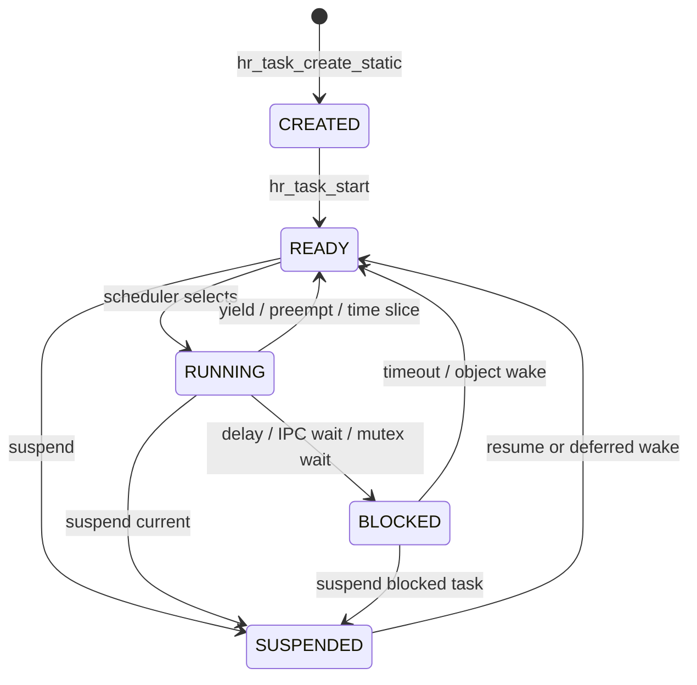

# `11-task-suspend-resume` — Tạm dừng và tiếp tục tác vụ

> **Môi trường:** Target  
> **Source:** `examples/11-task-suspend-resume/main.c`  
> **Trọng tâm:** Administrative suspend/resume

[← Root README](../../README.md)

## Mục lục

- [Mục tiêu và bản chất](#muc-tieu)
- [Build graph và cấu hình](#build-graph)
- [Luồng thực thi](#runtime)
- [API và ownership](#api)
- [Invariant / PASS criteria](#pass)
- [Debug và failure modes](#debug)
- [Validation](#validation)
- [Source map và references](#source-map)

<a id="muc-tieu"></a>
## Mục tiêu và bản chất

Chứng minh suspend task READY/RUNNING/BLOCKED và preserve wake semantics khi event/timeout xảy ra trong lúc suspended.

Example này không được hiểu như một application production. Nó cố ý cô lập một cơ chế để người học nhìn thấy **state transition và scheduling consequence** mà không bị che bởi middleware lớn. Những log/PASS check trong `main.c` là executable documentation: nếu invariant bị vi phạm, example gọi `board_panic()` hoặc trả failure trên host.

<a id="build-graph"></a>
## Build graph và cấu hình

- Environment được CMake khai báo: **Target**.
- Module được link cho example này: `platform`, `task_kernel`, `kernel_runtime`, `kernel_time`.
- Target tham chiếu: `bluepill_f103c8` — STM32F103C8T6 / Cortex-M3 / 72 MHz nominal / USART1 115200 / LED PC13 active-low.

### Compile-time / source constants

| Symbol | Giá trị trong `main.c` |
| --- | --- |
| `WORKER_TASK_PRIORITY` | `1U` |
| `SUPERVISOR_TASK_PRIORITY` | `2U` |
| `BACKGROUND_TASK_PRIORITY` | `4U` |
| `TASK_STACK_WORDS` | `224U` |

### CMake feature overrides

- Example dùng default config trừ những module/definition được khai báo trong `cmake/hairtos_examples.cmake`.

<a id="runtime"></a>
## Luồng thực thi



Để hiểu runtime thật, đọc sơ đồ cùng `main.c` và module source. Các điểm chuyển task state/context không diễn ra trong application code đơn lẻ mà qua kernel + architecture port.

### Các chi tiết quan sát trực tiếp từ example

- Suspend một task đang BLOCKED bởi delay.
- Cho timeout hoàn tất nhưng không đưa task suspended vào ready queue.
- Resume high task và quan sát preemption tức thời.
- Self-suspend rồi resume từ supervisor.
- Administrative suspension tách biệt với wait reason.
- SUSPENDED(BLOCKED) và SUSPENDED(READY).
- Resume phục hồi BLOCKED nếu event chưa hoàn tất, hoặc READY nếu đã hoàn tất.
- Không cho suspend idle task.
- `hairtos/hr_task.h`
- `hairtos/hr_time.h`
- `hr_task_suspend()`
- `hr_task_resume()`
- `hr_task_get_state()`
- `hr_task_delay()`
- `task_kernel`
- `kernel_runtime`
- `kernel_time`
- Timeout không tự làm worker READY khi đang suspended.
- Phần cứng — STM32F103C8T6 Blue Pill — Chạy firmware target.
- Nạp/debug — ST-Link V2 qua SWD — Dùng OpenOCD để flash, verify và reset.
- UART — USART1, PA9 TX / PA10 RX, 115200 8-N-1 — Theo dõi log và trạng thái PASS/FAIL.
- LED — PC13, active-low — Hiển thị heartbeat hoặc trạng thái quan sát.
- `worker` — Priority 1, stack 224 words — Delay 100, bị suspend, sau đó self-suspend.
- `supervisor` — Priority 2, stack 224 words — Điều khiển suspend/resume.

<a id="api"></a>
## API và ownership

API được gọi trực tiếp trong `main.c` (đã trích từ source):

- `board_init()`
- `board_led_toggle()`
- `board_panic()`
- `board_uart_write_line()`
- `board_uart_write_string()`
- `board_uart_write_u32()`
- `hr_kernel_init()`
- `hr_kernel_start()`
- `hr_port_thread_uses_psp()`
- `hr_task_create_static()`
- `hr_task_current()`
- `hr_task_delay()`
- `hr_task_get_state()`
- `hr_task_resume()`
- `hr_task_start()`
- `hr_task_suspend()`
- `hr_time_now()`

Ownership cần nhớ:

- `hr_task_t`, stack, queue/semaphore/mutex/timer object và haievent storage trong examples đều là static/caller-owned.
- API kernel giữ pointer tới storage này sau create, vì vậy lifetime phải kéo dài toàn bộ thời gian object còn active.
- ISR path không được gọi blocking API. API `_from_isr` chỉ làm bounded work và trả `higher_priority_task_woken` để PendSV xử lý switch sau ISR.
- Dynamic haievent event từ pool dùng retain/release; static event không được framework tự free.

<a id="pass"></a>
## Invariant và PASS criteria

- Task được tạo tĩnh bằng caller-owned `hr_task_t` và stack array; kernel không `malloc()` TCB hay stack.
- State machine công khai gồm INVALID → CREATED → READY/RUNNING ↔ BLOCKED và SUSPENDED.
- Base priority là cấu hình gốc; effective priority có thể bị boost bởi mutex priority inheritance.
- Stack được fill bằng `0xA5`; guard word `0xDEADBEEF` dùng cho stack integrity; high-watermark suy ra lượng stack chưa bị chạm.
- Task entry không được return bình thường; initial LR trỏ tới `hr_task_exit_error()` để biến task return thành lỗi kiểm soát.

Các check/log cứng trong source:

- `ERROR: invalid suspend/resume task context.`
- `worker: self-resume PASS at tick=`
- `ERROR: timeout made suspended worker READY.`
- `ERROR: resumed worker did not preempt supervisor.`
- `Suspend/resume task setup failed.`

<a id="debug"></a>
## Debug và failure modes

- Nếu target treo trong `board_panic()`, xem UART log ngay trước đó rồi attach GDB/OpenOCD để kiểm tra current task, PSP/MSP, ready bitmap và fault record nếu diagnostics bật.
- Nếu behavior sai chỉ khi optimize/timing thay đổi, kiểm tra race giữa task/ISR, critical-section scope và việc log UART làm nhiễu thời gian.
- Nếu task không chạy, phân biệt CREATED/READY/BLOCKED/SUSPENDED và kiểm tra task có được `hr_task_start()` hay không.
- Nếu wake không xảy ra, kiểm tra cả object wait list lẫn timeout node; một wake path không được để node stale trong structure còn lại.
- Target log là evidence runtime; build PASS chỉ là evidence compile/link.

<a id="validation"></a>
## Validation

- Example là target-only trong CMake. Môi trường audit không có `arm-none-eabi-gcc`/OpenOCD nên không tuyên bố đã build/flash lại target.
- `make TARGET=bluepill_f103c8 host-tests` đã PASS toàn bộ host suite trong audit tài liệu này.

### Lệnh chuẩn

```bash
make TARGET=bluepill_f103c8 EXAMPLE=11-task-suspend-resume build
make TARGET=bluepill_f103c8 EXAMPLE=11-task-suspend-resume run
make TARGET=bluepill_f103c8 EXAMPLE=11-task-suspend-resume check
```

<a id="source-map"></a>
## Source map và references

- `examples/11-task-suspend-resume/main.c`
- `cmake/hairtos_examples.cmake`
- `kernel/src/hr_task.c`
- `kernel/internal/hr_task_internal.h`
- `kernel/src/hr_kernel.c`
- `tests/host/test_task.c`

### Tài liệu tham khảo

- [Arm Cortex-M3 Technical Reference Manual](https://developer.arm.com/documentation/100165/latest/)
- [Arm Cortex-M3 Devices Generic User Guide](https://developer.arm.com/documentation/dui0552/latest/)

**Nguồn implementation trong repository:**
- `kernel/src/hr_task.c`
- `kernel/internal/hr_task_internal.h`
- `kernel/src/hr_kernel.c`
- `tests/host/test_task.c`
