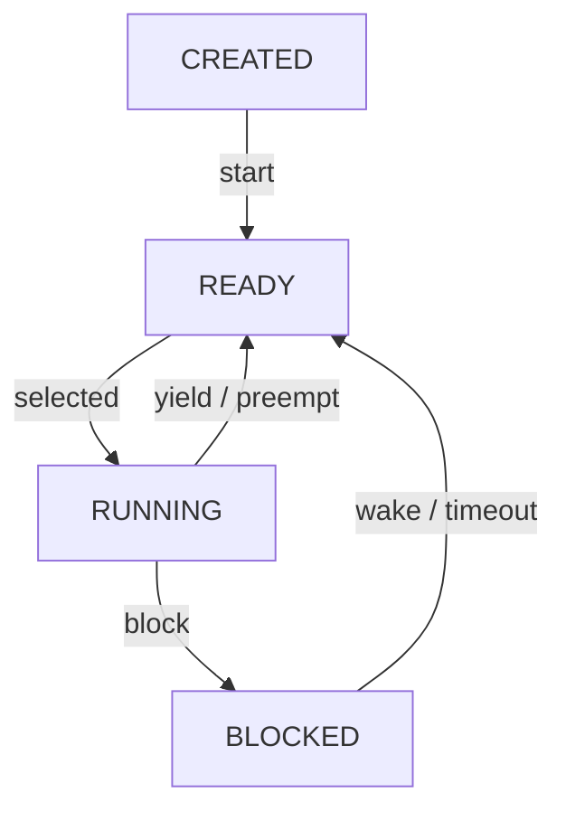
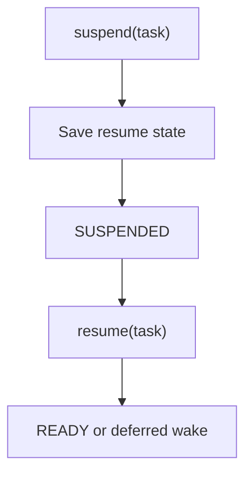

# `11-task-suspend-resume` — Task Suspend and Resume

> **Environment:** Target  
> **Source:** `examples/11-task-suspend-resume/main.c`  
> **Focus:** Administrative suspend/resume

[← Root README](../../README.md)

## Table of Contents

- [Objective and Core Concept](#objective)
- [Build Graph and Configuration](#build-graph)
- [Runtime Flow](#runtime)
- [API and Ownership](#api)
- [Invariant / PASS criteria](#pass)
- [Debugging and Failure Modes](#debug)
- [Validation](#validation)
- [Source Map and References](#source-map)

<a id="objective"></a>
## Objective and Core Concept

Demonstrates suspension of READY/RUNNING/BLOCKED tasks while preserving wake semantics when an event/timeout occurs during suspension.


<a id="build-graph"></a>
## Build Graph and Configuration

- CMake declares this example as a **Target** environment.
- Modules linked for this example: `platform`, `task_kernel`, `kernel_runtime`, `kernel_time`.
- Reference target: `bluepill_f103c8` — STM32F103C8T6 / Cortex-M3 / nominal 72 MHz / USART1 115200 / active-low PC13 LED.

### Compile-time / source constants

| Symbol | Value in `main.c` |
| --- | --- |
| `WORKER_TASK_PRIORITY` | `1U` |
| `SUPERVISOR_TASK_PRIORITY` | `2U` |
| `BACKGROUND_TASK_PRIORITY` | `4U` |
| `TASK_STACK_WORDS` | `224U` |

### CMake feature overrides

- The example uses the default configuration except for modules/definitions explicitly declared in `cmake/hairtos_examples.cmake`.

<a id="runtime"></a>
## Runtime Flow

**Scheduling and blocking states**



**Suspend/resume path**




### Details Observed Directly in the Example

- Suspend a task that is BLOCKED on delay.
- Allow the timeout to complete without placing the suspended task in the ready queue.
- Resume the high-priority task and observe immediate preemption.
- Self-suspend and resume from a supervisor task.
- Administrative suspension is separate from the task's wait reason.
- SUSPENDED(BLOCKED) and SUSPENDED(READY) are distinct conditions.
- Resume restores BLOCKED if the event has not completed, or READY if it has completed.
- The idle task cannot be suspended.
- `hairtos/hr_task.h`
- `hairtos/hr_time.h`
- `hr_task_suspend()`
- `hr_task_resume()`
- `hr_task_get_state()`
- `hr_task_delay()`
- `task_kernel`
- `kernel_runtime`
- `kernel_time`
- Timeout must not make the worker READY while it is suspended.
- Hardware — STM32F103C8T6 Blue Pill — Runs the target firmware.
- Flash/debug — ST-Link V2 over SWD — OpenOCD is used to flash, verify, and reset the target.
- UART — USART1, PA9 TX / PA10 RX, 115200 8-N-1 — Observes logs and PASS/FAIL status.
- LED — PC13, active-low — Displays heartbeat or observable status.
- `worker` — Priority 1, stack 224 words — Delays 100 ticks, is suspended, then later self-suspends.
- `supervisor` — Priority 2, stack 224 words — Controls suspend/resume.

<a id="api"></a>
## API and Ownership

APIs called directly from `main.c` (extracted from source):

- `board_init()`
- `board_led_toggle()`
- `board_panic()`
- `board_uart_write_line()`
- `board_uart_write_string()`
- `board_uart_write_u32()`
- `hr_kernel_init()`
- `hr_kernel_start()`
- `hr_port_thread_uses_psp()`
- `hr_task_create_static()`
- `hr_task_current()`
- `hr_task_delay()`
- `hr_task_get_state()`
- `hr_task_resume()`
- `hr_task_start()`
- `hr_task_suspend()`
- `hr_time_now()`

Ownership rules to keep in mind:

- `hr_task_t`, stacks, queue/semaphore/mutex/timer objects, and haievent storage in the examples are all static/caller-owned.
- Kernel APIs retain pointers to this storage after creation, so the storage lifetime must cover the entire period in which the object remains active.
- ISR paths must not call blocking APIs. `_from_isr` APIs perform bounded work and return `higher_priority_task_woken` so PendSV can perform any required switch after ISR exit.
- Dynamic haievent events allocated from a pool use retain/release semantics; static events are not freed automatically by the framework.

<a id="pass"></a>
## Invariants and PASS Criteria

- Tasks are created statically from caller-owned `hr_task_t` objects and stack arrays; the kernel does not `malloc()` TCBs or stacks.
- The public task-state model is INVALID → CREATED → READY/RUNNING ↔ BLOCKED, plus SUSPENDED.
- Base priority is the configured priority; effective priority may be boosted by mutex priority inheritance.
- Stacks are filled with `0xA5`; guard word `0xDEADBEEF` supports stack-integrity checks, and high-water-mark analysis estimates untouched stack space.
- A task entry function must not return normally; the initial LR points to `hr_task_exit_error()` so a returned task becomes a controlled error.

Hard-coded checks/logs in the source:

- `ERROR: invalid suspend/resume task context.`
- `worker: self-resume PASS at tick=`
- `ERROR: timeout made suspended worker READY.`
- `ERROR: resumed worker did not preempt supervisor.`
- `Suspend/resume task setup failed.`

<a id="debug"></a>
## Debugging and Failure Modes

- A suspended task is still selected by the scheduler: inspect removal from ready/wait structures and state transitions.
- Incorrect resume state: inspect `suspended_resume_state` and deferred-wakeup semantics.
- Wake occurs while the task is SUSPENDED: the event must be recorded according to the contract rather than making the task run immediately.
- Suspending the current task must lead to a valid reschedule.

<a id="validation"></a>
## Validation

- This example is target-only in CMake; host evidence does not replace ARM cross-build, OpenOCD, and hardware validation.
- Host validation baseline: `make TARGET=bluepill_f103c8 host-tests` passes the entire suite.

### Standard Commands

```bash
make TARGET=bluepill_f103c8 EXAMPLE=11-task-suspend-resume build
make TARGET=bluepill_f103c8 EXAMPLE=11-task-suspend-resume run
make TARGET=bluepill_f103c8 EXAMPLE=11-task-suspend-resume check
```

<a id="source-map"></a>
## Source Map and References

- `examples/11-task-suspend-resume/main.c`
- `cmake/hairtos_examples.cmake`
- `kernel/src/hr_task.c`
- `kernel/internal/hr_task_internal.h`
- `kernel/src/hr_kernel.c`
- `tests/host/test_task.c`

### References

- [Arm Cortex-M3 Technical Reference Manual](https://developer.arm.com/documentation/100165/latest/)
- [Arm Cortex-M3 Devices Generic User Guide](https://developer.arm.com/documentation/dui0552/latest/)

**Implementation sources in the repository:**
- `kernel/src/hr_task.c`
- `kernel/internal/hr_task_internal.h`
- `kernel/src/hr_kernel.c`
- `tests/host/test_task.c`
