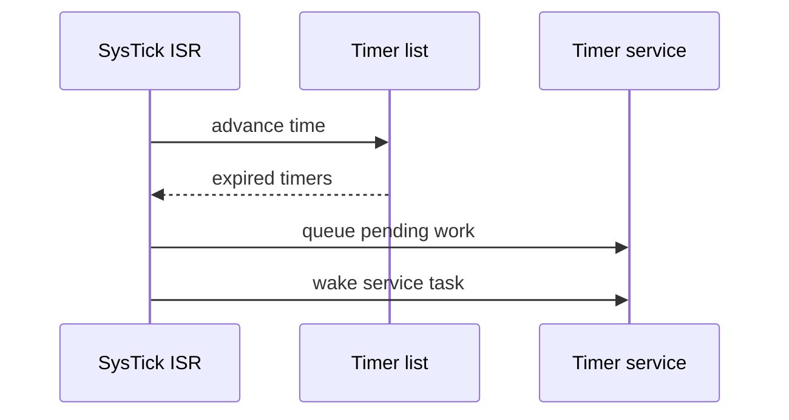
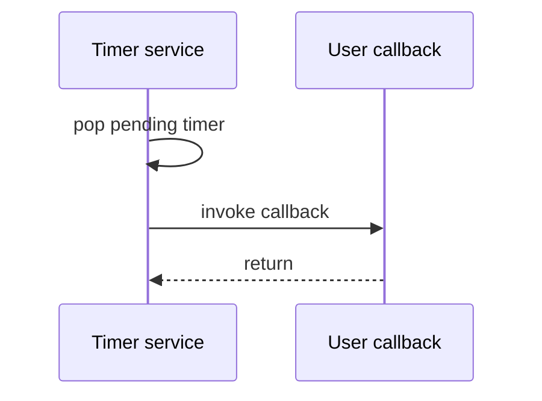

# `12-software-timer` — Software Timer Service

> **Environment:** Target  
> **Source:** `examples/12-software-timer/main.c`  
> **Focus:** Timer-service task

[← Root README](../../README.md)

## Table of Contents

- [Objective and Core Concept](#objective)
- [Build Graph and Configuration](#build-graph)
- [Runtime Flow](#runtime)
- [API and Ownership](#api)
- [Invariant / PASS criteria](#pass)
- [Debugging and Failure Modes](#debug)
- [Validation](#validation)
- [Source Map and References](#source-map)

<a id="objective"></a>
## Objective and Core Concept

Expiry is processed from the tick ISR, but callbacks run in the timer task; the demo exercises one-shot/periodic/reset/change/stop semantics.


<a id="build-graph"></a>
## Build Graph and Configuration

- CMake declares this example as a **Target** environment.
- Modules linked for this example: `platform`, `task_kernel`, `kernel_runtime`, `kernel_time`, `semaphore`, `timer`.
- Reference target: `bluepill_f103c8` — STM32F103C8T6 / Cortex-M3 / nominal 72 MHz / USART1 115200 / active-low PC13 LED.

### Compile-time / source constants

| Symbol | Value in `main.c` |
| --- | --- |
| `CONTROL_TASK_PRIORITY` | `3U` |
| `CONTROL_TASK_STACK_WORDS` | `224U` |

### CMake feature overrides

- Software timers are enabled for this build; the timer-service task priority is overridden to 1.

<a id="runtime"></a>
## Runtime Flow

**Expiry handoff**



**Callback execution**




### Details Observed Directly in the Example

- Create static timers.
- Start, reset, change period, and stop timers.
- Distinguish timer expiration in SysTick from callback execution in task context.
- Verify one-shot callbacks occur once and periodic timers re-arm automatically.
- Timer deadlines are kept in sorted order.
- Pending-callback list plus timer-service semaphore.
- Callbacks do not execute in ISR context.
- Periodic rearm is based on the deadline to limit drift.
- `hairtos/hr_timer.h`
- `hairtos/hr_time.h`
- `hr_timer_create_static()`
- `hr_timer_start()`
- `hr_timer_reset()`
- `hr_timer_change_period()`
- `hr_timer_stop()`
- `task_kernel`
- `kernel_runtime`
- `kernel_time`
- Hardware — STM32F103C8T6 Blue Pill — Runs the target firmware.
- Flash/debug — ST-Link V2 over SWD — OpenOCD is used to flash, verify, and reset the target.
- UART — USART1, PA9 TX / PA10 RX, 115200 8-N-1 — Observes logs and PASS/FAIL status.
- LED — PC13, active-low — Displays heartbeat or observable status.
- `timer-control` — Priority 3, stack 224 words — Controls start/reset/stop.
- `periodic` — 250 ticks → 500 ticks, auto reload — Toggles LED and counts callbacks.

<a id="api"></a>
## API and Ownership

APIs called directly from `main.c` (extracted from source):

- `board_init()`
- `board_led_toggle()`
- `board_panic()`
- `board_uart_write_line()`
- `board_uart_write_string()`
- `board_uart_write_u32()`
- `hr_kernel_init()`
- `hr_kernel_start()`
- `hr_port_thread_uses_psp()`
- `hr_task_create_static()`
- `hr_task_current()`
- `hr_task_delay()`
- `hr_task_start()`
- `hr_time_now()`
- `hr_timer_change_period()`
- `hr_timer_create_static()`
- `hr_timer_reset()`
- `hr_timer_start()`
- `hr_timer_stop()`

Ownership rules to keep in mind:

- `hr_task_t`, stacks, queue/semaphore/mutex/timer objects, and haievent storage in the examples are all static/caller-owned.
- Kernel APIs retain pointers to this storage after creation, so the storage lifetime must cover the entire period in which the object remains active.
- ISR paths must not call blocking APIs. `_from_isr` APIs perform bounded work and return `higher_priority_task_woken` so PendSV can perform any required switch after ISR exit.
- Dynamic haievent events allocated from a pool use retain/release semantics; static events are not freed automatically by the framework.

<a id="pass"></a>
## Invariants and PASS Criteria

- A timer is static opaque storage containing a name, period, `auto_reload`, callback, argument, and timeout node.
- The timer-service task is created lazily when the timer subsystem is first initialized and uses priority/stack settings from configuration.
- The expiry ISR path only updates state/pending information and wakes the service task; callbacks never execute in Handler mode.
- A one-shot timer becomes inactive after expiry; a periodic timer is re-armed for its configured period.
- `stop/reset/change_period` deliberately handle both an active timeout node and any pending callbacks.

Hard-coded checks/logs in the source:

- `ERROR: software timer callback count mismatch.`
- `Software timer service: PASS`
- `Software timer setup failed.`

<a id="debug"></a>
## Debugging and Failure Modes

- Callback running in the SysTick ISR violates the contract; expiry should only enqueue pending work and wake the timer-service task.
- Timer expires but callback does not run: inspect timeout list, pending node/count, and service-task wakeup.
- Periodic timer drifts/loses expirations: inspect rearm semantics and pending handling.
- A callback may call task-context APIs because it runs in the timer-service task, not in ISR context.

<a id="validation"></a>
## Validation

- This example is target-only in CMake; host evidence does not replace ARM cross-build, OpenOCD, and hardware validation.
- Host validation baseline: `make TARGET=bluepill_f103c8 host-tests` passes the entire suite.

### Standard Commands

```bash
make TARGET=bluepill_f103c8 EXAMPLE=12-software-timer build
make TARGET=bluepill_f103c8 EXAMPLE=12-software-timer run
make TARGET=bluepill_f103c8 EXAMPLE=12-software-timer check
```

<a id="source-map"></a>
## Source Map and References

- `examples/12-software-timer/main.c`
- `cmake/hairtos_examples.cmake`
- `kernel/src/hr_timer.c`
- `kernel/internal/hr_timer_internal.h`
- `tests/host/test_timer.c`

### References

- [Arm Cortex-M3 Technical Reference Manual](https://developer.arm.com/documentation/100165/latest/)
- [Arm Cortex-M3 Devices Generic User Guide](https://developer.arm.com/documentation/dui0552/latest/)

**Implementation sources in the repository:**
- `kernel/src/hr_timer.c`
- `kernel/internal/hr_timer_internal.h`
- `tests/host/test_timer.c`
