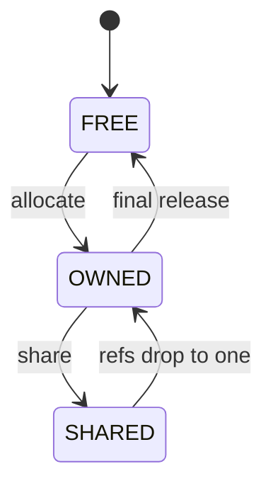
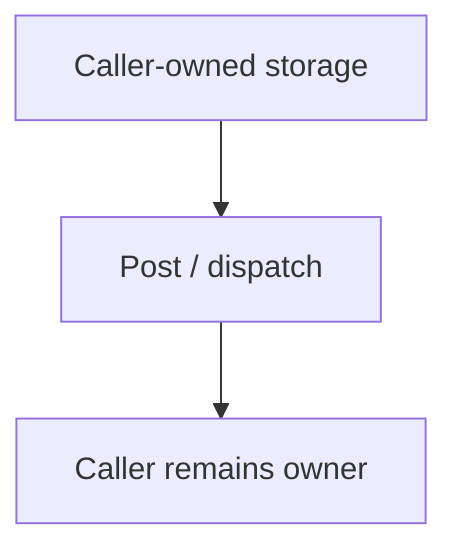

# `13-01-event-post` — Posting haievent Events from an ISR

> **Environment:** Target  
> **Source:** `examples/13-01-event-post/main.c`  
> **Focus:** Event posting from ISR context

[← Root README](../../README.md)

## Table of Contents

- [Objective and Core Concept](#objective)
- [Build Graph and Configuration](#build-graph)
- [Runtime Flow](#runtime)
- [API and Ownership](#api)
- [Invariant / PASS criteria](#pass)
- [Debugging and Failure Modes](#debug)
- [Validation](#validation)
- [Source Map and References](#source-map)

<a id="objective"></a>
## Objective and Core Concept

Connect ISR-safe event production to an Active Object queue and RTC dispatch.


<a id="build-graph"></a>
## Build Graph and Configuration

- CMake declares this example as a **Target** environment.
- Modules linked for this example: `platform`, `task_kernel`, `kernel_runtime`, `kernel_time`, `context`, `queue`, `semaphore`, `timer`, `haievent`.
- Reference target: `bluepill_f103c8` — STM32F103C8T6 / Cortex-M3 / nominal 72 MHz / USART1 115200 / active-low PC13 LED.

### Compile-time / source constants

| Symbol | Value in `main.c` |
| --- | --- |
| `AO_PRIORITY` | `2U` |
| `TRIGGER_PRIORITY` | `4U` |
| `STACK_WORDS` | `224U` |
| `QUEUE_LENGTH` | `4U` |
| `STM32F1_EXTI_BASE` | `0x40010400UL` |
| `STM32F1_NVIC_ISER0` | `0xE000E100UL` |
| `STM32F1_EXTI_IMR` | `STM32F1_REG32(STM32F1_EXTI_BASE + 0x00UL)` |
| `STM32F1_EXTI_SWIER` | `STM32F1_REG32(STM32F1_EXTI_BASE + 0x10UL)` |
| `STM32F1_EXTI_PR` | `STM32F1_REG32(STM32F1_EXTI_BASE + 0x14UL)` |
| `STM32F1_NVIC_ISER0_REG` | `STM32F1_REG32(STM32F1_NVIC_ISER0)` |
| `STM32F1_EXTI_LINE0` | `(1UL << 0U)` |
| `STM32F1_EXTI0_IRQ_BIT` | `(1UL << 6U)` |

### CMake feature overrides

- Software timers are enabled for this build; the timer-service task priority is overridden to 1.

<a id="runtime"></a>
## Runtime Flow

**Dynamic event lifetime**



Additional retain/release operations can change the reference count while the event remains in `SHARED`; they do not require a state transition.

**Static event ownership**




### Details Observed Directly in the Example

- Initialize an immutable static event.
- Post an event from ISR context into the AO queue.
- Wake a higher-priority AO and yield after ISR exit.
- Keep run-to-completion dispatch outside ISR context.
- Active Object = task + queue + state machine.
- A static event does not need to be released to a pool.
- The ISR only enqueues; the AO task performs dispatch.
- Higher-priority wakeup uses `hr_yield_from_isr`.
- `haievent/haievent.h`
- `hairtos/hr_context.h`
- `he_event_init_static()`
- `he_active_create_static()`
- `he_active_post_from_isr()`
- `hr_yield_from_isr()`
- `context`
- `haievent`
- IRQ count increases and the AO receives the matching number of events.
- The state handler does not execute in ISR context.
- Hardware — STM32F103C8T6 Blue Pill — Runs the target firmware.
- Flash/debug — ST-Link V2 over SWD — OpenOCD is used to flash, verify, and reset the target.
- UART — USART1, PA9 TX / PA10 RX, 115200 8-N-1 — Observes logs and PASS/FAIL status.
- LED — PC13, active-low — Displays heartbeat or observable status.
- `irq-receiver-AO` — Priority 2, stack 224, queue 4 — Receives `SIGNAL_IRQ_SAMPLE`.
- `irq-trigger` — Priority 4, stack 224 — Software-triggers EXTI0 every 500 ticks.

<a id="api"></a>
## API and Ownership

APIs called directly from `main.c` (extracted from source):

- `board_init()`
- `board_led_toggle()`
- `board_panic()`
- `board_uart_write_line()`
- `board_uart_write_string()`
- `board_uart_write_u32()`
- `he_active_create_static()`
- `he_active_post_from_isr()`
- `he_event_init_static()`
- `hr_kernel_init()`
- `hr_kernel_start()`
- `hr_task_create_static()`
- `hr_task_delay()`
- `hr_task_start()`
- `hr_time_now()`
- `hr_yield_from_isr()`

Ownership rules to keep in mind:

- `hr_task_t`, stacks, queue/semaphore/mutex/timer objects, and haievent storage in the examples are all static/caller-owned.
- Kernel APIs retain pointers to this storage after creation, so the storage lifetime must cover the entire period in which the object remains active.
- ISR paths must not call blocking APIs. `_from_isr` APIs perform bounded work and return `higher_priority_task_woken` so PendSV can perform any required switch after ISR exit.
- Dynamic haievent events allocated from a pool use retain/release semantics; static events are not freed automatically by the framework.

<a id="pass"></a>
## Invariants and PASS Criteria

- The event pool is a caller-owned arena partitioned into fixed-size blocks; it does not use a general-purpose heap.
- A dynamic event initializes `reference_count` and returns to the pool only when the count reaches zero.
- `he_active_post` retains before enqueue; the AO releases after dispatch; a failed post must roll back the retained reference.
- Publish/subscribe snapshots the subscriber list and then posts the shared event; publish consumes the publisher's dynamic reference even if no subscriber receives it.
- The reference count is `uint16_t` and includes overflow protection.

<a id="debug"></a>
## Debugging and Failure Modes

- Dynamic-event leak/double free: inspect reference counting across allocate → post/retain → dispatch/release.
- ISR post fails: inspect AO queue capacity and the `_from_isr` contract.
- Static events are not freed by the framework; storage remains caller-owned.
- Queue failure must return a clear status without corrupting ownership bookkeeping.

<a id="validation"></a>
## Validation

- This example is target-only in CMake; host evidence does not replace ARM cross-build, OpenOCD, and hardware validation.
- Host validation baseline: `make TARGET=bluepill_f103c8 host-tests` passes the entire suite.

### Standard Commands

```bash
make TARGET=bluepill_f103c8 EXAMPLE=13-01-event-post build
make TARGET=bluepill_f103c8 EXAMPLE=13-01-event-post run
make TARGET=bluepill_f103c8 EXAMPLE=13-01-event-post check
```

<a id="source-map"></a>
## Source Map and References

- `examples/13-01-event-post/main.c`
- `cmake/hairtos_examples.cmake`
- `haievent/src/he_event.c`
- `haievent/src/he_active.c`
- `haievent/src/he_pubsub.c`
- `tests/host/test_haievent.c`

### References


**Implementation sources in the repository:**
- `haievent/src/he_event.c`
- `haievent/src/he_active.c`
- `haievent/src/he_pubsub.c`
- `tests/host/test_haievent.c`
