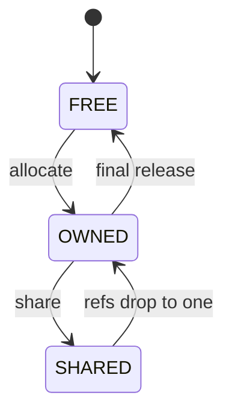
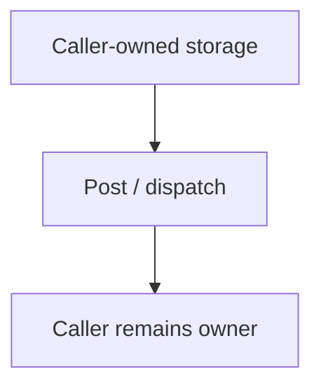

# `13-01-event-post` — Đăng sự kiện haievent từ ISR

> **Môi trường:** Target  
> **Source:** `examples/13-01-event-post/main.c`  
> **Trọng tâm:** Event post từ ISR

[← Root README](../../README.md)

## Mục lục

- [Mục tiêu và bản chất](#muc-tieu)
- [Build graph và cấu hình](#build-graph)
- [Luồng thực thi](#runtime)
- [API và ownership](#api)
- [Invariant / PASS criteria](#pass)
- [Debug và failure modes](#debug)
- [Validation](#validation)
- [Source map và references](#source-map)

<a id="muc-tieu"></a>
## Mục tiêu và bản chất

Nối ISR-safe event production với Active Object queue và RTC dispatch.


<a id="build-graph"></a>
## Build graph và cấu hình

- Environment được CMake khai báo: **Target**.
- Module được link cho example này: `platform`, `task_kernel`, `kernel_runtime`, `kernel_time`, `context`, `queue`, `semaphore`, `timer`, `haievent`.
- Target tham chiếu: `bluepill_f103c8` — STM32F103C8T6 / Cortex-M3 / 72 MHz nominal / USART1 115200 / LED PC13 active-low.

### Compile-time / source constants

| Symbol | Giá trị trong `main.c` |
| --- | --- |
| `AO_PRIORITY` | `2U` |
| `TRIGGER_PRIORITY` | `4U` |
| `STACK_WORDS` | `224U` |
| `QUEUE_LENGTH` | `4U` |
| `STM32F1_EXTI_BASE` | `0x40010400UL` |
| `STM32F1_NVIC_ISER0` | `0xE000E100UL` |
| `STM32F1_EXTI_IMR` | `STM32F1_REG32(STM32F1_EXTI_BASE + 0x00UL)` |
| `STM32F1_EXTI_SWIER` | `STM32F1_REG32(STM32F1_EXTI_BASE + 0x10UL)` |
| `STM32F1_EXTI_PR` | `STM32F1_REG32(STM32F1_EXTI_BASE + 0x14UL)` |
| `STM32F1_NVIC_ISER0_REG` | `STM32F1_REG32(STM32F1_NVIC_ISER0)` |
| `STM32F1_EXTI_LINE0` | `(1UL << 0U)` |
| `STM32F1_EXTI0_IRQ_BIT` | `(1UL << 6U)` |

### CMake feature overrides

- Software timer được bật cho build này; timer-service task priority được override thành 1.

<a id="runtime"></a>
## Luồng thực thi

**Dynamic event lifetime**



Additional retain/release operations can change the reference count while the event remains in `SHARED`; they do not require a state transition.

**Static event ownership**




### Các chi tiết quan sát trực tiếp từ example

- Khởi tạo immutable static event.
- Post event từ ISR vào AO queue.
- Đánh thức AO priority cao và yield sau ISR.
- Giữ run-to-completion dispatch ngoài ISR.
- Active Object = tác vụ + queue + máy trạng thái.
- Static event không cần release về pool.
- ISR chỉ enqueue; AO task dispatch.
- Higher-priority wake-up dùng `hr_yield_from_isr`.
- `haievent/haievent.h`
- `hairtos/hr_context.h`
- `he_event_init_static()`
- `he_active_create_static()`
- `he_active_post_from_isr()`
- `hr_yield_from_isr()`
- `context`
- `haievent`
- IRQ count tăng và AO nhận đúng số event.
- State handler không chạy trong ISR.
- Phần cứng — STM32F103C8T6 Blue Pill — Chạy firmware target.
- Nạp/debug — ST-Link V2 qua SWD — Dùng OpenOCD để flash, verify và reset.
- UART — USART1, PA9 TX / PA10 RX, 115200 8-N-1 — Theo dõi log và trạng thái PASS/FAIL.
- LED — PC13, active-low — Hiển thị heartbeat hoặc trạng thái quan sát.
- `irq-receiver-AO` — Priority 2, stack 224, queue 4 — Nhận `SIGNAL_IRQ_SAMPLE`.
- `irq-trigger` — Priority 4, stack 224 — Software-trigger EXTI0 mỗi 500 ticks.

<a id="api"></a>
## API và ownership

API được gọi trực tiếp trong `main.c` (đã trích từ source):

- `board_init()`
- `board_led_toggle()`
- `board_panic()`
- `board_uart_write_line()`
- `board_uart_write_string()`
- `board_uart_write_u32()`
- `he_active_create_static()`
- `he_active_post_from_isr()`
- `he_event_init_static()`
- `hr_kernel_init()`
- `hr_kernel_start()`
- `hr_task_create_static()`
- `hr_task_delay()`
- `hr_task_start()`
- `hr_time_now()`
- `hr_yield_from_isr()`

Ownership cần nhớ:

- `hr_task_t`, stack, queue/semaphore/mutex/timer object và haievent storage trong examples đều là static/caller-owned.
- API kernel giữ pointer tới storage này sau create, vì vậy lifetime phải kéo dài toàn bộ thời gian object còn active.
- ISR path không được gọi blocking API. API `_from_isr` chỉ làm bounded work và trả `higher_priority_task_woken` để PendSV xử lý switch sau ISR.
- Dynamic haievent event từ pool dùng retain/release; static event không được framework tự free.

<a id="pass"></a>
## Invariant và PASS criteria

- Event pool là caller-owned arena chia block cố định; không dùng general heap.
- Dynamic event khởi tạo reference_count và chỉ quay về pool khi count giảm về 0.
- `he_active_post` retain trước khi enqueue; AO release sau dispatch; post thất bại phải rollback reference.
- Publish/subscribe snapshot subscriber list rồi post shared event; publish tiêu thụ reference động của publisher kể cả không subscriber nào nhận.
- Reference count là uint16_t và có overflow guard.

<a id="debug"></a>
## Debug và failure modes

- Dynamic event leak/double free: kiểm tra reference count qua allocate → post/retain → dispatch/release.
- ISR post fail: kiểm tra AO queue capacity và `_from_isr` contract.
- Static event không được framework free; storage vẫn thuộc caller.
- Queue failure phải trả status rõ và không làm mất ownership bookkeeping.

<a id="validation"></a>
## Validation

- Example là target-only trong CMake; host evidence không thay thế ARM cross-build, OpenOCD và hardware validation.
- Host validation baseline: `make TARGET=bluepill_f103c8 host-tests` PASS toàn bộ suite.

### Lệnh chuẩn

```bash
make TARGET=bluepill_f103c8 EXAMPLE=13-01-event-post build
make TARGET=bluepill_f103c8 EXAMPLE=13-01-event-post run
make TARGET=bluepill_f103c8 EXAMPLE=13-01-event-post check
```

<a id="source-map"></a>
## Source map và references

- `examples/13-01-event-post/main.c`
- `cmake/hairtos_examples.cmake`
- `haievent/src/he_event.c`
- `haievent/src/he_active.c`
- `haievent/src/he_pubsub.c`
- `tests/host/test_haievent.c`

### Tài liệu tham khảo


**Nguồn implementation trong repository:**
- `haievent/src/he_event.c`
- `haievent/src/he_active.c`
- `haievent/src/he_pubsub.c`
- `tests/host/test_haievent.c`
