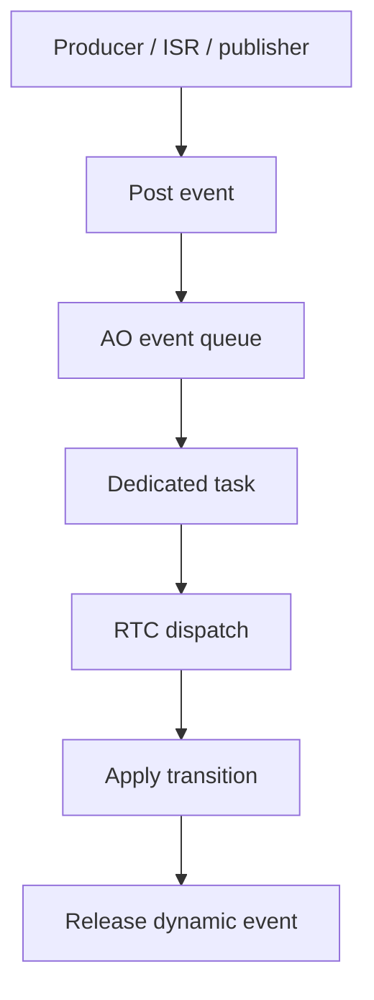

# `13-02-active-object` — Active Object Ping–Pong

> **Environment:** Target  
> **Source:** `examples/13-02-active-object/main.c`  
> **Focus:** Active Object ping-pong

[← Root README](../../README.md)

## Table of Contents

- [Objective and Core Concept](#objective)
- [Build Graph and Configuration](#build-graph)
- [Runtime Flow](#runtime)
- [API and Ownership](#api)
- [Invariant / PASS criteria](#pass)
- [Debugging and Failure Modes](#debug)
- [Validation](#validation)
- [Source Map and References](#source-map)

<a id="objective"></a>
## Objective and Core Concept

Two independent AOs, each composed of a task + queue + state machine; event ownership flows through post/dispatch/release.


<a id="build-graph"></a>
## Build Graph and Configuration

- CMake declares this example as a **Target** environment.
- Modules linked for this example: `platform`, `task_kernel`, `kernel_runtime`, `kernel_time`, `context`, `queue`, `semaphore`, `timer`, `haievent`.
- Reference target: `bluepill_f103c8` — STM32F103C8T6 / Cortex-M3 / nominal 72 MHz / USART1 115200 / active-low PC13 LED.

### Compile-time / source constants

| Symbol | Value in `main.c` |
| --- | --- |
| `STACK_WORDS` | `224U` |
| `QUEUE_LENGTH` | `4U` |

### CMake feature overrides

- Software timers are enabled for this build; the timer-service task priority is overridden to 1.

<a id="runtime"></a>
## Runtime Flow




### Details Observed Directly in the Example

- Understand Active Object encapsulation.
- Use a separate state-machine context for each actor.
- Post events between two AOs without sharing control flow.
- Observe run-to-completion and queue-driven scheduling.
- Each AO has a task, stack, queue, and state machine.
- Static PING/PONG events are reused.
- Context stores the peer, reply event, and counter.
- The starter task only kicks off the event chain.
- `haievent/haievent.h`
- `he_active_create_static()`
- `he_active_post()`
- `he_state_machine_context()`
- `haievent`
- Both AOs receive ENTRY.
- Ping and pong counters increase alternately.
- No queue-post failure occurs.
- Only one AO runs: inspect the peer pointer or reply event.
- Queue fills too quickly: UART is too slow or the producer loop is not being regulated by scheduling.
- Hardware — STM32F103C8T6 Blue Pill — Runs the target firmware.
- Flash/debug — ST-Link V2 over SWD — OpenOCD is used to flash, verify, and reset the target.
- UART — USART1, PA9 TX / PA10 RX, 115200 8-N-1 — Observes logs and PASS/FAIL status.
- LED — PC13, active-low — Displays heartbeat or observable status.
- `ping-AO` — Priority 2, stack 224, queue 4 — Handles PING, then posts PONG.
- `pong-AO` — Priority 3, stack 224, queue 4 — Handles PONG, then posts PING.

<a id="api"></a>
## API and Ownership

APIs called directly from `main.c` (extracted from source):

- `board_init()`
- `board_panic()`
- `board_uart_write_line()`
- `board_uart_write_string()`
- `board_uart_write_u32()`
- `he_active_create_static()`
- `he_active_post()`
- `he_event_init_static()`
- `he_state_machine_context()`
- `hr_kernel_init()`
- `hr_kernel_start()`
- `hr_task_create_static()`
- `hr_task_delay()`
- `hr_task_start()`

Ownership rules to keep in mind:

- `hr_task_t`, stacks, queue/semaphore/mutex/timer objects, and haievent storage in the examples are all static/caller-owned.
- Kernel APIs retain pointers to this storage after creation, so the storage lifetime must cover the entire period in which the object remains active.
- ISR paths must not call blocking APIs. `_from_isr` APIs perform bounded work and return `higher_priority_task_woken` so PendSV can perform any required switch after ISR exit.
- Dynamic haievent events allocated from a pool use retain/release semantics; static events are not freed automatically by the framework.

<a id="pass"></a>
## Invariants and PASS Criteria

- An AO runs run-to-completion: it dequeues one event, completes state-handler dispatch/transition processing, then receives the next event.
- The AO queue uses a kernel queue backed by a caller-supplied array of event pointers.
- The AO task starts during creation; the state machine is initialized before entering the event-receive loop.
- Dynamic events are released after each dispatch; static events remain caller-owned.
- v1 uses one task per AO and provides no shared executor.

<a id="debug"></a>
## Debugging and Failure Modes

- AO does not dispatch: inspect the dedicated hairtos task, AO queue, and startup order.
- Ping-pong stops: inspect post status, queue capacity, and RTC handler return values.
- Dynamic-event ownership must be released after dispatch; static events remain caller-owned.
- AO priority is scheduled by hairtos exactly like a normal task priority.

<a id="validation"></a>
## Validation

- This example is target-only in CMake; host evidence does not replace ARM cross-build, OpenOCD, and hardware validation.
- Host validation baseline: `make TARGET=bluepill_f103c8 host-tests` passes the entire suite.

### Standard Commands

```bash
make TARGET=bluepill_f103c8 EXAMPLE=13-02-active-object build
make TARGET=bluepill_f103c8 EXAMPLE=13-02-active-object run
make TARGET=bluepill_f103c8 EXAMPLE=13-02-active-object check
```

<a id="source-map"></a>
## Source Map and References

- `examples/13-02-active-object/main.c`
- `cmake/hairtos_examples.cmake`
- `haievent/src/he_active.c`
- `haievent/internal/he_internal.h`
- `haievent/src/he_state_machine.c`
- `kernel/src/hr_queue.c`

### References


**Implementation sources in the repository:**
- `haievent/src/he_active.c`
- `haievent/internal/he_internal.h`
- `haievent/src/he_state_machine.c`
- `kernel/src/hr_queue.c`
