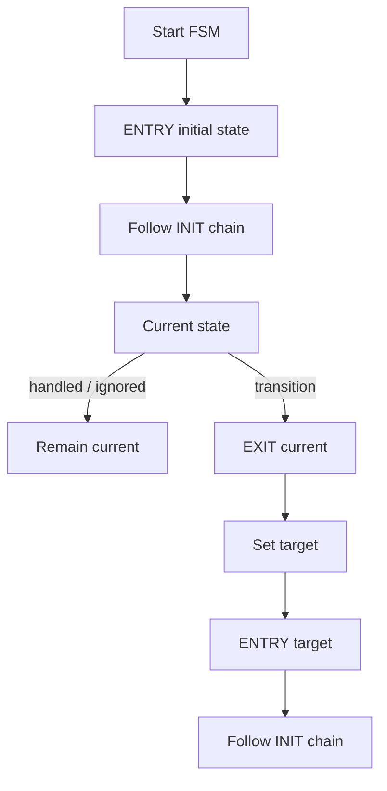

# `13-03-flat-state-machine` — Máy trạng thái phẳng

> **Môi trường:** Target  
> **Source:** `examples/13-03-flat-state-machine/main.c`  
> **Trọng tâm:** Flat FSM semantics

[← Root README](../../README.md)

## Mục lục

- [Mục tiêu và bản chất](#muc-tieu)
- [Build graph và cấu hình](#build-graph)
- [Luồng thực thi](#runtime)
- [API và ownership](#api)
- [Invariant / PASS criteria](#pass)
- [Debug và failure modes](#debug)
- [Validation](#validation)
- [Source map và references](#source-map)

<a id="muc-tieu"></a>
## Mục tiêu và bản chất

ENTRY/EXIT/INIT và transition được quan sát rõ mà chưa có Active Object concurrency.


<a id="build-graph"></a>
## Build graph và cấu hình

- Environment được CMake khai báo: **Target**.
- Module được link cho example này: `platform`, `task_kernel`, `kernel_runtime`, `kernel_time`, `context`, `queue`, `semaphore`, `timer`, `haievent`.
- Target tham chiếu: `bluepill_f103c8` — STM32F103C8T6 / Cortex-M3 / 72 MHz nominal / USART1 115200 / LED PC13 active-low.

### Compile-time / source constants

| Symbol | Giá trị trong `main.c` |
| --- | --- |
| `STACK_WORDS` | `224U` |
| `QUEUE_LENGTH` | `4U` |

### CMake feature overrides

- Software timer được bật cho build này; timer-service task priority được override thành 1.

<a id="runtime"></a>
## Luồng thực thi




### Các chi tiết quan sát trực tiếp từ example

- Viết state handler trả về HANDLED/IGNORED/TRANSITION.
- Quan sát thứ tự EXIT → đổi current state → ENTRY.
- Kết hợp state machine với AO queue.
- Giữ state transition run-to-completion.
- Flat state machine không có parent/child state.
- Reserved signals `HE_SIG_ENTRY` và `HE_SIG_EXIT`.
- `he_state_transition()` chỉ yêu cầu transition; framework thực hiện sequence.
- LED state phản ánh current state.
- `haievent/haievent.h`
- `he_state_transition()`
- `he_active_post()`
- `he_event_init_static()`
- `haievent`
- Mỗi transition có EXIT trước ENTRY.
- LED khớp state ON/OFF.
- Có PASS sau sáu toggle.
- ENTRY thiếu: framework transition sequence sai.
- LED/state lệch: logic handler hoặc active-low board API.
- Phần cứng — STM32F103C8T6 Blue Pill — Chạy firmware target.
- Nạp/debug — ST-Link V2 qua SWD — Dùng OpenOCD để flash, verify và reset.
- UART — USART1, PA9 TX / PA10 RX, 115200 8-N-1 — Theo dõi log và trạng thái PASS/FAIL.
- LED — PC13, active-low — Hiển thị heartbeat hoặc trạng thái quan sát.
- `switch-AO` — Priority 2, stack 224, queue 4 — State ban đầu OFF.
- `toggle-controller` — Priority 3, stack 224 — Post sáu TOGGLE event mỗi 400 ticks.

<a id="api"></a>
## API và ownership

API được gọi trực tiếp trong `main.c` (đã trích từ source):

- `board_init()`
- `board_led_off()`
- `board_led_on()`
- `board_panic()`
- `board_uart_write_line()`
- `he_active_create_static()`
- `he_active_post()`
- `he_event_init_static()`
- `he_state_transition()`
- `hr_kernel_init()`
- `hr_kernel_start()`
- `hr_task_create_static()`
- `hr_task_delay()`
- `hr_task_start()`

Ownership cần nhớ:

- `hr_task_t`, stack, queue/semaphore/mutex/timer object và haievent storage trong examples đều là static/caller-owned.
- API kernel giữ pointer tới storage này sau create, vì vậy lifetime phải kéo dài toàn bộ thời gian object còn active.
- ISR path không được gọi blocking API. API `_from_isr` chỉ làm bounded work và trả `higher_priority_task_woken` để PendSV xử lý switch sau ISR.
- Dynamic haievent event từ pool dùng retain/release; static event không được framework tự free.

<a id="pass"></a>
## Invariant và PASS criteria

- Reserved signals 1..4 dành cho ENTRY, EXIT, INIT, TIMEOUT; user signal bắt đầu từ 32.
- State handler trả HANDLED, IGNORED hoặc TRANSITION.
- Transition giữa state thực hiện EXIT old → current=target → ENTRY target → INIT chain.
- INIT transition loop được bound bởi `HE_CFG_MAX_INIT_TRANSITIONS=8` để tránh cycle vô hạn.
- Hierarchical parent propagation/history/defer chưa có trong v1.

Các check/log cứng trong source:

- `Flat state-machine ENTRY/EXIT transition demo: PASS`

<a id="debug"></a>
## Debug và failure modes

- ENTRY/EXIT/INIT sai thứ tự: kiểm tra transition path trong `he_state_machine.c`.
- HANDLED/IGNORED không được tự đổi current state.
- INIT chain phải dừng trong configured bound; loop init không được chạy vô hạn.
- FSM v1 là flat state machine, không có parent-state propagation như HSM.

<a id="validation"></a>
## Validation

- Example là target-only trong CMake; host evidence không thay thế ARM cross-build, OpenOCD và hardware validation.
- Host validation baseline: `make TARGET=bluepill_f103c8 host-tests` PASS toàn bộ suite.

### Lệnh chuẩn

```bash
make TARGET=bluepill_f103c8 EXAMPLE=13-03-flat-state-machine build
make TARGET=bluepill_f103c8 EXAMPLE=13-03-flat-state-machine run
make TARGET=bluepill_f103c8 EXAMPLE=13-03-flat-state-machine check
```

<a id="source-map"></a>
## Source map và references

- `examples/13-03-flat-state-machine/main.c`
- `cmake/hairtos_examples.cmake`
- `haievent/src/he_state_machine.c`
- `haievent/include/haievent/he_state_machine.h`
- `tests/host/test_haievent.c`

### Tài liệu tham khảo


**Nguồn implementation trong repository:**
- `haievent/src/he_state_machine.c`
- `haievent/include/haievent/he_state_machine.h`
- `tests/host/test_haievent.c`
