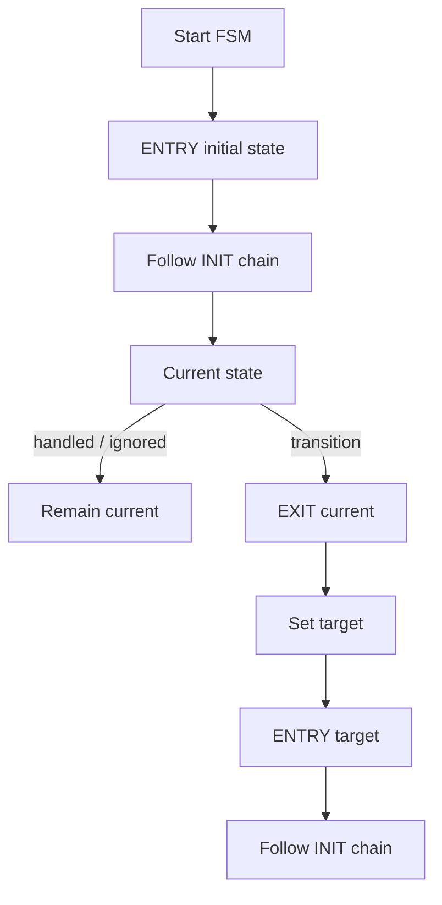

# `13-03-flat-state-machine` — Flat State Machine

> **Environment:** Target  
> **Source:** `examples/13-03-flat-state-machine/main.c`  
> **Focus:** Flat FSM semantics

[← Root README](../../README.md)

## Table of Contents

- [Objective and Core Concept](#objective)
- [Build Graph and Configuration](#build-graph)
- [Runtime Flow](#runtime)
- [API and Ownership](#api)
- [Invariant / PASS criteria](#pass)
- [Debugging and Failure Modes](#debug)
- [Validation](#validation)
- [Source Map and References](#source-map)

<a id="objective"></a>
## Objective and Core Concept

ENTRY/EXIT/INIT processing and transitions are observable directly, before Active Object concurrency is introduced.


<a id="build-graph"></a>
## Build Graph and Configuration

- CMake declares this example as a **Target** environment.
- Modules linked for this example: `platform`, `task_kernel`, `kernel_runtime`, `kernel_time`, `context`, `queue`, `semaphore`, `timer`, `haievent`.
- Reference target: `bluepill_f103c8` — STM32F103C8T6 / Cortex-M3 / nominal 72 MHz / USART1 115200 / active-low PC13 LED.

### Compile-time / source constants

| Symbol | Value in `main.c` |
| --- | --- |
| `STACK_WORDS` | `224U` |
| `QUEUE_LENGTH` | `4U` |

### CMake feature overrides

- Software timers are enabled for this build; the timer-service task priority is overridden to 1.

<a id="runtime"></a>
## Runtime Flow




### Details Observed Directly in the Example

- Write state handlers that return HANDLED/IGNORED/TRANSITION.
- Observe EXIT → current-state update → ENTRY ordering.
- Combine a state machine with an AO queue.
- Preserve run-to-completion state transitions.
- The flat state machine has no parent/child states.
- Reserved signals include `HE_SIG_ENTRY` and `HE_SIG_EXIT`.
- `he_state_transition()` only requests a transition; the framework executes the sequence.
- LED state reflects the current state.
- `haievent/haievent.h`
- `he_state_transition()`
- `he_active_post()`
- `he_event_init_static()`
- `haievent`
- Every transition performs EXIT before ENTRY.
- LED behavior matches ON/OFF states.
- PASS is reported after six toggles.
- Missing ENTRY: the framework transition sequence is incorrect.
- LED/state mismatch: inspect handler logic or the active-low board API.
- Hardware — STM32F103C8T6 Blue Pill — Runs the target firmware.
- Flash/debug — ST-Link V2 over SWD — OpenOCD is used to flash, verify, and reset the target.
- UART — USART1, PA9 TX / PA10 RX, 115200 8-N-1 — Observes logs and PASS/FAIL status.
- LED — PC13, active-low — Displays heartbeat or observable status.
- `switch-AO` — Priority 2, stack 224, queue 4 — Initial state OFF.
- `toggle-controller` — Priority 3, stack 224 — Posts six TOGGLE events every 400 ticks.

<a id="api"></a>
## API and Ownership

APIs called directly from `main.c` (extracted from source):

- `board_init()`
- `board_led_off()`
- `board_led_on()`
- `board_panic()`
- `board_uart_write_line()`
- `he_active_create_static()`
- `he_active_post()`
- `he_event_init_static()`
- `he_state_transition()`
- `hr_kernel_init()`
- `hr_kernel_start()`
- `hr_task_create_static()`
- `hr_task_delay()`
- `hr_task_start()`

Ownership rules to keep in mind:

- `hr_task_t`, stacks, queue/semaphore/mutex/timer objects, and haievent storage in the examples are all static/caller-owned.
- Kernel APIs retain pointers to this storage after creation, so the storage lifetime must cover the entire period in which the object remains active.
- ISR paths must not call blocking APIs. `_from_isr` APIs perform bounded work and return `higher_priority_task_woken` so PendSV can perform any required switch after ISR exit.
- Dynamic haievent events allocated from a pool use retain/release semantics; static events are not freed automatically by the framework.

<a id="pass"></a>
## Invariants and PASS Criteria

- Reserved signals 1..4 are ENTRY, EXIT, INIT, and TIMEOUT; user signals start at 32.
- A state handler returns HANDLED, IGNORED, or TRANSITION.
- A state transition performs EXIT(old) → current=target → ENTRY(target) → INIT chain.
- The INIT transition loop is bounded by `HE_CFG_MAX_INIT_TRANSITIONS=8` to prevent an infinite cycle.
- Hierarchical parent propagation, history, and defer are not implemented in v1.

Hard-coded checks/logs in the source:

- `Flat state-machine ENTRY/EXIT transition demo: PASS`

<a id="debug"></a>
## Debugging and Failure Modes

- Incorrect ENTRY/EXIT/INIT ordering: inspect the transition path in `he_state_machine.c`.
- HANDLED/IGNORED must not change the current state implicitly.
- The INIT chain must stop within the configured bound; an init loop must never run indefinitely.
- The v1 FSM is flat and provides no parent-state propagation as an HSM would.

<a id="validation"></a>
## Validation

- This example is target-only in CMake; host evidence does not replace ARM cross-build, OpenOCD, and hardware validation.
- Host validation baseline: `make TARGET=bluepill_f103c8 host-tests` passes the entire suite.

### Standard Commands

```bash
make TARGET=bluepill_f103c8 EXAMPLE=13-03-flat-state-machine build
make TARGET=bluepill_f103c8 EXAMPLE=13-03-flat-state-machine run
make TARGET=bluepill_f103c8 EXAMPLE=13-03-flat-state-machine check
```

<a id="source-map"></a>
## Source Map and References

- `examples/13-03-flat-state-machine/main.c`
- `cmake/hairtos_examples.cmake`
- `haievent/src/he_state_machine.c`
- `haievent/include/haievent/he_state_machine.h`
- `tests/host/test_haievent.c`

### References


**Implementation sources in the repository:**
- `haievent/src/he_state_machine.c`
- `haievent/include/haievent/he_state_machine.h`
- `tests/host/test_haievent.c`
