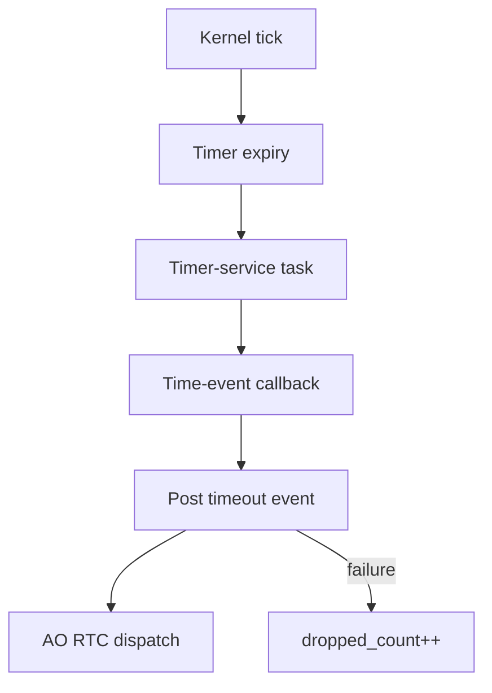

# `13-04-time-event` — haievent Time Events

> **Environment:** Target  
> **Source:** `examples/13-04-time-event/main.c`  
> **Focus:** Time Event → AO

[← Root README](../../README.md)

## Table of Contents

- [Objective and Core Concept](#objective)
- [Build Graph and Configuration](#build-graph)
- [Runtime Flow](#runtime)
- [API and Ownership](#api)
- [Invariant / PASS criteria](#pass)
- [Debugging and Failure Modes](#debug)
- [Validation](#validation)
- [Source Map and References](#source-map)

<a id="objective"></a>
## Objective and Core Concept

A software timer generates periodic timeout events; the AO handles them in task context and tracks drops.


<a id="build-graph"></a>
## Build Graph and Configuration

- CMake declares this example as a **Target** environment.
- Modules linked for this example: `platform`, `task_kernel`, `kernel_runtime`, `kernel_time`, `context`, `queue`, `semaphore`, `timer`, `haievent`.
- Reference target: `bluepill_f103c8` — STM32F103C8T6 / Cortex-M3 / nominal 72 MHz / USART1 115200 / active-low PC13 LED.

### Compile-time / source constants

| Symbol | Value in `main.c` |
| --- | --- |
| `STACK_WORDS` | `224U` |
| `QUEUE_LENGTH` | `6U` |

### CMake feature overrides

- Software timers are enabled for this build; the timer-service task priority is overridden to 1.

<a id="runtime"></a>
## Runtime Flow




### Details Observed Directly in the Example

- Create a static `he_time_event_t`.
- Arm a periodic event and disarm it after a defined number of expirations.
- Distinguish the timer-service callback from AO dispatch.
- Combine timing with an event-driven state handler.
- A Time Event owns one internal static event.
- Software-timer expiry only posts to the AO queue.
- The AO handles the event run-to-completion.
- Disarm prevents the next deadline from firing.
- `haievent/haievent.h`
- `hairtos/hr_time.h`
- `he_time_event_create_static()`
- `he_time_event_arm()`
- `he_time_event_disarm()`
- `haievent`
- Exactly six events occur before PASS.
- Tick values increase by approximately 250 per event.
- No new events arrive after disarm.
- Events continue after disarm: the timer was not removed correctly or rearm state is wrong.
- Hardware — STM32F103C8T6 Blue Pill — Runs the target firmware.
- Flash/debug — ST-Link V2 over SWD — OpenOCD is used to flash, verify, and reset the target.
- UART — USART1, PA9 TX / PA10 RX, 115200 8-N-1 — Observes logs and PASS/FAIL status.
- LED — PC13, active-low — Displays heartbeat or observable status.
- `blinker-AO` — Priority 2, stack 224, queue 6 — Toggles the LED on each tick event.
- `blink-time-event` — Period 250 ticks, auto-reload — Posts `SIGNAL_TICK`.

<a id="api"></a>
## API and Ownership

APIs called directly from `main.c` (extracted from source):

- `board_init()`
- `board_led_toggle()`
- `board_panic()`
- `board_uart_write_line()`
- `board_uart_write_string()`
- `board_uart_write_u32()`
- `he_active_create_static()`
- `he_time_event_arm()`
- `he_time_event_create_static()`
- `he_time_event_disarm()`
- `hr_kernel_init()`
- `hr_kernel_start()`
- `hr_time_now()`

Ownership rules to keep in mind:

- `hr_task_t`, stacks, queue/semaphore/mutex/timer objects, and haievent storage in the examples are all static/caller-owned.
- Kernel APIs retain pointers to this storage after creation, so the storage lifetime must cover the entire period in which the object remains active.
- ISR paths must not call blocking APIs. `_from_isr` APIs perform bounded work and return `higher_priority_task_woken` so PendSV can perform any required switch after ISR exit.
- Dynamic haievent events allocated from a pool use retain/release semantics; static events are not freed automatically by the framework.

<a id="pass"></a>
## Invariants and PASS Criteria

- A time event embeds a kernel timer and stores its target AO/signal.
- Periodic/one-shot semantics are delegated to `hr_timer_*`.
- If the AO queue cannot accept a timeout event, `dropped_count` increments with saturation at UINT32_MAX.
- Disarm/arm/rearm/change-period operations map directly to the corresponding timer APIs.
- A timeout event does not perform a state transition by itself; the AO state handler determines the signal's meaning.

Hard-coded checks/logs in the source:

- `Time event: PASS`

<a id="debug"></a>
## Debugging and Failure Modes

- Timeout event does not reach the AO: inspect software timer → timer-service task → time-event callback → AO post.
- Post failure must increment `dropped_count` according to the Time Event contract.
- The callback does not execute in the SysTick ISR; it runs through the timer-service task.
- Disarm/rearm must preserve valid timer and AO/event lifetimes.

<a id="validation"></a>
## Validation

- This example is target-only in CMake; host evidence does not replace ARM cross-build, OpenOCD, and hardware validation.
- Host validation baseline: `make TARGET=bluepill_f103c8 host-tests` passes the entire suite.

### Standard Commands

```bash
make TARGET=bluepill_f103c8 EXAMPLE=13-04-time-event build
make TARGET=bluepill_f103c8 EXAMPLE=13-04-time-event run
make TARGET=bluepill_f103c8 EXAMPLE=13-04-time-event check
```

<a id="source-map"></a>
## Source Map and References

- `examples/13-04-time-event/main.c`
- `cmake/hairtos_examples.cmake`
- `haievent/src/he_time_event.c`
- `kernel/src/hr_timer.c`
- `haievent/src/he_active.c`

### References


**Implementation sources in the repository:**
- `haievent/src/he_time_event.c`
- `kernel/src/hr_timer.c`
- `haievent/src/he_active.c`
