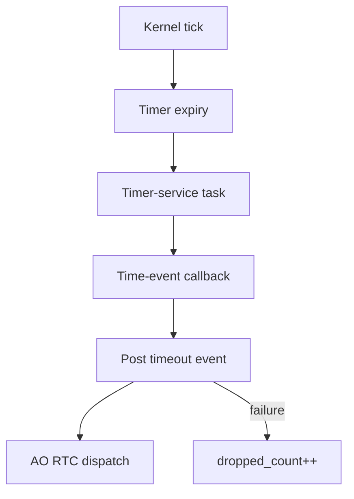

# `13-04-time-event` — Sự kiện thời gian haievent

> **Môi trường:** Target  
> **Source:** `examples/13-04-time-event/main.c`  
> **Trọng tâm:** Time Event → AO

[← Root README](../../README.md)

## Mục lục

- [Mục tiêu và bản chất](#muc-tieu)
- [Build graph và cấu hình](#build-graph)
- [Luồng thực thi](#runtime)
- [API và ownership](#api)
- [Invariant / PASS criteria](#pass)
- [Debug và failure modes](#debug)
- [Validation](#validation)
- [Source map và references](#source-map)

<a id="muc-tieu"></a>
## Mục tiêu và bản chất

Software timer phát timeout event định kỳ; AO xử lý trong task context và theo dõi drop.


<a id="build-graph"></a>
## Build graph và cấu hình

- Environment được CMake khai báo: **Target**.
- Module được link cho example này: `platform`, `task_kernel`, `kernel_runtime`, `kernel_time`, `context`, `queue`, `semaphore`, `timer`, `haievent`.
- Target tham chiếu: `bluepill_f103c8` — STM32F103C8T6 / Cortex-M3 / 72 MHz nominal / USART1 115200 / LED PC13 active-low.

### Compile-time / source constants

| Symbol | Giá trị trong `main.c` |
| --- | --- |
| `STACK_WORDS` | `224U` |
| `QUEUE_LENGTH` | `6U` |

### CMake feature overrides

- Software timer được bật cho build này; timer-service task priority được override thành 1.

<a id="runtime"></a>
## Luồng thực thi




### Các chi tiết quan sát trực tiếp từ example

- Tạo `he_time_event_t` tĩnh.
- Arm periodic event và disarm sau số lần xác định.
- Phân biệt timer-service callback với AO dispatch.
- Kết hợp timing và event-driven state handler.
- Time event sở hữu một static event nội bộ.
- Software timer expiry chỉ post vào AO queue.
- AO xử lý event theo run-to-completion.
- Disarm ngăn deadline tiếp theo.
- `haievent/haievent.h`
- `hairtos/hr_time.h`
- `he_time_event_create_static()`
- `he_time_event_arm()`
- `he_time_event_disarm()`
- `haievent`
- Có đúng sáu event trước PASS.
- Tick tăng gần 250 mỗi event.
- Sau disarm không còn event mới.
- Event vẫn chạy sau khi disarm: timer chưa được gỡ hoặc trạng thái rearm sai.
- Phần cứng — STM32F103C8T6 Blue Pill — Chạy firmware target.
- Nạp/debug — ST-Link V2 qua SWD — Dùng OpenOCD để flash, verify và reset.
- UART — USART1, PA9 TX / PA10 RX, 115200 8-N-1 — Theo dõi log và trạng thái PASS/FAIL.
- LED — PC13, active-low — Hiển thị heartbeat hoặc trạng thái quan sát.
- `blinker-AO` — Priority 2, stack 224, queue 6 — Toggle LED khi nhận tick.
- `blink-time-event` — Chu kỳ 250 tick, tự động nạp lại — Đăng `SIGNAL_TICK`.

<a id="api"></a>
## API và ownership

API được gọi trực tiếp trong `main.c` (đã trích từ source):

- `board_init()`
- `board_led_toggle()`
- `board_panic()`
- `board_uart_write_line()`
- `board_uart_write_string()`
- `board_uart_write_u32()`
- `he_active_create_static()`
- `he_time_event_arm()`
- `he_time_event_create_static()`
- `he_time_event_disarm()`
- `hr_kernel_init()`
- `hr_kernel_start()`
- `hr_time_now()`

Ownership cần nhớ:

- `hr_task_t`, stack, queue/semaphore/mutex/timer object và haievent storage trong examples đều là static/caller-owned.
- API kernel giữ pointer tới storage này sau create, vì vậy lifetime phải kéo dài toàn bộ thời gian object còn active.
- ISR path không được gọi blocking API. API `_from_isr` chỉ làm bounded work và trả `higher_priority_task_woken` để PendSV xử lý switch sau ISR.
- Dynamic haievent event từ pool dùng retain/release; static event không được framework tự free.

<a id="pass"></a>
## Invariant và PASS criteria

- Time event chứa embedded kernel timer và target AO/signal.
- Periodic/one-shot semantics được ủy quyền cho `hr_timer_*`.
- Nếu AO queue không nhận được timeout event, `dropped_count` tăng saturating tới UINT32_MAX.
- Disarm/arm/rearm/change-period ánh xạ trực tiếp sang timer API tương ứng.
- Timeout event không tự làm state transition; AO state handler quyết định ý nghĩa signal.

Các check/log cứng trong source:

- `Time event: PASS`

<a id="debug"></a>
## Debug và failure modes

- Timeout event không tới AO: kiểm tra software timer → timer-service task → time-event callback → AO post.
- Post failure phải tăng `dropped_count` theo time-event contract.
- Callback không chạy trong SysTick ISR; nó đi qua timer-service task.
- Disarm/rearm phải giữ timer và AO/event lifetime hợp lệ.

<a id="validation"></a>
## Validation

- Example là target-only trong CMake; host evidence không thay thế ARM cross-build, OpenOCD và hardware validation.
- Host validation baseline: `make TARGET=bluepill_f103c8 host-tests` PASS toàn bộ suite.

### Lệnh chuẩn

```bash
make TARGET=bluepill_f103c8 EXAMPLE=13-04-time-event build
make TARGET=bluepill_f103c8 EXAMPLE=13-04-time-event run
make TARGET=bluepill_f103c8 EXAMPLE=13-04-time-event check
```

<a id="source-map"></a>
## Source map và references

- `examples/13-04-time-event/main.c`
- `cmake/hairtos_examples.cmake`
- `haievent/src/he_time_event.c`
- `kernel/src/hr_timer.c`
- `haievent/src/he_active.c`

### Tài liệu tham khảo


**Nguồn implementation trong repository:**
- `haievent/src/he_time_event.c`
- `kernel/src/hr_timer.c`
- `haievent/src/he_active.c`
