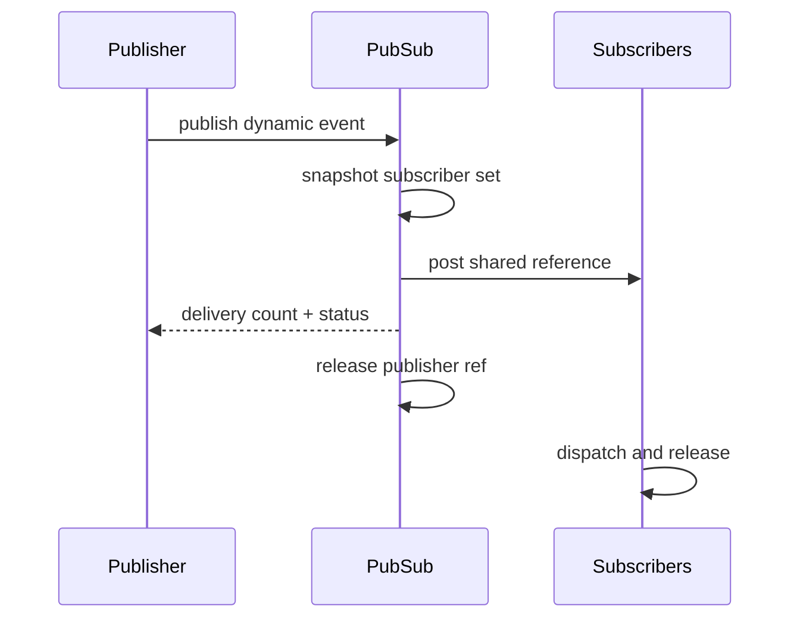

# `13-05-publish-subscribe` — Publish–Subscribe và quyền sở hữu sự kiện động

> **Môi trường:** Target  
> **Source:** `examples/13-05-publish-subscribe/main.c`  
> **Trọng tâm:** Publish/subscribe + dynamic event ownership

[← Root README](../../README.md)

## Mục lục

- [Mục tiêu và bản chất](#muc-tieu)
- [Build graph và cấu hình](#build-graph)
- [Luồng thực thi](#runtime)
- [API và ownership](#api)
- [Invariant / PASS criteria](#pass)
- [Debug và failure modes](#debug)
- [Validation](#validation)
- [Source map và references](#source-map)

<a id="muc-tieu"></a>
## Mục tiêu và bản chất

Publisher tạo event từ pool rồi broadcast tới nhiều AO; reference counting bảo vệ lifetime qua các queue.


<a id="build-graph"></a>
## Build graph và cấu hình

- Environment được CMake khai báo: **Target**.
- Module được link cho example này: `platform`, `task_kernel`, `kernel_runtime`, `kernel_time`, `context`, `queue`, `semaphore`, `timer`, `haievent`.
- Target tham chiếu: `bluepill_f103c8` — STM32F103C8T6 / Cortex-M3 / 72 MHz nominal / USART1 115200 / LED PC13 active-low.

### Compile-time / source constants

| Symbol | Giá trị trong `main.c` |
| --- | --- |
| `STACK_WORDS` | `224U` |
| `QUEUE_LENGTH` | `4U` |
| `SIGNAL_COUNT` | `64U` |

### CMake feature overrides

- Software timer được bật cho build này; timer-service task priority được override thành 1.

<a id="runtime"></a>
## Luồng thực thi




### Các chi tiết quan sát trực tiếp từ example

- Khởi tạo event pool không dùng malloc.
- Đăng ký nhiều subscriber theo signal.
- Publish cùng một event tới nhiều AO.
- Theo dõi reference count và trả block về pool sau subscriber cuối.
- Dynamic event có header `he_event_t` và payload mở rộng.
- Publisher chuyển ownership cho bus.
- Bus retain một reference cho mỗi delivery thành công.
- Mỗi AO release event sau dispatch.
- `haievent/haievent.h`
- `he_event_pool_init()`
- `he_event_new()`
- `he_pubsub_init()`
- `he_pubsub_subscribe()`
- `he_pubsub_publish()`
- `haievent`
- Mỗi publish delivered=2.
- Cả logger và display nhận cùng sequence.
- Pool không cạn sau nhiều chu kỳ.
- Phần cứng — STM32F103C8T6 Blue Pill — Chạy firmware target.
- Nạp/debug — ST-Link V2 qua SWD — Dùng OpenOCD để flash, verify và reset.
- UART — USART1, PA9 TX / PA10 RX, 115200 8-N-1 — Theo dõi log và trạng thái PASS/FAIL.
- LED — PC13, active-low — Hiển thị heartbeat hoặc trạng thái quan sát.
- Event pool — 6 blocks × 64 bytes — Cấp `telemetry_event_t`.
- Pub/sub bus — 64 signals × tối đa 2 subscriber — Routing theo signal.

<a id="api"></a>
## API và ownership

API được gọi trực tiếp trong `main.c` (đã trích từ source):

- `board_init()`
- `board_panic()`
- `board_uart_write_line()`
- `board_uart_write_string()`
- `board_uart_write_u32()`
- `he_active_create_static()`
- `he_event_new()`
- `he_event_pool_init()`
- `he_pubsub_init()`
- `he_pubsub_publish()`
- `he_pubsub_subscribe()`
- `he_state_machine_context()`
- `hr_kernel_init()`
- `hr_kernel_start()`
- `hr_task_create_static()`
- `hr_task_delay()`
- `hr_task_start()`

Ownership cần nhớ:

- `hr_task_t`, stack, queue/semaphore/mutex/timer object và haievent storage trong examples đều là static/caller-owned.
- API kernel giữ pointer tới storage này sau create, vì vậy lifetime phải kéo dài toàn bộ thời gian object còn active.
- ISR path không được gọi blocking API. API `_from_isr` chỉ làm bounded work và trả `higher_priority_task_woken` để PendSV xử lý switch sau ISR.
- Dynamic haievent event từ pool dùng retain/release; static event không được framework tự free.

<a id="pass"></a>
## Invariant và PASS criteria

- Signal dưới `HE_SIG_USER` không được subscribe/publish như application signal.
- Mỗi subscriber chỉ xuất hiện một lần cho một signal; subscribe đầy slot trả `HR_ERROR_NO_MEMORY`.
- Unsubscribe compact mảng để slot active nằm liền nhau.
- Publish snapshot tối đa `HE_CFG_MAX_ACTIVE_OBJECTS` rồi release critical section trước khi có thể block trong post.
- Dynamic event: publish luôn tiêu thụ reference của publisher; mỗi post thành công giữ reference riêng cho AO.

<a id="debug"></a>
## Debug và failure modes

- Subscriber bỏ sót/nhận thừa event: kiểm tra topic table và subscriber snapshot trong critical section.
- Dynamic event refcount sai: mỗi shared post retain một reference; publisher reference được release sau publish.
- Post tới một subscriber fail không được làm hỏng ownership của các subscriber còn lại.
- Subscribe/unsubscribe và publish phải giữ bảng subscriber nhất quán dưới concurrency.

<a id="validation"></a>
## Validation

- Example là target-only trong CMake; host evidence không thay thế ARM cross-build, OpenOCD và hardware validation.
- Host validation baseline: `make TARGET=bluepill_f103c8 host-tests` PASS toàn bộ suite.

### Lệnh chuẩn

```bash
make TARGET=bluepill_f103c8 EXAMPLE=13-05-publish-subscribe build
make TARGET=bluepill_f103c8 EXAMPLE=13-05-publish-subscribe run
make TARGET=bluepill_f103c8 EXAMPLE=13-05-publish-subscribe check
```

<a id="source-map"></a>
## Source map và references

- `examples/13-05-publish-subscribe/main.c`
- `cmake/hairtos_examples.cmake`
- `haievent/src/he_pubsub.c`
- `haievent/src/he_event.c`
- `haievent/src/he_active.c`

### Tài liệu tham khảo


**Nguồn implementation trong repository:**
- `haievent/src/he_pubsub.c`
- `haievent/src/he_event.c`
- `haievent/src/he_active.c`
