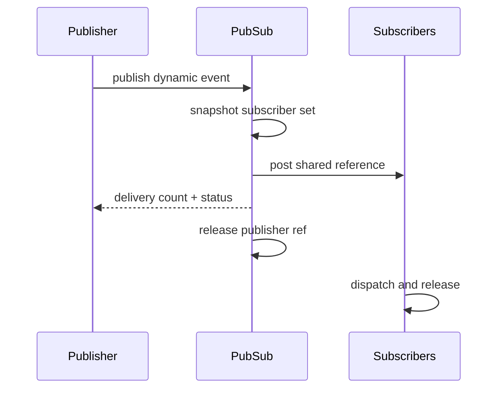

# `13-05-publish-subscribe` — Publish–Subscribe and Dynamic-Event Ownership

> **Environment:** Target  
> **Source:** `examples/13-05-publish-subscribe/main.c`  
> **Focus:** Publish/subscribe + dynamic-event ownership

[← Root README](../../README.md)

## Table of Contents

- [Objective and Core Concept](#objective)
- [Build Graph and Configuration](#build-graph)
- [Runtime Flow](#runtime)
- [API and Ownership](#api)
- [Invariant / PASS criteria](#pass)
- [Debugging and Failure Modes](#debug)
- [Validation](#validation)
- [Source Map and References](#source-map)

<a id="objective"></a>
## Objective and Core Concept

A publisher allocates an event from the pool and broadcasts it to multiple AOs; reference counting protects lifetime across their queues.


<a id="build-graph"></a>
## Build Graph and Configuration

- CMake declares this example as a **Target** environment.
- Modules linked for this example: `platform`, `task_kernel`, `kernel_runtime`, `kernel_time`, `context`, `queue`, `semaphore`, `timer`, `haievent`.
- Reference target: `bluepill_f103c8` — STM32F103C8T6 / Cortex-M3 / nominal 72 MHz / USART1 115200 / active-low PC13 LED.

### Compile-time / source constants

| Symbol | Value in `main.c` |
| --- | --- |
| `STACK_WORDS` | `224U` |
| `QUEUE_LENGTH` | `4U` |
| `SIGNAL_COUNT` | `64U` |

### CMake feature overrides

- Software timers are enabled for this build; the timer-service task priority is overridden to 1.

<a id="runtime"></a>
## Runtime Flow




### Details Observed Directly in the Example

- Initialize an event pool without using malloc.
- Register multiple subscribers for a signal.
- Publish the same event to multiple AOs.
- Track the reference count and return the block to the pool after the final subscriber releases it.
- A dynamic event contains an `he_event_t` header plus an extended payload.
- The publisher transfers ownership to the bus.
- The bus retains one reference for each successful delivery.
- Each AO releases the event after dispatch.
- `haievent/haievent.h`
- `he_event_pool_init()`
- `he_event_new()`
- `he_pubsub_init()`
- `he_pubsub_subscribe()`
- `he_pubsub_publish()`
- `haievent`
- Every publish reports delivered=2.
- Logger and display both receive the same sequence.
- The pool does not exhaust after repeated cycles.
- Hardware — STM32F103C8T6 Blue Pill — Runs the target firmware.
- Flash/debug — ST-Link V2 over SWD — OpenOCD is used to flash, verify, and reset the target.
- UART — USART1, PA9 TX / PA10 RX, 115200 8-N-1 — Observes logs and PASS/FAIL status.
- LED — PC13, active-low — Displays heartbeat or observable status.
- Event pool — 6 blocks × 64 bytes — Allocates `telemetry_event_t`.
- Pub/sub bus — 64 signals × at most 2 subscribers — Routes by signal.

<a id="api"></a>
## API and Ownership

APIs called directly from `main.c` (extracted from source):

- `board_init()`
- `board_panic()`
- `board_uart_write_line()`
- `board_uart_write_string()`
- `board_uart_write_u32()`
- `he_active_create_static()`
- `he_event_new()`
- `he_event_pool_init()`
- `he_pubsub_init()`
- `he_pubsub_publish()`
- `he_pubsub_subscribe()`
- `he_state_machine_context()`
- `hr_kernel_init()`
- `hr_kernel_start()`
- `hr_task_create_static()`
- `hr_task_delay()`
- `hr_task_start()`

Ownership rules to keep in mind:

- `hr_task_t`, stacks, queue/semaphore/mutex/timer objects, and haievent storage in the examples are all static/caller-owned.
- Kernel APIs retain pointers to this storage after creation, so the storage lifetime must cover the entire period in which the object remains active.
- ISR paths must not call blocking APIs. `_from_isr` APIs perform bounded work and return `higher_priority_task_woken` so PendSV can perform any required switch after ISR exit.
- Dynamic haievent events allocated from a pool use retain/release semantics; static events are not freed automatically by the framework.

<a id="pass"></a>
## Invariants and PASS Criteria

- Signals below `HE_SIG_USER` cannot be subscribed/published as application signals.
- A subscriber may appear only once for a signal; subscribing when all slots are full returns `HR_ERROR_NO_MEMORY`.
- Unsubscribe compacts the array so active slots remain contiguous.
- Publish snapshots up to `HE_CFG_MAX_ACTIVE_OBJECTS` subscribers, then releases the critical section before any post operation can block.
- Dynamic event: publish always consumes the publisher's reference; each successful post holds a separate reference for the destination AO.

<a id="debug"></a>
## Debugging and Failure Modes

- Subscriber misses/duplicates events: inspect the topic table and subscriber snapshot inside the critical section.
- Incorrect dynamic-event refcount: each shared post retains one reference; the publisher reference is released after publish.
- A failed post to one subscriber must not corrupt ownership for remaining subscribers.
- Subscribe/unsubscribe and publish must keep the subscriber table consistent under concurrency.

<a id="validation"></a>
## Validation

- This example is target-only in CMake; host evidence does not replace ARM cross-build, OpenOCD, and hardware validation.
- Host validation baseline: `make TARGET=bluepill_f103c8 host-tests` passes the entire suite.

### Standard Commands

```bash
make TARGET=bluepill_f103c8 EXAMPLE=13-05-publish-subscribe build
make TARGET=bluepill_f103c8 EXAMPLE=13-05-publish-subscribe run
make TARGET=bluepill_f103c8 EXAMPLE=13-05-publish-subscribe check
```

<a id="source-map"></a>
## Source Map and References

- `examples/13-05-publish-subscribe/main.c`
- `cmake/hairtos_examples.cmake`
- `haievent/src/he_pubsub.c`
- `haievent/src/he_event.c`
- `haievent/src/he_active.c`

### References


**Implementation sources in the repository:**
- `haievent/src/he_pubsub.c`
- `haievent/src/he_event.c`
- `haievent/src/he_active.c`
