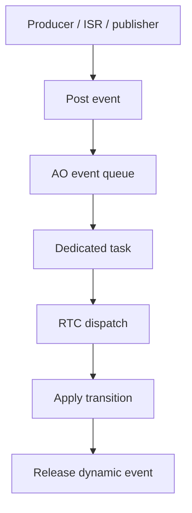

# `13-06-event-driven-demo` — Integrated haievent Demo

> **Environment:** Target  
> **Source:** `examples/13-06-event-driven-demo/main.c`  
> **Focus:** Full haievent integration

[← Root README](../../README.md)

## Table of Contents

- [Objective and Core Concept](#objective)
- [Build Graph and Configuration](#build-graph)
- [Runtime Flow](#runtime)
- [API and Ownership](#api)
- [Invariant / PASS criteria](#pass)
- [Debugging and Failure Modes](#debug)
- [Validation](#validation)
- [Source Map and References](#source-map)

<a id="objective"></a>
## Objective and Core Concept

A controller/observer pair plus a script task combines state transitions, Active Objects, Time Events, pub/sub, and both dynamic and static events.


<a id="build-graph"></a>
## Build Graph and Configuration

- CMake declares this example as a **Target** environment.
- Modules linked for this example: `platform`, `task_kernel`, `kernel_runtime`, `kernel_time`, `context`, `queue`, `semaphore`, `timer`, `haievent`.
- Reference target: `bluepill_f103c8` — STM32F103C8T6 / Cortex-M3 / nominal 72 MHz / USART1 115200 / active-low PC13 LED.

### Compile-time / source constants

| Symbol | Value in `main.c` |
| --- | --- |
| `STACK_WORDS` | `256U` |
| `QUEUE_LENGTH` | `6U` |
| `SIGNAL_COUNT` | `64U` |

### CMake feature overrides

- Software timers are enabled for this build; the timer-service task priority is overridden to 1.

<a id="runtime"></a>
## Runtime Flow




### Details Observed Directly in the Example

- Combine haievent capabilities in one complete flow.
- Arm/disarm the time event on state ENTRY/EXIT.
- Publish a dynamic status event from a state handler.
- Use a script task to issue START/STOP commands.
- The controller has IDLE and ACTIVE states.
- The Time Event is active only while the controller is in ACTIVE.
- An internal heartbeat event creates a dynamic status event.
- Observer subscribe `SIGNAL_STATUS`.
- `haievent/haievent.h`
- `hairtos/hr_time.h`
- `he_state_transition()`
- `he_time_event_arm()`
- `he_time_event_disarm()`
- `he_event_new()`
- `he_pubsub_publish()`
- `context`
- `semaphore`
- `haievent`
- Hardware — STM32F103C8T6 Blue Pill — Runs the target firmware.
- Flash/debug — ST-Link V2 over SWD — OpenOCD is used to flash, verify, and reset the target.
- UART — USART1, PA9 TX / PA10 RX, 115200 8-N-1 — Observes logs and PASS/FAIL status.
- LED — PC13, active-low — Displays heartbeat or observable status.
- `controller-AO` — Priority 2, stack 256, queue 6 — IDLE/ACTIVE state plus heartbeat count.
- `observer-AO` — Priority 3, stack 256, queue 6 — Receives status events.

<a id="api"></a>
## API and Ownership

APIs called directly from `main.c` (extracted from source):

- `board_init()`
- `board_led_off()`
- `board_led_on()`
- `board_panic()`
- `board_uart_write_line()`
- `board_uart_write_string()`
- `board_uart_write_u32()`
- `he_active_create_static()`
- `he_active_post()`
- `he_event_init_static()`
- `he_event_new()`
- `he_event_pool_init()`
- `he_pubsub_init()`
- `he_pubsub_publish()`
- `he_pubsub_subscribe()`
- `he_state_machine_context()`
- `he_state_transition()`
- `he_time_event_arm()`
- `he_time_event_create_static()`
- `he_time_event_disarm()`
- `hr_kernel_init()`
- `hr_kernel_start()`
- `hr_task_create_static()`
- `hr_task_delay()`
- `hr_task_start()`
- `hr_time_now()`

Ownership rules to keep in mind:

- `hr_task_t`, stacks, queue/semaphore/mutex/timer objects, and haievent storage in the examples are all static/caller-owned.
- Kernel APIs retain pointers to this storage after creation, so the storage lifetime must cover the entire period in which the object remains active.
- ISR paths must not call blocking APIs. `_from_isr` APIs perform bounded work and return `higher_priority_task_woken` so PendSV can perform any required switch after ISR exit.
- Dynamic haievent events allocated from a pool use retain/release semantics; static events are not freed automatically by the framework.

<a id="pass"></a>
## Invariants and PASS Criteria

- An AO runs run-to-completion: it dequeues one event, completes state-handler dispatch/transition processing, then receives the next event.
- The AO queue uses a kernel queue backed by a caller-supplied array of event pointers.
- The AO task starts during creation; the state machine is initialized before entering the event-receive loop.
- Dynamic events are released after each dispatch; static events remain caller-owned.
- v1 uses one task per AO and provides no shared executor.

<a id="debug"></a>
## Debugging and Failure Modes

- Event-driven flow stalls: inspect AO task, queue, timer, and pub/sub boundaries individually instead of debugging the application as one monolithic block.
- Dynamic-event leak: inspect retain/release across every consumer.
- Time-event drops must be observable through status/counters rather than remaining silent.
- An FSM handler must complete run-to-completion before the AO dequeues the next event.

<a id="validation"></a>
## Validation

- This example is target-only in CMake; host evidence does not replace ARM cross-build, OpenOCD, and hardware validation.
- Host validation baseline: `make TARGET=bluepill_f103c8 host-tests` passes the entire suite.

### Standard Commands

```bash
make TARGET=bluepill_f103c8 EXAMPLE=13-06-event-driven-demo build
make TARGET=bluepill_f103c8 EXAMPLE=13-06-event-driven-demo run
make TARGET=bluepill_f103c8 EXAMPLE=13-06-event-driven-demo check
```

<a id="source-map"></a>
## Source Map and References

- `examples/13-06-event-driven-demo/main.c`
- `cmake/hairtos_examples.cmake`
- `haievent/src/he_active.c`
- `haievent/internal/he_internal.h`
- `haievent/src/he_state_machine.c`
- `kernel/src/hr_queue.c`

### References


**Implementation sources in the repository:**
- `haievent/src/he_active.c`
- `haievent/internal/he_internal.h`
- `haievent/src/he_state_machine.c`
- `kernel/src/hr_queue.c`
