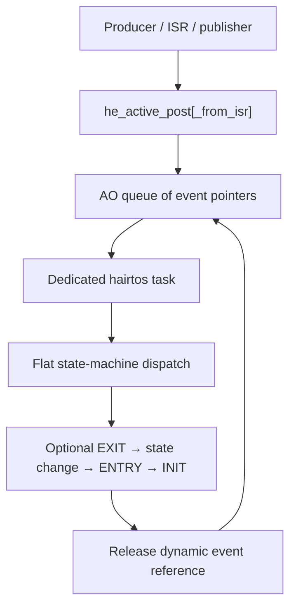

# `13-06-event-driven-demo` — Demo haievent tích hợp

> **Môi trường:** Target  
> **Source:** `examples/13-06-event-driven-demo/main.c`  
> **Trọng tâm:** Tích hợp haievent đầy đủ

[← Root README](../../README.md)

## Mục lục

- [Mục tiêu và bản chất](#muc-tieu)
- [Build graph và cấu hình](#build-graph)
- [Luồng thực thi](#runtime)
- [API và ownership](#api)
- [Invariant / PASS criteria](#pass)
- [Debug và failure modes](#debug)
- [Validation](#validation)
- [Source map và references](#source-map)

<a id="muc-tieu"></a>
## Mục tiêu và bản chất

Controller/observer + script task kết hợp state transition, AO, time event, pub-sub, dynamic/static event.

Example này không được hiểu như một application production. Nó cố ý cô lập một cơ chế để người học nhìn thấy **state transition và scheduling consequence** mà không bị che bởi middleware lớn. Những log/PASS check trong `main.c` là executable documentation: nếu invariant bị vi phạm, example gọi `board_panic()` hoặc trả failure trên host.

<a id="build-graph"></a>
## Build graph và cấu hình

- Environment được CMake khai báo: **Target**.
- Module được link cho example này: `platform`, `task_kernel`, `kernel_runtime`, `kernel_time`, `context`, `queue`, `semaphore`, `timer`, `haievent`.
- Target tham chiếu: `bluepill_f103c8` — STM32F103C8T6 / Cortex-M3 / 72 MHz nominal / USART1 115200 / LED PC13 active-low.

### Compile-time / source constants

| Symbol | Giá trị trong `main.c` |
| --- | --- |
| `STACK_WORDS` | `256U` |
| `QUEUE_LENGTH` | `6U` |
| `SIGNAL_COUNT` | `64U` |

### CMake feature overrides

- Software timer được bật cho build này; timer-service task priority được override thành 1.

<a id="runtime"></a>
## Luồng thực thi



Để hiểu runtime thật, đọc sơ đồ cùng `main.c` và module source. Các điểm chuyển task state/context không diễn ra trong application code đơn lẻ mà qua kernel + architecture port.

### Các chi tiết quan sát trực tiếp từ example

- Kết hợp các capability haievent trong một flow hoàn chỉnh.
- Arm/disarm time event theo state ENTRY/EXIT.
- Publish dynamic status event từ state handler.
- Dùng script task để phát command START/STOP.
- Controller có states IDLE và ACTIVE.
- Time event chỉ active khi controller ở ACTIVE.
- Heartbeat event nội bộ tạo status dynamic event.
- Observer subscribe `SIGNAL_STATUS`.
- `haievent/haievent.h`
- `hairtos/hr_time.h`
- `he_state_transition()`
- `he_time_event_arm()`
- `he_time_event_disarm()`
- `he_event_new()`
- `he_pubsub_publish()`
- `context`
- `semaphore`
- `haievent`
- Phần cứng — STM32F103C8T6 Blue Pill — Chạy firmware target.
- Nạp/debug — ST-Link V2 qua SWD — Dùng OpenOCD để flash, verify và reset.
- UART — USART1, PA9 TX / PA10 RX, 115200 8-N-1 — Theo dõi log và trạng thái PASS/FAIL.
- LED — PC13, active-low — Hiển thị heartbeat hoặc trạng thái quan sát.
- `controller-AO` — Priority 2, stack 256, queue 6 — State IDLE/ACTIVE và heartbeat count.
- `observer-AO` — Priority 3, stack 256, queue 6 — Nhận status event.

<a id="api"></a>
## API và ownership

API được gọi trực tiếp trong `main.c` (đã trích từ source):

- `board_init()`
- `board_led_off()`
- `board_led_on()`
- `board_panic()`
- `board_uart_write_line()`
- `board_uart_write_string()`
- `board_uart_write_u32()`
- `he_active_create_static()`
- `he_active_post()`
- `he_event_init_static()`
- `he_event_new()`
- `he_event_pool_init()`
- `he_pubsub_init()`
- `he_pubsub_publish()`
- `he_pubsub_subscribe()`
- `he_state_machine_context()`
- `he_state_transition()`
- `he_time_event_arm()`
- `he_time_event_create_static()`
- `he_time_event_disarm()`
- `hr_kernel_init()`
- `hr_kernel_start()`
- `hr_task_create_static()`
- `hr_task_delay()`
- `hr_task_start()`
- `hr_time_now()`

Ownership cần nhớ:

- `hr_task_t`, stack, queue/semaphore/mutex/timer object và haievent storage trong examples đều là static/caller-owned.
- API kernel giữ pointer tới storage này sau create, vì vậy lifetime phải kéo dài toàn bộ thời gian object còn active.
- ISR path không được gọi blocking API. API `_from_isr` chỉ làm bounded work và trả `higher_priority_task_woken` để PendSV xử lý switch sau ISR.
- Dynamic haievent event từ pool dùng retain/release; static event không được framework tự free.

<a id="pass"></a>
## Invariant và PASS criteria

- Một AO chạy run-to-completion: lấy một event, dispatch hoàn tất state handler/transition rồi mới nhận event tiếp theo.
- Queue của AO dùng kernel queue và do caller cấp mảng pointer storage.
- AO task start cùng lúc với create; state machine được start trước vòng nhận event.
- Dynamic event được release sau mỗi dispatch; static event vẫn do caller sở hữu.
- v1 dùng one-task-per-AO, không có shared executor.

<a id="debug"></a>
## Debug và failure modes

- Nếu target treo trong `board_panic()`, xem UART log ngay trước đó rồi attach GDB/OpenOCD để kiểm tra current task, PSP/MSP, ready bitmap và fault record nếu diagnostics bật.
- Nếu behavior sai chỉ khi optimize/timing thay đổi, kiểm tra race giữa task/ISR, critical-section scope và việc log UART làm nhiễu thời gian.
- Nếu task không chạy, phân biệt CREATED/READY/BLOCKED/SUSPENDED và kiểm tra task có được `hr_task_start()` hay không.
- Nếu wake không xảy ra, kiểm tra cả object wait list lẫn timeout node; một wake path không được để node stale trong structure còn lại.
- Target log là evidence runtime; build PASS chỉ là evidence compile/link.

<a id="validation"></a>
## Validation

- Example là target-only trong CMake. Môi trường audit không có `arm-none-eabi-gcc`/OpenOCD nên không tuyên bố đã build/flash lại target.
- `make TARGET=bluepill_f103c8 host-tests` đã PASS toàn bộ host suite trong audit tài liệu này.

### Lệnh chuẩn

```bash
make TARGET=bluepill_f103c8 EXAMPLE=13-06-event-driven-demo build
make TARGET=bluepill_f103c8 EXAMPLE=13-06-event-driven-demo run
make TARGET=bluepill_f103c8 EXAMPLE=13-06-event-driven-demo check
```

<a id="source-map"></a>
## Source map và references

- `examples/13-06-event-driven-demo/main.c`
- `cmake/hairtos_examples.cmake`
- `haievent/src/he_active.c`
- `haievent/internal/he_internal.h`
- `haievent/src/he_state_machine.c`
- `kernel/src/hr_queue.c`

### Tài liệu tham khảo


**Nguồn implementation trong repository:**
- `haievent/src/he_active.c`
- `haievent/internal/he_internal.h`
- `haievent/src/he_state_machine.c`
- `kernel/src/hr_queue.c`
