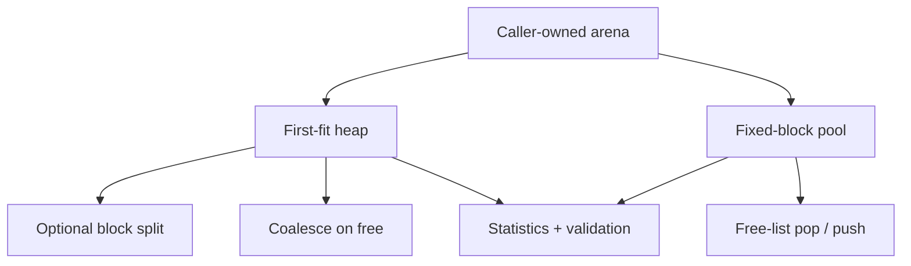

# `14-memory-allocator-lab` — Memory Allocator Lab

> **Environment:** Host + target  
> **Source:** `examples/14-memory-allocator-lab/main.c`  
> **Focus:** Allocator experiment outside the kernel

[← Root README](../../README.md)

## Table of Contents

- [Objective and Core Concept](#objective)
- [Build Graph and Configuration](#build-graph)
- [Runtime Flow](#runtime)
- [API and Ownership](#api)
- [Invariant / PASS criteria](#pass)
- [Debugging and Failure Modes](#debug)
- [Validation](#validation)
- [Source Map and References](#source-map)

<a id="objective"></a>
## Objective and Core Concept

A first-fit heap and fixed pool run on host/target to observe fragmentation, coalescing, and validation without introducing dynamic allocation into the kernel.


<a id="build-graph"></a>
## Build Graph and Configuration

- CMake declares this example as **Host + target**.
- Modules linked for this example: `allocator (+ board/platform on target)`.
- Reference target: `bluepill_f103c8` — STM32F103C8T6 / Cortex-M3 / nominal 72 MHz / USART1 115200 / active-low PC13 LED.

### Compile-time / source constants

| Symbol | Value in `main.c` |
| --- | --- |
| `HEAP_ARENA_BYTES` | `UINT32_C(2048)` |
| `POOL_ARENA_BYTES` | `UINT32_C(512)` |

### CMake feature overrides

- The example uses the default configuration except for modules/definitions explicitly declared in `cmake/hairtos_examples.cmake`.

<a id="runtime"></a>
## Runtime Flow




### Details Observed Directly in the Example

- Understand fixed-size pools with deterministic allocation time.
- Understand first-fit, block splitting, and adjacent coalescing.
- Measure internal and external fragmentation.
- Detect invalid pointers, double frees, and structural corruption through validation/tests.
- Static memory region owned by the application.
- Alignment follows `max_align_t`.
- Heap block headers and payloads.
- Reuse under a first-fit strategy.
- The allocator lab remains separate from TCB/queue/timer/AO runtime paths.
- `hr_heap_lab.h`
- `hr_pool_lab.h`
- `hr_heap_lab_init()`
- `hr_heap_lab_alloc()`
- `hr_heap_lab_free()`
- `hr_heap_lab_get_stats()`
- `hr_heap_lab_validate()`
- `hr_pool_lab_*()`
- `allocator` on target
- Target heap arena — 2048 bytes — Runs alloc/free/coalesce sequences and prints statistics over UART.
- Target pool arena — 512 bytes, 8 blocks with 24-byte payload — Allocates/frees one block and validates the pool.
- Host demo — 2048/512-byte stack arenas — Prints statistics with `printf`.
- Host tests — ASan/UBSan — Exercise edge cases and randomized workloads.
- Kernel dependency — None
- Target loop after PASS — LED toggles every 500 ms

<a id="api"></a>
## API and Ownership

APIs called directly from `main.c` (extracted from source):

- `board_delay_ms()`
- `board_init()`
- `board_led_toggle()`
- `board_panic()`
- `board_uart_write_line()`
- `board_uart_write_string()`
- `board_uart_write_u32()`
- `hr_heap_lab_alloc()`
- `hr_heap_lab_free()`
- `hr_heap_lab_get_stats()`
- `hr_heap_lab_init()`
- `hr_heap_lab_validate()`
- `hr_pool_lab_alloc()`
- `hr_pool_lab_free()`
- `hr_pool_lab_get_stats()`
- `hr_pool_lab_init()`
- `hr_pool_lab_validate()`

Ownership rules to keep in mind:

- `hr_task_t`, stacks, queue/semaphore/mutex/timer objects, and haievent storage in the examples are all static/caller-owned.
- Kernel APIs retain pointers to this storage after creation, so the storage lifetime must cover the entire period in which the object remains active.
- ISR paths must not call blocking APIs. `_from_isr` APIs perform bounded work and return `higher_priority_task_woken` so PendSV can perform any required switch after ISR exit.
- Dynamic haievent events allocated from a pool use retain/release semantics; static events are not freed automatically by the framework.

<a id="pass"></a>
## Invariants and PASS Criteria

- The arena is caller-supplied; the implementation does not call the system allocator.
- The heap aligns to `max_align_t`, uses per-block metadata and first-fit scanning, and coalesces free blocks both forward and backward when adjacent blocks are free.
- The pool partitions storage into fixed-stride blocks and recycles them through a free list; allocation/free are suited to same-sized objects.
- Statistics distinguish allocated/free bytes, largest free block, internal/external fragmentation, and failed allocations.
- Host tests cover invalid/double-free cases, exhaustion, coalescing, and randomized sequences; the lab is not thread-safe and is not a production allocator.

<a id="debug"></a>
## Debugging and Failure Modes

- First-fit returns an incorrect/overlapping block: inspect header size/alignment and split conditions.
- Coalescing fails after free: inspect physical adjacency and free-list traversal.
- Pool double-free/corruption: inspect free-list ownership and validator logic.
- The host variant is suitable for sanitizers/GDB; the target variant runs the same allocator logic over caller-owned arenas.

<a id="validation"></a>
## Validation

- Host validation baseline: the host variant passes; allocator tests are also part of the host test suite.
- Host validation baseline: `make TARGET=bluepill_f103c8 host-tests` passes the entire suite.

### Standard Commands

```bash
make TARGET=bluepill_f103c8 ENVIRONMENT=host EXAMPLE=14-memory-allocator-lab run
make TARGET=bluepill_f103c8 ENVIRONMENT=target EXAMPLE=14-memory-allocator-lab build
```

<a id="source-map"></a>
## Source Map and References

- `examples/14-memory-allocator-lab/main.c`
- `cmake/hairtos_examples.cmake`
- `labs/memory-allocator/src/hr_heap_lab.c`
- `labs/memory-allocator/src/hr_pool_lab.c`
- `labs/memory-allocator/tests/test_heap_lab.c`

### References


**Implementation sources in the repository:**
- `labs/memory-allocator/src/hr_heap_lab.c`
- `labs/memory-allocator/src/hr_pool_lab.c`
- `labs/memory-allocator/tests/test_heap_lab.c`
