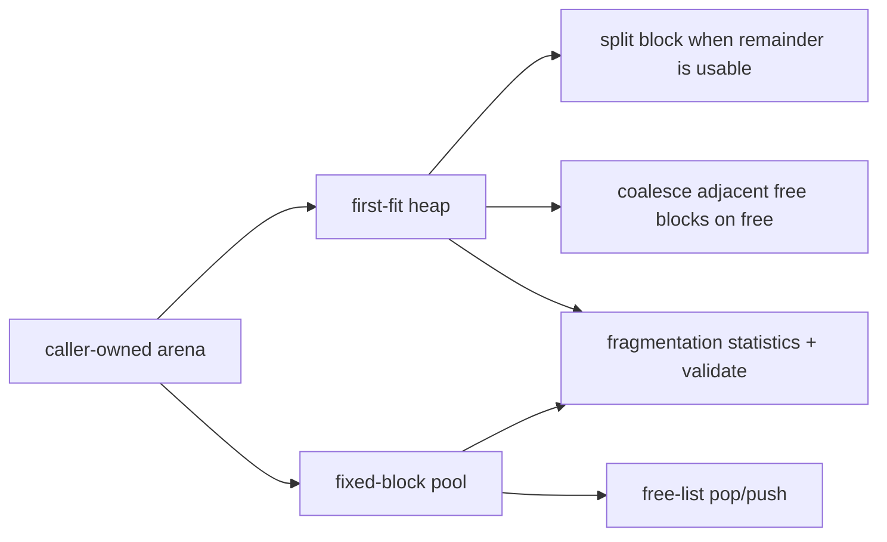

# `14-memory-allocator-lab` — Bài thực hành bộ cấp phát bộ nhớ

> **Môi trường:** Host + target  
> **Source:** `examples/14-memory-allocator-lab/main.c`  
> **Trọng tâm:** Allocator experiment ngoài kernel

[← Root README](../../README.md)

## Mục lục

- [Mục tiêu và bản chất](#muc-tieu)
- [Build graph và cấu hình](#build-graph)
- [Luồng thực thi](#runtime)
- [API và ownership](#api)
- [Invariant / PASS criteria](#pass)
- [Debug và failure modes](#debug)
- [Validation](#validation)
- [Source map và references](#source-map)

<a id="muc-tieu"></a>
## Mục tiêu và bản chất

First-fit heap và fixed pool chạy host/target để quan sát fragmentation, coalescing và validation mà không đưa dynamic allocation vào kernel.

Example này không được hiểu như một application production. Nó cố ý cô lập một cơ chế để người học nhìn thấy **state transition và scheduling consequence** mà không bị che bởi middleware lớn. Những log/PASS check trong `main.c` là executable documentation: nếu invariant bị vi phạm, example gọi `board_panic()` hoặc trả failure trên host.

<a id="build-graph"></a>
## Build graph và cấu hình

- Environment được CMake khai báo: **Host + target**.
- Module được link cho example này: `allocator (+ board/platform on target)`.
- Target tham chiếu: `bluepill_f103c8` — STM32F103C8T6 / Cortex-M3 / 72 MHz nominal / USART1 115200 / LED PC13 active-low.

### Compile-time / source constants

| Symbol | Giá trị trong `main.c` |
| --- | --- |
| `HEAP_ARENA_BYTES` | `UINT32_C(2048)` |
| `POOL_ARENA_BYTES` | `UINT32_C(512)` |

### CMake feature overrides

- Example dùng default config trừ những module/definition được khai báo trong `cmake/hairtos_examples.cmake`.

<a id="runtime"></a>
## Luồng thực thi



Để hiểu runtime thật, đọc sơ đồ cùng `main.c` và module source. Các điểm chuyển task state/context không diễn ra trong application code đơn lẻ mà qua kernel + architecture port.

### Các chi tiết quan sát trực tiếp từ example

- Hiểu fixed-size pool có allocation time xác định.
- Hiểu first-fit, block splitting và adjacent coalescing.
- Đo internal/external fragmentation.
- Phát hiện invalid pointer, double free và structural corruption qua validation/tests.
- Vùng nhớ tĩnh do ứng dụng sở hữu.
- Alignment theo `max_align_t`.
- Heap block header và payload.
- Tái sử dụng theo chiến lược first-fit.
- Allocator lab tách khỏi TCB/queue/timer/AO.
- `hr_heap_lab.h`
- `hr_pool_lab.h`
- `hr_heap_lab_init()`
- `hr_heap_lab_alloc()`
- `hr_heap_lab_free()`
- `hr_heap_lab_get_stats()`
- `hr_heap_lab_validate()`
- `hr_pool_lab_*()`
- `allocator` trên target
- Target heap arena — 2048 bytes — Chạy chuỗi alloc/free/coalesce và in stats qua UART.
- Target pool arena — 512 bytes, 8 block payload 24 bytes — Cấp/free một block và validate.
- Host demo — Stack arenas 2048/512 bytes — In stats bằng `printf`.
- Host tests — ASan/UBSan — Kiểm tra edge cases và randomized workload.
- Kernel dependency — Không
- Vòng lặp target sau PASS — LED toggle 500 ms

<a id="api"></a>
## API và ownership

API được gọi trực tiếp trong `main.c` (đã trích từ source):

- `board_delay_ms()`
- `board_init()`
- `board_led_toggle()`
- `board_panic()`
- `board_uart_write_line()`
- `board_uart_write_string()`
- `board_uart_write_u32()`
- `hr_heap_lab_alloc()`
- `hr_heap_lab_free()`
- `hr_heap_lab_get_stats()`
- `hr_heap_lab_init()`
- `hr_heap_lab_validate()`
- `hr_pool_lab_alloc()`
- `hr_pool_lab_free()`
- `hr_pool_lab_get_stats()`
- `hr_pool_lab_init()`
- `hr_pool_lab_validate()`

Ownership cần nhớ:

- `hr_task_t`, stack, queue/semaphore/mutex/timer object và haievent storage trong examples đều là static/caller-owned.
- API kernel giữ pointer tới storage này sau create, vì vậy lifetime phải kéo dài toàn bộ thời gian object còn active.
- ISR path không được gọi blocking API. API `_from_isr` chỉ làm bounded work và trả `higher_priority_task_woken` để PendSV xử lý switch sau ISR.
- Dynamic haievent event từ pool dùng retain/release; static event không được framework tự free.

<a id="pass"></a>
## Invariant và PASS criteria

- Arena do caller cấp; implementation không gọi system malloc.
- Heap align theo `max_align_t`, dùng block metadata và first-fit scan; free coalesce cả forward/backward khi adjacent block trống.
- Pool chia block stride cố định và recycle qua free list; allocation/free phù hợp object cùng kích thước.
- Stats phân biệt allocated/free/largest free/internal/external fragmentation và failed allocation.
- Host tests có invalid/double-free, exhaustion, coalescing và randomized sequence; lab không thread-safe và không phải production allocator.

<a id="debug"></a>
## Debug và failure modes

- Nếu target treo trong `board_panic()`, xem UART log ngay trước đó rồi attach GDB/OpenOCD để kiểm tra current task, PSP/MSP, ready bitmap và fault record nếu diagnostics bật.
- Nếu behavior sai chỉ khi optimize/timing thay đổi, kiểm tra race giữa task/ISR, critical-section scope và việc log UART làm nhiễu thời gian.
- Nếu task không chạy, phân biệt CREATED/READY/BLOCKED/SUSPENDED và kiểm tra task có được `hr_task_start()` hay không.
- Nếu wake không xảy ra, kiểm tra cả object wait list lẫn timeout node; một wake path không được để node stale trong structure còn lại.
- Target log là evidence runtime; build PASS chỉ là evidence compile/link.

<a id="validation"></a>
## Validation

- Host variant đã chạy PASS trong audit hiện tại; allocator tests cũng nằm trong host test suite.
- `make TARGET=bluepill_f103c8 host-tests` đã PASS toàn bộ host suite trong audit tài liệu này.

### Lệnh chuẩn

```bash
make TARGET=bluepill_f103c8 ENVIRONMENT=host EXAMPLE=14-memory-allocator-lab run
make TARGET=bluepill_f103c8 ENVIRONMENT=target EXAMPLE=14-memory-allocator-lab build
```

<a id="source-map"></a>
## Source map và references

- `examples/14-memory-allocator-lab/main.c`
- `cmake/hairtos_examples.cmake`
- `labs/memory-allocator/src/hr_heap_lab.c`
- `labs/memory-allocator/src/hr_pool_lab.c`
- `labs/memory-allocator/tests/test_heap_lab.c`

### Tài liệu tham khảo


**Nguồn implementation trong repository:**
- `labs/memory-allocator/src/hr_heap_lab.c`
- `labs/memory-allocator/src/hr_pool_lab.c`
- `labs/memory-allocator/tests/test_heap_lab.c`
