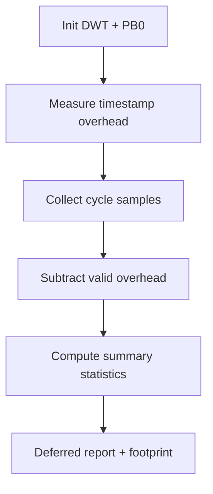

# `15-kernel-benchmark` — Benchmark kernel

> **Môi trường:** Target  
> **Source:** `examples/15-kernel-benchmark/main.c`  
> **Trọng tâm:** Kernel microbenchmark trên target

[← Root README](../../README.md)

## Mục lục

- [Mục tiêu và bản chất](#muc-tieu)
- [Build graph và cấu hình](#build-graph)
- [Luồng thực thi](#runtime)
- [API và ownership](#api)
- [Invariant / PASS criteria](#pass)
- [Debug và failure modes](#debug)
- [Validation](#validation)
- [Source map và references](#source-map)

<a id="muc-tieu"></a>
## Mục tiêu và bản chất

DWT/PB0 đo primitive/scheduler/wakeup/event/timer và report statistical distribution + footprint.


<a id="build-graph"></a>
## Build graph và cấu hình

- Environment được CMake khai báo: **Target**.
- Module được link cho example này: `platform`, `task_kernel`, `kernel_runtime`, `kernel_time`, `context`, `queue`, `semaphore`, `mutex`, `timer`, `haievent_benchmark`, `benchmark`.
- Target tham chiếu: `bluepill_f103c8` — STM32F103C8T6 / Cortex-M3 / 72 MHz nominal / USART1 115200 / LED PC13 active-low.

### Compile-time / source constants

| Symbol | Giá trị trong `main.c` |
| --- | --- |
| `BENCHMARK_SAMPLES` | `32U` |
| `TIMER_INTERVAL_SAMPLES` | `24U` |
| `TIMER_PERIOD_TICKS` | `10U` |
| `STARTUP_TASK_STACK_WORDS` | `128U` |
| `BENCHMARK_TASK_STACK_WORDS` | `320U` |
| `PEER_TASK_STACK_WORDS` | `160U` |
| `RECEIVER_STACK_WORDS` | `192U` |
| `EVENT_STACK_WORDS` | `224U` |
| `EVENT_QUEUE_CAPACITY` | `2U` |
| `PRIMITIVE_QUEUE_CAPACITY` | `4U` |
| `STARTUP_TASK_PRIORITY` | `0U` |
| `RECEIVER_TASK_PRIORITY` | `2U` |
| `EVENT_TASK_PRIORITY` | `3U` |
| `BENCHMARK_TASK_PRIORITY` | `4U` |

### CMake feature overrides

- Preemption bật, time slicing tắt; software timer bật; timer-service priority = 1 để benchmark có workload xác định hơn.

<a id="runtime"></a>
## Luồng thực thi




### Các chi tiết quan sát trực tiếp từ example

- Đo latency bằng cycle counter thay vì UART timestamp.
- Trừ measurement overhead.
- Tính min, p50, mean, p95 và max.
- Đo stack high-water mark, Flash và static RAM.
- Đối chiếu một số đường đi bằng marker do board cung cấp.
- Benchmark clock 32-bit; target tham chiếu dùng DWT CYCCNT trên ARM Cortex-M3.
- Benchmark perturbation và deferred UART output.
- Startup probe priority 0.
- Round-trip measurement cho yield/wake/event.
- Kết quả phụ thuộc compiler, optimization và interrupt load.
- `hr_benchmark.h`
- `hairtos/hairtos.h`
- `haievent/haievent.h`
- `hr_scheduler_internal.h` (có chủ đích)
- `hr_benchmark_clock_now()`
- `hr_benchmark_stats_record()`
- `hr_benchmark_stats_percentile()`
- Các API queue/semaphore/mutex/timer/context được đo
- Phần cứng — STM32F103C8T6 Blue Pill — Chạy firmware target.
- Nạp/debug — ST-Link V2 qua SWD — Dùng OpenOCD để flash, verify và reset.
- UART — USART1, PA9 TX / PA10 RX, 115200 8-N-1 — Theo dõi log và trạng thái PASS/FAIL.
- LED — PC13, active-low — Hiển thị heartbeat hoặc trạng thái quan sát.
- Board marker — Do `board_benchmark_marker_*()` cung cấp — Bao quanh switch/wake/event samples cho logic analyzer.
- `startup-probe` — Priority 0, stack 128 — Đo SVC đến instruction đầu tiên.

<a id="api"></a>
## API và ownership

API được gọi trực tiếp trong `main.c` (đã trích từ source):

- `board_benchmark_marker_begin()`
- `board_benchmark_marker_description()`
- `board_benchmark_marker_end()`
- `board_benchmark_marker_init()`
- `board_get_core_clock_hz()`
- `board_get_cpu_name()`
- `board_get_flash_image_bytes()`
- `board_get_static_ram_bytes()`
- `board_init()`
- `board_led_toggle()`
- `board_panic()`
- `board_uart_write_char()`
- `board_uart_write_line()`
- `board_uart_write_string()`
- `board_uart_write_u32()`
- `he_active_create_static()`
- `he_active_get_task()`
- `he_active_post()`
- `he_event_init_static()`
- `hr_benchmark_adjust_cycles()`
- `hr_benchmark_clock_frequency_hz()`
- `hr_benchmark_clock_init()`
- `hr_benchmark_clock_name()`
- `hr_benchmark_clock_now()`
- `hr_benchmark_cycles_to_nanoseconds()`
- `hr_benchmark_elapsed_cycles()`
- `hr_benchmark_stats_count()`
- `hr_benchmark_stats_max()`
- `hr_benchmark_stats_mean()`
- `hr_benchmark_stats_min()`
- `hr_benchmark_stats_percentile()`
- `hr_benchmark_stats_record()`
- `hr_benchmark_stats_reset()`
- `hr_critical_enter()`
- `hr_critical_exit()`
- `hr_kernel_init()`
- `hr_kernel_start()`
- `hr_mutex_create()`
- `hr_mutex_lock()`
- `hr_mutex_unlock()`
- `hr_queue_create_static()`
- `hr_queue_receive()`
- `hr_queue_send()`
- `hr_ready_node_init()`
- `hr_scheduler_add_ready()`
- `hr_scheduler_init()`
- `hr_scheduler_select_highest()`
- `hr_semaphore_create_binary()`
- `hr_semaphore_give()`
- `hr_semaphore_take()`
- `hr_task_create_static()`
- `hr_task_current()`
- `hr_task_delay()`
- `hr_task_get_stack_high_watermark()`
- `hr_task_get_stack_words()`
- `hr_task_start()`
- `hr_task_suspend()`
- `hr_task_yield()`
- `hr_timer_create_static()`
- `hr_timer_start()`
- `hr_timer_stop()`

Ownership cần nhớ:

- `hr_task_t`, stack, queue/semaphore/mutex/timer object và haievent storage trong examples đều là static/caller-owned.
- API kernel giữ pointer tới storage này sau create, vì vậy lifetime phải kéo dài toàn bộ thời gian object còn active.
- ISR path không được gọi blocking API. API `_from_isr` chỉ làm bounded work và trả `higher_priority_task_woken` để PendSV xử lý switch sau ISR.
- Dynamic haievent event từ pool dùng retain/release; static event không được framework tự free.

<a id="pass"></a>
## Invariant và PASS criteria

- Statistics container có bounded sample capacity và tính min/max/mean/percentile.
- Cycle arithmetic dùng unsigned wrap-safe subtraction và convert sang nanosecond bằng clock frequency.
- Example đo read overhead trước để có thể report adjusted cycle cho primitive nhỏ.
- Metrics gồm critical section, scheduler selection, semaphore/mutex/queue primitive, yield roundtrip, queue wakeup, event dispatch và timer jitter.
- Benchmark là measurement evidence của target/build cụ thể, không phải hard real-time guarantee cho mọi board/toolchain.

Các check/log cứng trong source:

- `Kernel benchmark: PASS`

<a id="debug"></a>
## Debug và failure modes

- DWT không tăng: kiểm tra CYCCNT enable và clock-frequency binding.
- Không log UART trong measurement window nếu mục tiêu là latency kernel; report được defer sau sampling.
- Adjusted sample phải trừ measurement overhead chỉ khi phép trừ hợp lệ.
- PB0 marker dùng để đối chiếu external timing; mismatch giữa marker và cycle sample cần kiểm tra measurement boundary.

<a id="validation"></a>
## Validation

- Example là target-only trong CMake; host evidence không thay thế ARM cross-build, OpenOCD và hardware validation.
- Host validation baseline: `make TARGET=bluepill_f103c8 host-tests` PASS toàn bộ suite.

### Lệnh chuẩn

```bash
make TARGET=bluepill_f103c8 EXAMPLE=15-kernel-benchmark build
make TARGET=bluepill_f103c8 EXAMPLE=15-kernel-benchmark run
make TARGET=bluepill_f103c8 EXAMPLE=15-kernel-benchmark check
```

<a id="source-map"></a>
## Source map và references

- `examples/15-kernel-benchmark/main.c`
- `cmake/hairtos_examples.cmake`
- `benchmarks/kernel/src/hr_benchmark_stats.c`
- `arch/arm/cortex-m3/hr_benchmark_clock_dwt.c`
- `examples/15-kernel-benchmark/main.c`
- `tests/host/test_benchmark.c`
- `benchmarks/kernel/`
- `cmake/hairtos_modules.cmake`
- `benchmarks/kernel`

### Tài liệu tham khảo

- [Arm Cortex-M3 Technical Reference Manual](https://developer.arm.com/documentation/100165/latest/)
- [Arm Cortex-M3 Devices Generic User Guide](https://developer.arm.com/documentation/dui0552/latest/)

**Nguồn implementation trong repository:**
- `benchmarks/kernel/src/hr_benchmark_stats.c`
- `arch/arm/cortex-m3/hr_benchmark_clock_dwt.c`
- `examples/15-kernel-benchmark/main.c`
- `tests/host/test_benchmark.c`
- `benchmarks/kernel/`
- `cmake/hairtos_modules.cmake`
- `benchmarks/kernel`
