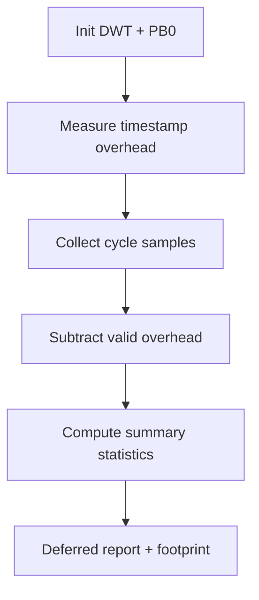

# `15-kernel-benchmark` — Benchmark kernel

> **Environment:** Target  
> **Source:** `examples/15-kernel-benchmark/main.c`  
> **Focus:** Kernel microbenchmark on target

[← Root README](../../README.md)

## Table of Contents

- [Objective and Core Concept](#objective)
- [Build Graph and Configuration](#build-graph)
- [Runtime Flow](#runtime)
- [API and Ownership](#api)
- [Invariant / PASS criteria](#pass)
- [Debugging and Failure Modes](#debug)
- [Validation](#validation)
- [Source Map and References](#source-map)

<a id="objective"></a>
## Objective and Core Concept

DWT/PB0 measure primitive/scheduler/wakeup/event/timer paths and report statistical distributions plus footprint.


<a id="build-graph"></a>
## Build Graph and Configuration

- CMake declares this example as a **Target** environment.
- Modules linked for this example: `platform`, `task_kernel`, `kernel_runtime`, `kernel_time`, `context`, `queue`, `semaphore`, `mutex`, `timer`, `haievent_benchmark`, `benchmark`.
- Reference target: `bluepill_f103c8` — STM32F103C8T6 / Cortex-M3 / nominal 72 MHz / USART1 115200 / active-low PC13 LED.

### Compile-time / source constants

| Symbol | Value in `main.c` |
| --- | --- |
| `BENCHMARK_SAMPLES` | `32U` |
| `TIMER_INTERVAL_SAMPLES` | `24U` |
| `TIMER_PERIOD_TICKS` | `10U` |
| `STARTUP_TASK_STACK_WORDS` | `128U` |
| `BENCHMARK_TASK_STACK_WORDS` | `320U` |
| `PEER_TASK_STACK_WORDS` | `160U` |
| `RECEIVER_STACK_WORDS` | `192U` |
| `EVENT_STACK_WORDS` | `224U` |
| `EVENT_QUEUE_CAPACITY` | `2U` |
| `PRIMITIVE_QUEUE_CAPACITY` | `4U` |
| `STARTUP_TASK_PRIORITY` | `0U` |
| `RECEIVER_TASK_PRIORITY` | `2U` |
| `EVENT_TASK_PRIORITY` | `3U` |
| `BENCHMARK_TASK_PRIORITY` | `4U` |

### CMake feature overrides

- Preemption enabled, time slicing disabled; software timers enabled; timer-service priority = 1 for a more controlled benchmark workload.

<a id="runtime"></a>
## Runtime Flow




### Details Observed Directly in the Example

- Measure latency with the cycle counter rather than UART timestamps.
- Subtract measurement overhead.
- Compute min, p50, mean, p95, and max.
- Measure stack high-water marks, Flash usage, and static RAM.
- Correlate selected paths with a board-provided marker.
- The benchmark clock is 32-bit; the reference target uses DWT CYCCNT on ARM Cortex-M3.
- Benchmark perturbation and deferred UART output.
- Startup probe priority 0.
- Round-trip measurement for yield/wake/event paths.
- Results depend on compiler, optimization, and interrupt load.
- `hr_benchmark.h`
- `hairtos/hairtos.h`
- `haievent/haievent.h`
- `hr_scheduler_internal.h` (intentional)
- `hr_benchmark_clock_now()`
- `hr_benchmark_stats_record()`
- `hr_benchmark_stats_percentile()`
- Queue/semaphore/mutex/timer/context APIs are measured
- Hardware — STM32F103C8T6 Blue Pill — Runs the target firmware.
- Flash/debug — ST-Link V2 over SWD — OpenOCD is used to flash, verify, and reset the target.
- UART — USART1, PA9 TX / PA10 RX, 115200 8-N-1 — Observes logs and PASS/FAIL status.
- LED — PC13, active-low — Displays heartbeat or observable status.
- Board marker — Provided by `board_benchmark_marker_*()` — Wraps switch/wakeup/event samples for logic-analyzer correlation.
- `startup-probe` — Priority 0, stack 128 — Measures SVC to the first instruction.

<a id="api"></a>
## API and Ownership

APIs called directly from `main.c` (extracted from source):

- `board_benchmark_marker_begin()`
- `board_benchmark_marker_description()`
- `board_benchmark_marker_end()`
- `board_benchmark_marker_init()`
- `board_get_core_clock_hz()`
- `board_get_cpu_name()`
- `board_get_flash_image_bytes()`
- `board_get_static_ram_bytes()`
- `board_init()`
- `board_led_toggle()`
- `board_panic()`
- `board_uart_write_char()`
- `board_uart_write_line()`
- `board_uart_write_string()`
- `board_uart_write_u32()`
- `he_active_create_static()`
- `he_active_get_task()`
- `he_active_post()`
- `he_event_init_static()`
- `hr_benchmark_adjust_cycles()`
- `hr_benchmark_clock_frequency_hz()`
- `hr_benchmark_clock_init()`
- `hr_benchmark_clock_name()`
- `hr_benchmark_clock_now()`
- `hr_benchmark_cycles_to_nanoseconds()`
- `hr_benchmark_elapsed_cycles()`
- `hr_benchmark_stats_count()`
- `hr_benchmark_stats_max()`
- `hr_benchmark_stats_mean()`
- `hr_benchmark_stats_min()`
- `hr_benchmark_stats_percentile()`
- `hr_benchmark_stats_record()`
- `hr_benchmark_stats_reset()`
- `hr_critical_enter()`
- `hr_critical_exit()`
- `hr_kernel_init()`
- `hr_kernel_start()`
- `hr_mutex_create()`
- `hr_mutex_lock()`
- `hr_mutex_unlock()`
- `hr_queue_create_static()`
- `hr_queue_receive()`
- `hr_queue_send()`
- `hr_ready_node_init()`
- `hr_scheduler_add_ready()`
- `hr_scheduler_init()`
- `hr_scheduler_select_highest()`
- `hr_semaphore_create_binary()`
- `hr_semaphore_give()`
- `hr_semaphore_take()`
- `hr_task_create_static()`
- `hr_task_current()`
- `hr_task_delay()`
- `hr_task_get_stack_high_watermark()`
- `hr_task_get_stack_words()`
- `hr_task_start()`
- `hr_task_suspend()`
- `hr_task_yield()`
- `hr_timer_create_static()`
- `hr_timer_start()`
- `hr_timer_stop()`

Ownership rules to keep in mind:

- `hr_task_t`, stacks, queue/semaphore/mutex/timer objects, and haievent storage in the examples are all static/caller-owned.
- Kernel APIs retain pointers to this storage after creation, so the storage lifetime must cover the entire period in which the object remains active.
- ISR paths must not call blocking APIs. `_from_isr` APIs perform bounded work and return `higher_priority_task_woken` so PendSV can perform any required switch after ISR exit.
- Dynamic haievent events allocated from a pool use retain/release semantics; static events are not freed automatically by the framework.

<a id="pass"></a>
## Invariants and PASS Criteria

- The statistics container has bounded sample capacity and computes min/max/mean/percentiles.
- Cycle arithmetic uses unsigned wrap-safe subtraction and converts cycles to nanoseconds using the clock frequency.
- The example measures timestamp-read overhead first so it can report adjusted cycles for short primitives.
- Metrics include critical-section cost, scheduler selection, semaphore/mutex/queue primitives, yield round-trip, queue wakeup, event dispatch, and timer jitter.
- Benchmark results are measurement evidence for a specific target/build, not a hard real-time guarantee across every board/toolchain.

Hard-coded checks/logs in the source:

- `Kernel benchmark: PASS`

<a id="debug"></a>
## Debugging and Failure Modes

- DWT does not advance: inspect CYCCNT enablement and clock-frequency binding.
- Avoid UART logging inside the measurement window when measuring kernel latency; reporting is deferred until sampling completes.
- Adjusted samples subtract measurement overhead only when the subtraction is valid.
- PB0 marker correlates external timing; mismatches between marker timing and cycle samples require inspection of measurement boundaries.

<a id="validation"></a>
## Validation

- This example is target-only in CMake; host evidence does not replace ARM cross-build, OpenOCD, and hardware validation.
- Host validation baseline: `make TARGET=bluepill_f103c8 host-tests` passes the entire suite.

### Standard Commands

```bash
make TARGET=bluepill_f103c8 EXAMPLE=15-kernel-benchmark build
make TARGET=bluepill_f103c8 EXAMPLE=15-kernel-benchmark run
make TARGET=bluepill_f103c8 EXAMPLE=15-kernel-benchmark check
```

<a id="source-map"></a>
## Source Map and References

- `examples/15-kernel-benchmark/main.c`
- `cmake/hairtos_examples.cmake`
- `benchmarks/kernel/src/hr_benchmark_stats.c`
- `arch/arm/cortex-m3/hr_benchmark_clock_dwt.c`
- `examples/15-kernel-benchmark/main.c`
- `tests/host/test_benchmark.c`
- `benchmarks/kernel/`
- `cmake/hairtos_modules.cmake`
- `benchmarks/kernel`

### References

- [Arm Cortex-M3 Technical Reference Manual](https://developer.arm.com/documentation/100165/latest/)
- [Arm Cortex-M3 Devices Generic User Guide](https://developer.arm.com/documentation/dui0552/latest/)

**Implementation sources in the repository:**
- `benchmarks/kernel/src/hr_benchmark_stats.c`
- `arch/arm/cortex-m3/hr_benchmark_clock_dwt.c`
- `examples/15-kernel-benchmark/main.c`
- `tests/host/test_benchmark.c`
- `benchmarks/kernel/`
- `cmake/hairtos_modules.cmake`
- `benchmarks/kernel`
