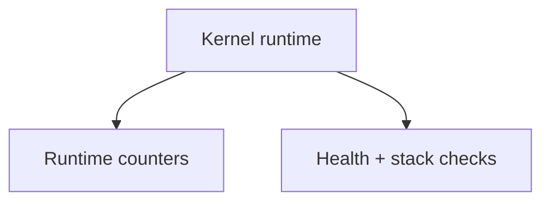
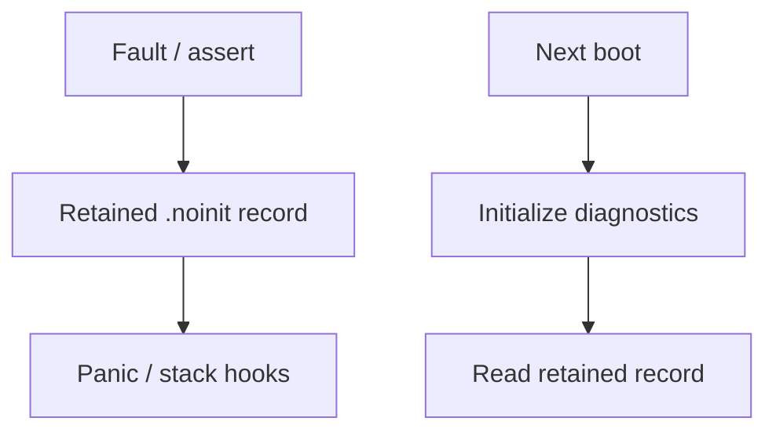

# `16-diagnostics-stress-stabilization` — Diagnostics and Stress-Test Stabilization

> **Environment:** Host + target  
> **Source:** `examples/16-diagnostics-stress-stabilization/main.c`  
> **Focus:** Diagnostics + sustained mixed workload

[← Root README](../../README.md)

## Table of Contents

- [Objective and Core Concept](#objective)
- [Build Graph and Configuration](#build-graph)
- [Runtime Flow](#runtime)
- [API and Ownership](#api)
- [Invariant / PASS criteria](#pass)
- [Debugging and Failure Modes](#debug)
- [Validation](#validation)
- [Source Map and References](#source-map)

<a id="objective"></a>
## Objective and Core Concept

Queues/semaphores/mutexes/timers + retained faults + health checks + runtime statistics; host scheduler stress runs 500k iterations.


<a id="build-graph"></a>
## Build Graph and Configuration

- CMake declares this example as **Host + target**.
- Modules linked for this example: `task_kernel`, `kernel_runtime`, `kernel_time`, `context`, `queue`, `semaphore`, `mutex`, `timer`, `diagnostics`, `fault`.
- Reference target: `bluepill_f103c8` — STM32F103C8T6 / Cortex-M3 / nominal 72 MHz / USART1 115200 / active-low PC13 LED.

### Compile-time / source constants

| Symbol | Value in `main.c` |
| --- | --- |
| `HR_DIAGNOSTICS_INJECT_USAGE_FAULT` | `0` |
| `MESSAGE_QUEUE_CAPACITY` | `8U` |
| `PRODUCER_STACK_WORDS` | `144U` |
| `CONSUMER_STACK_WORDS` | `144U` |
| `PULSE_TASK_STACK_WORDS` | `128U` |
| `HEALTH_MONITOR_STACK_WORDS` | `224U` |
| `HEALTH_REPORT_PERIOD_TICKS` | `1000U` |

### CMake feature overrides

- Diagnostics, runtime statistics, preemption, time slicing, and software timers are enabled; timer-service priority = 1.

<a id="runtime"></a>
## Runtime Flow

**Runtime health path**



**Retained fault path**




### Details Observed Directly in the Example

- Store and read panic/fault records across reset through `.noinit`.
- Collect scheduler runtime counters.
- Run periodic health checks over task/list/timeout/stack invariants.
- Run a sustained workload to expose races and corruption.
- Run deterministic scheduler stress for 500,000 iterations on the host.
- Strong fault handlers.
- Panic records are retained across reset.
- The health-monitor task has high priority.
- Queue producer/consumer, semaphore pulses, mutex-protected counters, and a periodic timer.
- Fault injection uses an architecture-appropriate instruction/backend; the reference Cortex-M3 target uses `udf #0`.
- `hairtos/hairtos.h`
- `hr_diagnostics_initialize()`
- `hr_diagnostics_get_last_panic()`
- `hr_diagnostics_run_health_check()`
- `hr_diagnostics_get_runtime_statistics()`
- Queue/semaphore/mutex/timer/task APIs
- `diagnostics`
- `semaphore`
- `health-monitor` — Priority 1, stack 224 — Reports every 1000 ticks and checks invariants.
- `queue-consumer` — Priority 2, stack 144 — Receives sequences and verifies ordering.
- `timer-pulse` — Priority 2, stack 128 — Takes a counting semaphore given by a timer callback.
- `queue-producer` — Priority 3, stack 144 — Sends every 2 ticks with timeout 10.
- Message queue — 8 × `uint32_t` — Stresses blocking/timeouts.
- Diagnostics timer — Periodic 10 ticks — Gives a counting semaphore and coalesces when full.

<a id="api"></a>
## API and Ownership

APIs called directly from `main.c` (extracted from source):

- `board_init()`
- `board_led_on()`
- `board_led_toggle()`
- `board_panic()`
- `board_uart_write_hex32()`
- `board_uart_write_line()`
- `board_uart_write_string()`
- `board_uart_write_u32()`
- `hr_diagnostics_clear_last_panic()`
- `hr_diagnostics_get_last_panic()`
- `hr_diagnostics_get_runtime_statistics()`
- `hr_diagnostics_initialize()`
- `hr_diagnostics_panic_reason_string()`
- `hr_diagnostics_run_health_check()`
- `hr_hook_panic()`
- `hr_hook_stack_overflow()`
- `hr_kernel_init()`
- `hr_kernel_start()`
- `hr_mutex_create()`
- `hr_mutex_lock()`
- `hr_mutex_unlock()`
- `hr_queue_create_static()`
- `hr_queue_receive()`
- `hr_queue_send()`
- `hr_semaphore_create_counting()`
- `hr_semaphore_give()`
- `hr_semaphore_take()`
- `hr_task_create_static()`
- `hr_task_delay()`
- `hr_task_delay_until()`
- `hr_task_start()`
- `hr_time_now()`
- `hr_timer_create_static()`
- `hr_timer_start()`

Ownership rules to keep in mind:

- `hr_task_t`, stacks, queue/semaphore/mutex/timer objects, and haievent storage in the examples are all static/caller-owned.
- Kernel APIs retain pointers to this storage after creation, so the storage lifetime must cover the entire period in which the object remains active.
- ISR paths must not call blocking APIs. `_from_isr` APIs perform bounded work and return `higher_priority_task_woken` so PendSV can perform any required switch after ISR exit.
- Dynamic haievent events allocated from a pool use retain/release semantics; static events are not freed automatically by the framework.

<a id="pass"></a>
## Invariants and PASS Criteria

- The panic record contains signature/version/boot_count/sequence/reason/tick/task/source plus the fault register frame.
- The record lives in `.noinit.hairtos`, so startup/linker logic does not zero it with `.bss`.
- Health checks iterate tasks, validate stack guard/high-water mark, and invoke kernel invariant validation.
- Runtime counters track SysTick, PendSV, switches, yields, blocks, preemptions, time slices, timeout wakes, invariant/stack failures, and panics.
- Hooks are weak functions that let applications react without modifying the kernel core.

<a id="debug"></a>
## Debugging and Failure Modes

- Health check fails: inspect ready/timeout/task counts, stack guards, and the kernel invariant report.
- Retained panic does not appear after reset: inspect `.noinit.hairtos`, linker placement, and record validation.
- Producer/consumer/pulse progress stalls: inspect queue, semaphore, mutex, and periodic-timer interactions.
- Fault injection should be enabled deliberately; on the next boot the record is read and then cleared according to the example flow.

<a id="validation"></a>
## Validation

- Host variant (`scheduler_stress_main`) passes 500,000 iterations; the target diagnostics workload requires a board to verify retained-fault/UART/stack behavior.
- Host validation baseline: `make TARGET=bluepill_f103c8 host-tests` passes the entire suite.

### Standard Commands

```bash
make TARGET=bluepill_f103c8 ENVIRONMENT=host EXAMPLE=16-diagnostics-stress-stabilization run
make TARGET=bluepill_f103c8 ENVIRONMENT=target EXAMPLE=16-diagnostics-stress-stabilization build
```

<a id="source-map"></a>
## Source Map and References

- `examples/16-diagnostics-stress-stabilization/main.c`
- `cmake/hairtos_examples.cmake`
- `kernel/src/hr_diagnostics.c`
- `kernel/include/hairtos/hr_diagnostics.h`
- `arch/arm/cortex-m3/hr_fault.c`
- `arch/arm/cortex-m3/hr_faultasm.S`
- `tests/host/test_diagnostics.c`

### References

- [Arm Cortex-M3 Technical Reference Manual](https://developer.arm.com/documentation/100165/latest/)
- [Arm Cortex-M3 Devices Generic User Guide](https://developer.arm.com/documentation/dui0552/latest/)

**Implementation sources in the repository:**
- `kernel/src/hr_diagnostics.c`
- `kernel/include/hairtos/hr_diagnostics.h`
- `arch/arm/cortex-m3/hr_fault.c`
- `arch/arm/cortex-m3/hr_faultasm.S`
- `tests/host/test_diagnostics.c`
