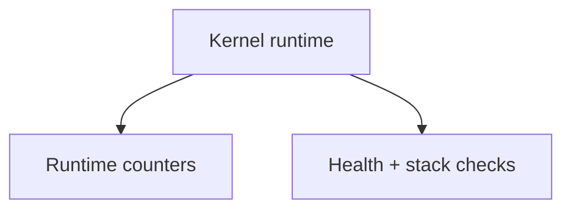
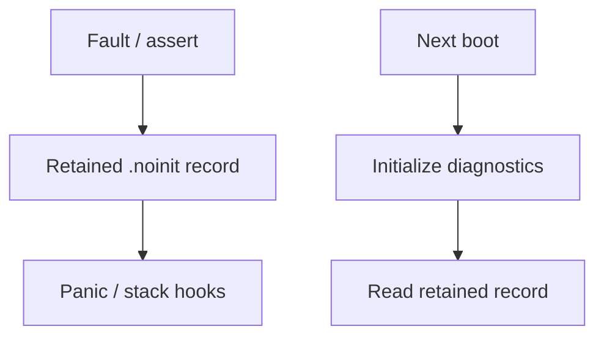

# `16-diagnostics-stress-stabilization` — Chẩn đoán và ổn định bằng stress test

> **Môi trường:** Host + target  
> **Source:** `examples/16-diagnostics-stress-stabilization/main.c`  
> **Trọng tâm:** Diagnostics + sustained mixed workload

[← Root README](../../README.md)

## Mục lục

- [Mục tiêu và bản chất](#muc-tieu)
- [Build graph và cấu hình](#build-graph)
- [Luồng thực thi](#runtime)
- [API và ownership](#api)
- [Invariant / PASS criteria](#pass)
- [Debug và failure modes](#debug)
- [Validation](#validation)
- [Source map và references](#source-map)

<a id="muc-tieu"></a>
## Mục tiêu và bản chất

Queue/semaphore/mutex/timer + retained faults + health check + runtime stats; host scheduler stress có 500k iterations.


<a id="build-graph"></a>
## Build graph và cấu hình

- Environment được CMake khai báo: **Host + target**.
- Module được link cho example này: `task_kernel`, `kernel_runtime`, `kernel_time`, `context`, `queue`, `semaphore`, `mutex`, `timer`, `diagnostics`, `fault`.
- Target tham chiếu: `bluepill_f103c8` — STM32F103C8T6 / Cortex-M3 / 72 MHz nominal / USART1 115200 / LED PC13 active-low.

### Compile-time / source constants

| Symbol | Giá trị trong `main.c` |
| --- | --- |
| `HR_DIAGNOSTICS_INJECT_USAGE_FAULT` | `0` |
| `MESSAGE_QUEUE_CAPACITY` | `8U` |
| `PRODUCER_STACK_WORDS` | `144U` |
| `CONSUMER_STACK_WORDS` | `144U` |
| `PULSE_TASK_STACK_WORDS` | `128U` |
| `HEALTH_MONITOR_STACK_WORDS` | `224U` |
| `HEALTH_REPORT_PERIOD_TICKS` | `1000U` |

### CMake feature overrides

- Diagnostics + runtime stats + preemption + time slicing + software timer đều bật; timer-service priority = 1.

<a id="runtime"></a>
## Luồng thực thi

**Runtime health path**



**Retained fault path**




### Các chi tiết quan sát trực tiếp từ example

- Lưu và đọc panic/fault record qua reset bằng `.noinit`.
- Thu runtime counters của scheduler.
- Chạy health check định kỳ trên task/list/timeout/stack invariants.
- Tạo workload liên tục để phát hiện race và corruption.
- Chạy deterministic scheduler stress 500.000 vòng trên host.
- Các fault handler mạnh.
- Panic record được giữ lại qua reset.
- Tác vụ giám sát sức khỏe có priority cao.
- Queue producer/consumer, semaphore pulse, mutex-protected counters và periodic timer.
- Fault injection qua instruction/backend phù hợp architecture; target Cortex-M3 tham chiếu dùng `udf #0`.
- `hairtos/hairtos.h`
- `hr_diagnostics_initialize()`
- `hr_diagnostics_get_last_panic()`
- `hr_diagnostics_run_health_check()`
- `hr_diagnostics_get_runtime_statistics()`
- Queue/semaphore/mutex/timer/task APIs
- `diagnostics`
- `semaphore`
- `health-monitor` — Priority 1, stack 224 — Report mỗi 1000 ticks và kiểm tra invariants.
- `queue-consumer` — Priority 2, stack 144 — Receive sequence và kiểm tra ordering.
- `timer-pulse` — Priority 2, stack 128 — Take counting semaphore từ timer callback.
- `queue-producer` — Priority 3, stack 144 — Send mỗi 2 ticks với timeout 10.
- Queue thông điệp — 8 × `uint32_t` — Stress blocking/timeout.
- Bộ định thời chẩn đoán — Periodic 10 ticks — Give counting semaphore, coalesce khi full.

<a id="api"></a>
## API và ownership

API được gọi trực tiếp trong `main.c` (đã trích từ source):

- `board_init()`
- `board_led_on()`
- `board_led_toggle()`
- `board_panic()`
- `board_uart_write_hex32()`
- `board_uart_write_line()`
- `board_uart_write_string()`
- `board_uart_write_u32()`
- `hr_diagnostics_clear_last_panic()`
- `hr_diagnostics_get_last_panic()`
- `hr_diagnostics_get_runtime_statistics()`
- `hr_diagnostics_initialize()`
- `hr_diagnostics_panic_reason_string()`
- `hr_diagnostics_run_health_check()`
- `hr_hook_panic()`
- `hr_hook_stack_overflow()`
- `hr_kernel_init()`
- `hr_kernel_start()`
- `hr_mutex_create()`
- `hr_mutex_lock()`
- `hr_mutex_unlock()`
- `hr_queue_create_static()`
- `hr_queue_receive()`
- `hr_queue_send()`
- `hr_semaphore_create_counting()`
- `hr_semaphore_give()`
- `hr_semaphore_take()`
- `hr_task_create_static()`
- `hr_task_delay()`
- `hr_task_delay_until()`
- `hr_task_start()`
- `hr_time_now()`
- `hr_timer_create_static()`
- `hr_timer_start()`

Ownership cần nhớ:

- `hr_task_t`, stack, queue/semaphore/mutex/timer object và haievent storage trong examples đều là static/caller-owned.
- API kernel giữ pointer tới storage này sau create, vì vậy lifetime phải kéo dài toàn bộ thời gian object còn active.
- ISR path không được gọi blocking API. API `_from_isr` chỉ làm bounded work và trả `higher_priority_task_woken` để PendSV xử lý switch sau ISR.
- Dynamic haievent event từ pool dùng retain/release; static event không được framework tự free.

<a id="pass"></a>
## Invariant và PASS criteria

- Panic record có signature/version/boot_count/sequence/reason/tick/task/source và fault register frame.
- Record nằm trong `.noinit.hairtos`, nên startup/linker không zero nó cùng `.bss`.
- Health check duyệt task, kiểm tra stack guard/high-watermark và gọi kernel invariant validation.
- Runtime counters theo dõi SysTick, PendSV, switch, yield, block, preemption, time slice, timeout wake, invariant/stack failures, panic.
- Hooks là weak functions để application phản ứng mà không sửa kernel core.

<a id="debug"></a>
## Debug và failure modes

- Health check fail: kiểm tra ready/timeout/task counts, stack guard và kernel invariant report.
- Retained panic không xuất hiện sau reset: kiểm tra `.noinit.hairtos`, linker placement và record validation.
- Producer/consumer/pulse progress dừng: kiểm tra queue, semaphore, mutex và periodic timer interaction.
- Fault injection chỉ nên bật có chủ đích; sau boot kế tiếp record được đọc rồi clear theo example flow.

<a id="validation"></a>
## Validation

- Host variant (`scheduler_stress_main`) đã chạy PASS với 500.000 iteration; target diagnostics workload cần board để xác nhận retained fault/UART/stack behavior.
- Host validation baseline: `make TARGET=bluepill_f103c8 host-tests` PASS toàn bộ suite.

### Lệnh chuẩn

```bash
make TARGET=bluepill_f103c8 ENVIRONMENT=host EXAMPLE=16-diagnostics-stress-stabilization run
make TARGET=bluepill_f103c8 ENVIRONMENT=target EXAMPLE=16-diagnostics-stress-stabilization build
```

<a id="source-map"></a>
## Source map và references

- `examples/16-diagnostics-stress-stabilization/main.c`
- `cmake/hairtos_examples.cmake`
- `kernel/src/hr_diagnostics.c`
- `kernel/include/hairtos/hr_diagnostics.h`
- `arch/arm/cortex-m3/hr_fault.c`
- `arch/arm/cortex-m3/hr_faultasm.S`
- `tests/host/test_diagnostics.c`

### Tài liệu tham khảo

- [Arm Cortex-M3 Technical Reference Manual](https://developer.arm.com/documentation/100165/latest/)
- [Arm Cortex-M3 Devices Generic User Guide](https://developer.arm.com/documentation/dui0552/latest/)

**Nguồn implementation trong repository:**
- `kernel/src/hr_diagnostics.c`
- `kernel/include/hairtos/hr_diagnostics.h`
- `arch/arm/cortex-m3/hr_fault.c`
- `arch/arm/cortex-m3/hr_faultasm.S`
- `tests/host/test_diagnostics.c`
