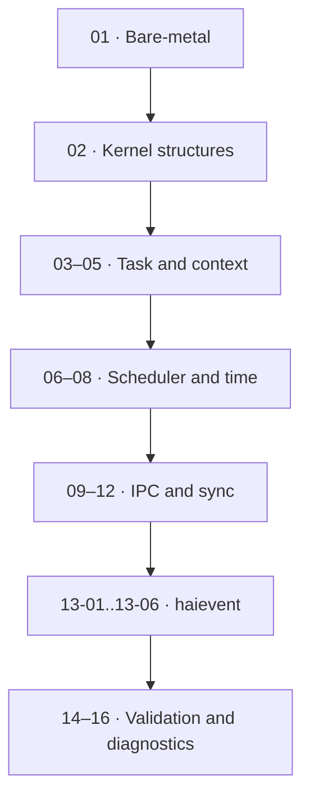

# hairtos Examples

> **Role:** The examples are arranged as a deliberate progression from bare metal → data structures → task/context switching → scheduling/time → IPC/synchronization → haievent → allocator/benchmark/diagnostics. CMake determines whether each example runs on the host, the target, or both.

[← Root README](../README.md)

## Table of Contents

- [Content Map](#content-map)
- [How to Read This Section](#reading-guide)
- [Documents](#documents)
- [Validation baseline](#validation)
- [References](#references)

## Content Map

## How to Read This Section

1. Start with the section README to understand the scope and recommended learning order.
2. When an API appears, refer to `docs/05-api-reference/` for context and return-value contracts; for kernel behavior, prioritize `docs/01`–`03`.
3. Cross-check every timing and ownership statement against the source map at the end of the chapter.
4. Clearly distinguish **host evidence**, **target evidence**, and **future proposals**.

## Documents

### Subgroups

- [`01-baremetal-foundation/`](01-baremetal-foundation/README.md) — `01-baremetal-foundation` — Bare-Metal Foundation
- [`02-kernel-data-structures-host/`](02-kernel-data-structures-host/README.md) — `02-kernel-data-structures-host` — Kernel Data Structures — Host Demo
- [`03-static-task-stack/`](03-static-task-stack/README.md) — `03-static-task-stack` — Static TCB and Initial Task Stack
- [`04-start-first-task/`](04-start-first-task/README.md) — `04-start-first-task` — Starting the First Task with SVC
- [`05-cooperative-context-switch/`](05-cooperative-context-switch/README.md) — `05-cooperative-context-switch` — Cooperative Context Switching
- [`06-priority-scheduler/`](06-priority-scheduler/README.md) — `06-priority-scheduler` — Fixed-Priority Scheduler
- [`07-task-delay-timeout/`](07-task-delay-timeout/README.md) — `07-task-delay-timeout` — SysTick, Task Delay, and Timeouts
- [`08-preemption-round-robin/`](08-preemption-round-robin/README.md) — `08-preemption-round-robin` — Preemption and Round-Robin
- [`09-queue-blocking-ipc/`](09-queue-blocking-ipc/README.md) — `09-queue-blocking-ipc` — Queue and Blocking IPC
- [`10-01-semaphore-from-isr/`](10-01-semaphore-from-isr/README.md) — `10-01-semaphore-from-isr` — Giving a Semaphore from an ISR
- [`10-02-mutex-priority-inheritance/`](10-02-mutex-priority-inheritance/README.md) — `10-02-mutex-priority-inheritance` — Mutex and Priority Inheritance
- [`11-task-suspend-resume/`](11-task-suspend-resume/README.md) — `11-task-suspend-resume` — Task Suspend and Resume
- [`12-software-timer/`](12-software-timer/README.md) — `12-software-timer` — Software Timer Service
- [`13-01-event-post/`](13-01-event-post/README.md) — `13-01-event-post` — Posting haievent Events from an ISR
- [`13-02-active-object/`](13-02-active-object/README.md) — `13-02-active-object` — Active Object Ping–Pong
- [`13-03-flat-state-machine/`](13-03-flat-state-machine/README.md) — `13-03-flat-state-machine` — Flat State Machine
- [`13-04-time-event/`](13-04-time-event/README.md) — `13-04-time-event` — haievent Time Events
- [`13-05-publish-subscribe/`](13-05-publish-subscribe/README.md) — `13-05-publish-subscribe` — Publish–Subscribe and Dynamic-Event Ownership
- [`13-06-event-driven-demo/`](13-06-event-driven-demo/README.md) — `13-06-event-driven-demo` — Integrated haievent Demo
- [`14-memory-allocator-lab/`](14-memory-allocator-lab/README.md) — `14-memory-allocator-lab` — Memory Allocator Lab
- [`15-kernel-benchmark/`](15-kernel-benchmark/README.md) — `15-kernel-benchmark` — Benchmark kernel
- [`16-diagnostics-stress-stabilization/`](16-diagnostics-stress-stabilization/README.md) — `16-diagnostics-stress-stabilization` — Diagnostics and Stress-Test Stabilization

## Validation baseline

- `VERSION`: `1.0.0-rc1`.
- Host validation baseline: all 64 test functions in the current suite pass.
- `02-kernel-data-structures-host`, `14-memory-allocator-lab`, and `16-diagnostics-stress-stabilization` pass on the host.
- The reference target is `bluepill_f103c8`; host evidence does not replace cross-build, OpenOCD, and on-board hardware validation.

## References

- [CMake — CMAKE_TOOLCHAIN_FILE](https://cmake.org/cmake/help/latest/variable/CMAKE_TOOLCHAIN_FILE.html)
- [CMake — CMAKE_EXPORT_COMPILE_COMMANDS](https://cmake.org/cmake/help/latest/variable/CMAKE_EXPORT_COMPILE_COMMANDS.html)

**Implementation sources in the repository:**
- `README.md`
- `CMakeLists.txt`
- `cmake/hairtos_examples.cmake`
- `cmake/hairtos_targets.cmake`
