# Các ví dụ của hairtos

> **Vai trò:** Examples được sắp theo progression từ bare-metal → data structures → task/context switch → scheduler/time → IPC/synchronization → haievent → allocator/benchmark/diagnostics. CMake quyết định example nào chạy host, target hoặc cả hai.

[← Root README](../README.md)

## Mục lục

- [Bản đồ nội dung](#ban-do)
- [Cách đọc](#cach-doc)
- [Các tài liệu](#tai-lieu)
- [Validation baseline](#validation)
- [Tài liệu tham khảo](#references)

## Bản đồ nội dung

```mermaid
flowchart TD
    ROOT["Các ví dụ của hairtos"]
    ROOT --> N0["01-baremetal-foundation"]
    ROOT --> N1["02-kernel-data-structures-host"]
    ROOT --> N2["03-static-task-stack"]
    ROOT --> N3["04-start-first-task"]
    ROOT --> N4["05-cooperative-context-switch"]
    ROOT --> N5["06-priority-scheduler"]
    ROOT --> N6["07-task-delay-timeout"]
    ROOT --> N7["08-preemption-round-robin"]
    ROOT --> N8["09-queue-blocking-ipc"]
    ROOT --> N9["10-01-semaphore-from-isr"]
    ROOT --> N10["10-02-mutex-priority-inheritance"]
    ROOT --> N11["11-task-suspend-resume"]
    ROOT --> N12["12-software-timer"]
    ROOT --> N13["13-01-event-post"]
    ROOT --> N14["13-02-active-object"]
    ROOT --> N15["13-03-flat-state-machine"]
    ROOT --> N16["13-04-time-event"]
    ROOT --> N17["13-05-publish-subscribe"]
    ROOT --> N18["13-06-event-driven-demo"]
    ROOT --> N19["14-memory-allocator-lab"]
    ROOT --> N20["15-kernel-benchmark"]
    ROOT --> N21["16-diagnostics-stress-stabilization"]
```

## Cách đọc

1. Bắt đầu từ README của section để biết scope và thứ tự học.
2. Khi gặp API, quay lại `docs/05-api-reference/` để xem context/return contract; khi gặp behavior kernel, ưu tiên `docs/01`–`03`.
3. Đối chiếu mọi statement timing/ownership với source map ở cuối chapter.
4. Phân biệt rõ **host evidence**, **target evidence** và **future proposal**.

## Các tài liệu

### Nhóm con

- [`01-baremetal-foundation/`](01-baremetal-foundation/README.md) — `01-baremetal-foundation` — Nền tảng bare-metal
- [`02-kernel-data-structures-host/`](02-kernel-data-structures-host/README.md) — `02-kernel-data-structures-host` — Cấu trúc dữ liệu kernel — Demo trên host
- [`03-static-task-stack/`](03-static-task-stack/README.md) — `03-static-task-stack` — TCB tĩnh và ngăn xếp khởi tạo của tác vụ
- [`04-start-first-task/`](04-start-first-task/README.md) — `04-start-first-task` — Khởi chạy tác vụ đầu tiên bằng SVC
- [`05-cooperative-context-switch/`](05-cooperative-context-switch/README.md) — `05-cooperative-context-switch` — Chuyển ngữ cảnh hợp tác
- [`06-priority-scheduler/`](06-priority-scheduler/README.md) — `06-priority-scheduler` — Bộ lập lịch ưu tiên cố định
- [`07-task-delay-timeout/`](07-task-delay-timeout/README.md) — `07-task-delay-timeout` — SysTick, trì hoãn tác vụ và timeout
- [`08-preemption-round-robin/`](08-preemption-round-robin/README.md) — `08-preemption-round-robin` — Chiếm quyền và Round-Robin
- [`09-queue-blocking-ipc/`](09-queue-blocking-ipc/README.md) — `09-queue-blocking-ipc` — Queue và IPC chặn
- [`10-01-semaphore-from-isr/`](10-01-semaphore-from-isr/README.md) — `10-01-semaphore-from-isr` — Trao semaphore từ ISR
- [`10-02-mutex-priority-inheritance/`](10-02-mutex-priority-inheritance/README.md) — `10-02-mutex-priority-inheritance` — Mutex và kế thừa ưu tiên
- [`11-task-suspend-resume/`](11-task-suspend-resume/README.md) — `11-task-suspend-resume` — Tạm dừng và tiếp tục tác vụ
- [`12-software-timer/`](12-software-timer/README.md) — `12-software-timer` — Dịch vụ bộ định thời phần mềm
- [`13-01-event-post/`](13-01-event-post/README.md) — `13-01-event-post` — Đăng sự kiện haievent từ ISR
- [`13-02-active-object/`](13-02-active-object/README.md) — `13-02-active-object` — Active Object Ping–Pong
- [`13-03-flat-state-machine/`](13-03-flat-state-machine/README.md) — `13-03-flat-state-machine` — Máy trạng thái phẳng
- [`13-04-time-event/`](13-04-time-event/README.md) — `13-04-time-event` — Sự kiện thời gian haievent
- [`13-05-publish-subscribe/`](13-05-publish-subscribe/README.md) — `13-05-publish-subscribe` — Publish–Subscribe và quyền sở hữu sự kiện động
- [`13-06-event-driven-demo/`](13-06-event-driven-demo/README.md) — `13-06-event-driven-demo` — Demo haievent tích hợp
- [`14-memory-allocator-lab/`](14-memory-allocator-lab/README.md) — `14-memory-allocator-lab` — Bài thực hành bộ cấp phát bộ nhớ
- [`15-kernel-benchmark/`](15-kernel-benchmark/README.md) — `15-kernel-benchmark` — Benchmark kernel
- [`16-diagnostics-stress-stabilization/`](16-diagnostics-stress-stabilization/README.md) — `16-diagnostics-stress-stabilization` — Chẩn đoán và ổn định bằng stress test

## Validation baseline

- `VERSION`: `1.0.0-rc1`.
- Host test suite hiện có 64 test function và đã chạy PASS trong lần audit tài liệu này.
- `02-kernel-data-structures-host`, `14-memory-allocator-lab`, `16-diagnostics-stress-stabilization` chạy PASS trên host.
- Target tham chiếu là `bluepill_f103c8`; cross toolchain/OpenOCD không có trong môi trường audit nên không tuyên bố đã flash lại hardware.

## Tài liệu tham khảo

- [CMake — CMAKE_TOOLCHAIN_FILE](https://cmake.org/cmake/help/latest/variable/CMAKE_TOOLCHAIN_FILE.html)
- [CMake — CMAKE_EXPORT_COMPILE_COMMANDS](https://cmake.org/cmake/help/latest/variable/CMAKE_EXPORT_COMPILE_COMMANDS.html)

**Nguồn implementation trong repository:**
- `README.md`
- `CMakeLists.txt`
- `cmake/hairtos_examples.cmake`
- `cmake/hairtos_targets.cmake`
