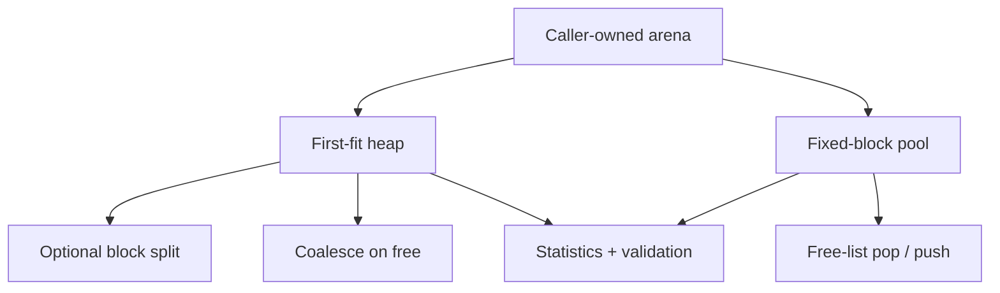

# Memory Allocator Lab

> **Scope:** `hairtos 1.0.0-rc1` implementation, including the current source, configuration, build graph, and host-test evidence.

[← Root README](../../README.md)

## Table of Contents

- [Overview and Core Concepts](#overview)
- [Implementation in the Repository](#implementation)
- [Execution Model and Runtime Flow](#runtime-model)
- [Ownership, Concurrency, and Invariants](#invariants)
- [Failure Modes and Limitations](#failure)
- [Validation and Verification](#validation)
- [Source map](#source-map)
- [References](#references)

<a id="overview"></a>
## Overview and Core Concepts

The memory-allocator lab is intentionally separated from kernel runtime so fragmentation and allocator metadata can be studied without violating hairtos's static-first design principle. The lab provides a first-fit heap with split/coalesce and a fixed-block pool with a free list.


<a id="implementation"></a>
## Implementation in the Repository

The current implementation includes:

- The arena is caller-supplied; the implementation does not call the system allocator.
- The heap aligns to `max_align_t`, uses per-block metadata and first-fit scanning, and coalesces free blocks both forward and backward when adjacent blocks are free.
- The pool partitions storage into fixed-stride blocks and recycles them through a free list; allocation/free are suited to same-sized objects.
- Statistics distinguish allocated/free bytes, largest free block, internal/external fragmentation, and failed allocations.
- Host tests cover invalid/double-free cases, exhaustion, coalescing, and randomized sequences; the lab is not thread-safe and is not a production allocator.
- alignment follows `max_align_t`;
- block header and payload;
- first-fit allocation;
- splitting and adjacent coalescing;
- invalid pointer/double free detection;
- internal and external fragmentation;
- validation on host and target.

Key implementation details:

- The arena must have valid alignment and size.
- Every block is in exactly one state: allocated or free.
- Adjacent free blocks must be coalesced after free.
- The pool free list must not contain duplicate nodes.
- The lab is not thread-safe and must not be called from ISR context.
- This is not a production allocator and is never used implicitly by the kernel.


<a id="runtime-model"></a>
## Execution Model and Runtime Flow



The corresponding functions and source files are listed in the Source Map section.

<a id="invariants"></a>
## Ownership, Concurrency, and Invariants

The following baseline invariants apply to this topic:

- A public opaque object is valid only after a successful create/init operation and when its magic/internal state matches the contract.
- An intrusive node may be linked into exactly one list at a time; remove/timeout/wake paths must leave the node in a consistent unlinked state.
- A thread API may block only while the kernel is RUNNING and the caller is not in ISR context; ISR APIs must be non-blocking and use `higher_priority_task_woken` when a switch should be deferred to PendSV.
- Critical sections currently use PRIMASK on Cortex-M3, globally masking interrupts for a short bounded interval; therefore critical-section code must remain bounded and must not invoke operations that can block.
- Ready/wait policy uses **effective priority** while mutex priority inheritance is active; base priority remains the task's configured priority.
- Static-first does not mean “no lifetime”: caller-owned TCB, stack, queue storage, and event-pool storage must outlive every object that still references them.

<a id="failure"></a>
## Failure Modes and Limitations

- `hairtos 1.0.0-rc1` is single-core and provides no SMP, FPU context management, MPU isolation, or general-purpose dynamic kernel heap.
- The current interrupt-masking model uses PRIMASK; the repository does not yet define a BASEPRI ceiling contract for applications with complex ISR-priority schemes.
- Tickless idle is not implemented; the current time model uses a 1 kHz tick on the reference target.
- `haievent` v1 provides a flat state machine and one task per AO; HSMs, deferred events, and a shared executor are Version 2 roadmap items.
- A successful build/link does not by itself prove real-time timing or race-free behavior on hardware; target tests and measurements remain necessary.

<a id="validation"></a>
## Validation and Verification

- The repository's host suite is built with GCC, AddressSanitizer, UndefinedBehaviorSanitizer, and `ctest`.
- Host validation baseline: `make TARGET=bluepill_f103c8 host-tests` PASS.
- Host examples `02-kernel-data-structures-host`, `14-memory-allocator-lab`, and `16-diagnostics-stress-stabilization` pass; the scheduler stress test reports 500,000 iterations.
- Do not infer target-runtime PASS from host tests. Cortex-M3 assembly, timing, exception priorities, UART/LED behavior, and hardware clocks still require cross-build and board validation.

Primary reproduction commands:

```bash
make TARGET=bluepill_f103c8 \
ENVIRONMENT=host \
EXAMPLE=14-memory-allocator-lab \
run
ENVIRONMENT=target \
make TARGET=bluepill_f103c8 host-tests
```


<a id="source-map"></a>
## Source map

- `labs/memory-allocator/src/hr_heap_lab.c`
- `labs/memory-allocator/src/hr_pool_lab.c`
- `labs/memory-allocator/tests/test_heap_lab.c`
- `labs/memory-allocator/`
- `labs/memory-allocator/include`


<a id="references"></a>
## References


**Implementation sources in the repository:**
- `labs/memory-allocator/src/hr_heap_lab.c`
- `labs/memory-allocator/src/hr_pool_lab.c`
- `labs/memory-allocator/tests/test_heap_lab.c`
- `labs/memory-allocator/`
- `labs/memory-allocator/include`
